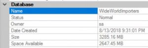

I recently gave my [first usergroup presentation in Cleveland](http://jesspomfret.com/first-user-group-presentation-i-survived/), closely followed by my first SQL Saturday presentation in Columbus. My chosen topic was row store data compression and I had a few great questions that I plan on answering with blog posts. First up...

### What happens if I use data compression and backup compression, do I get double compression?

This is a great question, and without diving too deeply into how backup compression works I'm going to do a simple experiment on the WideWorldImporters database.  I've restored this database to my local SQL Server 2016 instance and I'm simply going to back it up several times under different conditions.

After restoring the database it's about 3GB in size, so our testing will be on a reasonably small database.  It would be interesting to see how the results change as the database size increases, perhaps a future blog post.

Now I'm not sure how to write a blog post without mentioning [dbatools](http://dbatools.io), I'm using my favourite PowerShell module to check current database compression (Get-DbaDbCompression), apply data compression (Set-DbaDbCompression) and to create the backups with and without compression (Backup-DbaDatabase).

The script I used to run through this experiment is available for you to test out on my [github](https://github.com/jpomfret/demos/blob/master/BlogExamples/01_DataCompressionPlusBackupCompression.ps1) and the results are below:

\[table id=1 /\]

We can clearly see that using backup compression gives us a huge space savings.  On our database where none of the objects are compressed we get a 78% reduction in the size of the backup file. When all our objects are row compressed we get a 70% savings and even when all our objects are page compressed we still get a 60% reduction in size when we apply backup compression.

Now, if we compare the difference in sizes for the three backups that used backup compression, we do get a small amount of additional space savings by using data compression in combination with backup compression. The backup file is 7% smaller when the database objects are row compressed and 6% smaller when page compression is applied, however, these savings aren't nearly as significant as as just comparing whether backup compression is used or not.

So to answer the question, we don't get double the compression by using both data and backup compression, but whether we use data compression or not within our database using backup compression will get you a pretty significant space saving when looking at the size of the backup file on disk.
