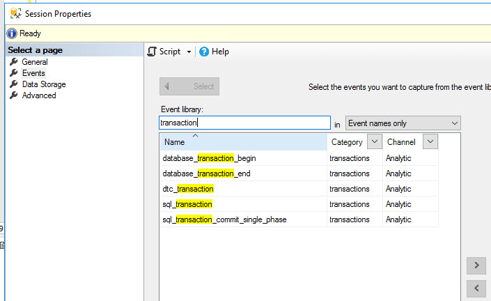
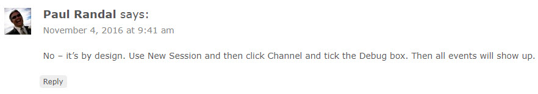
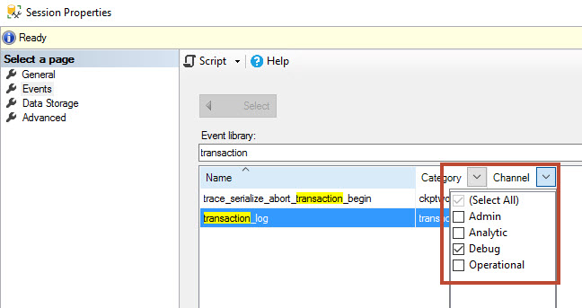

I was troubleshooting an issue last week which led to me firing up extended events to look at records being written to the transaction log, I typed into the search bar ‘Transaction’ hoping to find something that would do the trick and didn’t quite find what I was looking for.

After a few more failed attempts I headed to the internet and found a [post by Paul Randal](https://www.sqlskills.com/blogs/paul/t-sql-tuesday-67-monitoring-log-activity-with-extended-events/) describing exactly what I needed for this situation, using the \[sqlserver\].\[transaction\_log\] event. Hold on, that’s exactly what I searched for.  I ran the T-SQL within his blog post, the event was successfully created and gave me the information I was looking for.

I then noticed someone asked in the comments whether it was a bug that the transaction\_log event doesn’t show up in the XEvents GUI and Paul had replied:

It took me a second to find it but by default there is a filter on the ‘Channel’ column that doesn’t include ‘Debug’. Selecting that gives you a whole host of new XEvents to investigate (and use carefully, for example the transaction\_log event can generate a lot of activity).

I’m not sure how often I’ll need these ‘Debug’ events, but it sure is nice to know they exist. I feel like there should be some notation in the GUI that there is a filter being applied, similar to the icon in Excel when you have something filtered.
