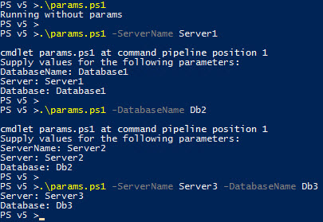

I came across a situation this week where I wanted to add the option of running an existing script,  for a specific server/database combination.  The script currently has no parameters and runs against all servers in the environment from a scheduled task.  I wanted to make sure that behaviour didn’t change. The other requirement was that if I specified Server, Database should be a mandatory parameter and vice versa.

The final solution was to add the two parameters to a parameter set and make them both mandatory.  I also had to add a different DefaultParameterSet (thanks to [Andrew](http://twitter.com/awickham) for this idea), otherwise it defaulted to the defined parameter set, meaning the script always required both Server and Database parameters.

```PowerShell
[CmdletBinding(DefaultParameterSetName="Normal")]
param (
    [Parameter(Mandatory = $True, ParameterSetName='Specific')]
    [string]$ServerName,

    [Parameter(Mandatory = $True, ParameterSetName='Specific')]
    [string]$DatabaseName
)

if($PSCmdlet.ParameterSetName -eq 'Normal') {
    Write-Host 'Running without params'
} else {
    Write-Host ("Server: {0}" -f $ServerName)
    Write-Host ("Database: {0}" -f $DatabaseName)
}
```

I saved the above code as params.ps1 to ensure my test cases worked. As you can see in my testing below, I can still run params.ps1 without any parameters, this replicates the current behaviour of my nightly job.

I can also now pass in Server and Database parameters, if I specify one the script will prompt for the other since they are both required.


