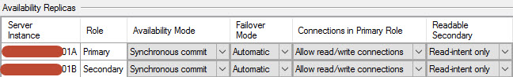

I recently set up an Availability Group with the intent of using the secondary as a read only replica for reporting.  We have a few AG's in our environment already but currently none are using this feature.

I'm not going to step through setting up the AG or configuring the readable secondary as there are plenty of good posts out there as well as the official [books online documentation](https://docs.microsoft.com/en-us/sql/database-engine/availability-groups/windows/configure-read-only-access-on-an-availability-replica-sql-server?view=sql-server-2017).

Once my AG was created I set the 'Connections in Primary Role' to 'Allow read/write connections' and the 'Readable Secondary' to 'Read-intent only' as shown below. On a side note it's important to set these for both instances, if you're running with 01B as the Primary after a failover by setting both you'll get the same behaviour, with read only connections being routed to the now secondary, 01A server.



The other part I needed to set up was [read-only routing](https://docs.microsoft.com/en-us/sql/database-engine/availability-groups/windows/configure-read-only-routing-for-an-availability-group-sql-server?view=sql-server-2017), this enables SQL Server to reroute those read only connections to the appropriate replica.  You can also list the read only replicas by priority if you have multiple available or you can group them to enable load-balancing.

Although this seems to be setup correctly so that connections that specify their application intent of read only will be routed to the secondary node I wanted to prove it. I used the [Connect-DbaInstance](https://dbatools.io/functions/connect-dbainstance/) function from dbatools to connect to the listener name with the -ApplicationIntent property set to 'ReadOnly'.

```PowerShell
$svr = Connect-DbaInstance -SqlInstance AGListenerName `
-Database DatabaseInAG `
-ApplicationIntent ReadOnly

$svr.Query('Select @@ServerName as ServerName')

ServerName
------------
*******01B

You can see it routed correctly to 01B which is currently the secondary node.  If I don't specify the ApplicationIntent property on the connection it'll be routed to the primary.

$svr = Connect-DbaInstance -SqlInstance AGListenerName -Database DatabaseInAG

$svr.Query('Select @@ServerName as ServerName')

ServerName
------------
*******01A
```

This was a quick and easy way to ensure my read only routing was working as expected, and another great use of dbatools.
