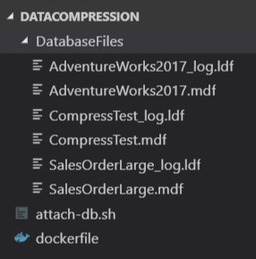
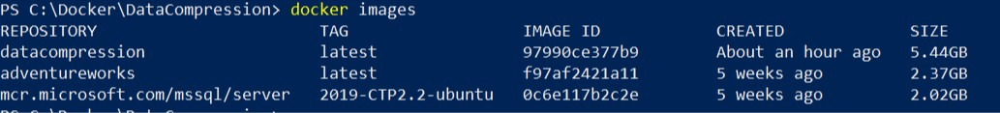

One of the things I want to spend more time exploring this year is containers, specifically SQL Server running in containers. While I’ve been preparing to give my data compression talk at SQL Saturday Cleveland, which is only two weeks away, and generally procrastinating from all other responsibilities, I decided I should change my demos from running against a VM on my laptop to running against a containerized instance of SQL Server.

First, a couple of blog shout outs. This idea had been in my mind for a little while after reading [a great post by Cathrine Wilhelmsen](https://www.cathrinewilhelmsen.net/2018/12/02/sql-server-2019-docker-container/) where she wrote about moving her demo environments to containers. I’ve also spent a decent amount of time reading [Andrew Pruski’s excellent container series](https://dbafromthecold.com/2017/03/15/summary-of-my-container-series/). These were the source for the majority of both my knowledge and confidence that I could pull this off.

## Demo environment setup

I use three databases in my data compression demos - first is a copy of AdventureWorks. On my VM I actually removed some of the tables I didn’t use to skinny it down a little. The second database I named ‘SalesOrderLarge’ and is just three copies of the SalesOrderDetail and SalesOrderHeader tables that have been enlarged using Jonathan Kehayias’ script. Finally, I have a ‘CompressTest’ database that is just an empty shell that I use to create one table in during the demos to show the internals of compression.

## Creating my Image

The first step in this process was to stop the SQL Server service in my VM and copy out the database files (mdf & ldf) to use in my container. I’ll save these into a folder on my laptop for now and then they’ll be copied into my image as it’s built.

I created the dockerfile below (following Andrew’s [example](https://dbafromthecold.com/2018/12/11/attaching-databases-via-a-dockerfile-update/)) that will be used to build an image for my datacompression containers. This image is based off the SQL Server 2019 CTP 2.2 image from Microsoft, then we’ll create a folder and copy in a script and the files for my three databases. The last line runs the script and starts SQL Server.

```bash
# start with the SQL 2019 CTP 2.2 image
FROM mcr.microsoft.com/mssql/server:2019-CTP2.2-ubuntu

# create a folder and copy in the attach-db script
RUN mkdir /var/opt/sqlserver
COPY attach-db.sh /var/opt/sqlserver

# copy in AdventureWorks database files
COPY DatabaseFiles/AdventureWorks2017.mdf /var/opt/sqlserver
COPY DatabaseFiles/AdventureWorks2017_log.ldf /var/opt/sqlserver

# copy in CompressTest database files
COPY DatabaseFiles/CompressTest.mdf /var/opt/sqlserver
COPY DatabaseFiles/CompressTest_log.ldf /var/opt/sqlserver

# copy in SalesOrderLarge database files
COPY DatabaseFiles/SalesOrderLarge.mdf /var/opt/sqlserver
COPY DatabaseFiles/SalesOrderLarge_log.ldf /var/opt/sqlserver

# attach databases and start SQL Server
ENTRYPOINT /var/opt/sqlserver/attach-db.sh & /opt/mssql/bin/sqlservr
```

The attach-db.sh script uses sqlcmd to execute three `CREATE DATABASE` commands to finish the setup of my environment and I end up with a folder structure as shown below. You don’t have to put the database files in a separate folder, I only did that for neatness.



Everything is setup so I’m ready to build my image. I’ll navigate to the DataCompression folder from my PowerShell console and run the `docker build` command:

```bash
cd C:\Docker\DataCompression\
docker build -t datacompression .
```

To check out my new image I’ll use `docker images`:



## Running my demo container

I used to have a ResetEnvironment script that I would use to make sure my VM was setup for the start of my demos. This allowed me to run through and practice my demos as many times as I wanted (read, a lot, probably too many). With containers I will just start up a new one, run through my demos, then remove it, easy as that.

Side note - I will run some activity against the AdventureWorks database once I start the container. This is needed to show the compression suggestions since these are partially based off index usage. I’ll probably still use some kind of script to start a container and run the load in preparation for the demos.

For now, I’ll just use the following to start up a container from my new datacompression image. The important parts of this code are firstly, setting `-p 1433:1433`, this maps the containers port 1433 to the host computers port. Secondly, we need to set two environmental variables, `ACCEPT_EULA=Y` to accept the end user licensing agreement and `SA_PASSWORD=’password’` to create the SA password for the instance. In this case the password needs to match what I have used in my `attach.sh` script otherwise when that runs it’ll throw a failed login error and we won’t have any databases created.

```bash
docker run -e ACCEPT_EULA=Y -e SA_PASSWORD=$SaPwd -p 1433:1433 -d datacompression
```

My plan is to use this setup for my demos at SQL Saturday Cleveland. It’s pretty cool that this works exactly the same in my VM running Windows Server 2016 and SQL Server 2016, or in a linux container running SQL Server 2019.

## Try it yourself

I'm going to write a few follow up posts that make use of this container so if you want to follow along or set up your own environment for tinkering you can pull it down from [docker hub](https://cloud.docker.com/repository/registry-1.docker.io/jpomfret7/datacompression).

```bash
docker pull jpomfret7/datacompression:demo
docker run -e ACCEPT_EULA=Y -e SA_PASSWORD=$SaPwd -p 1433:1433 -d jpomfret7/datacompression:demo
```
