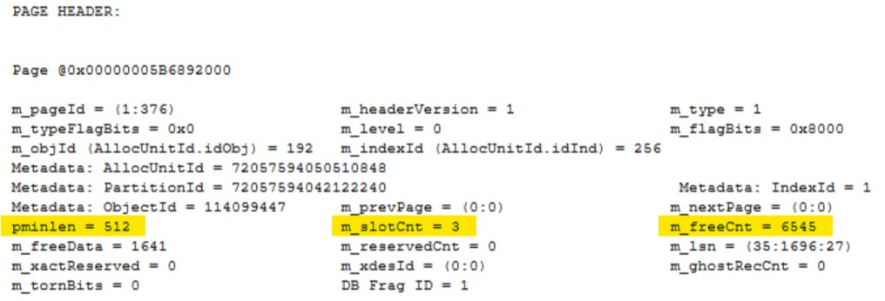
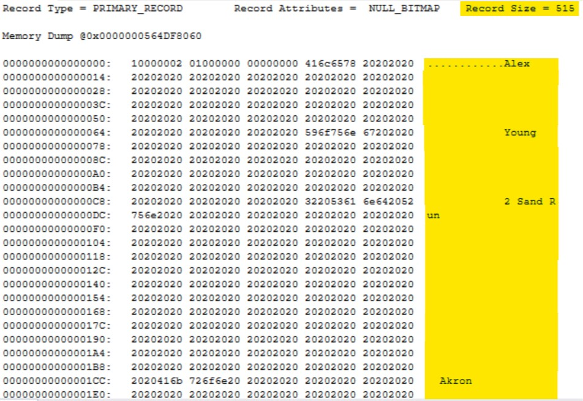
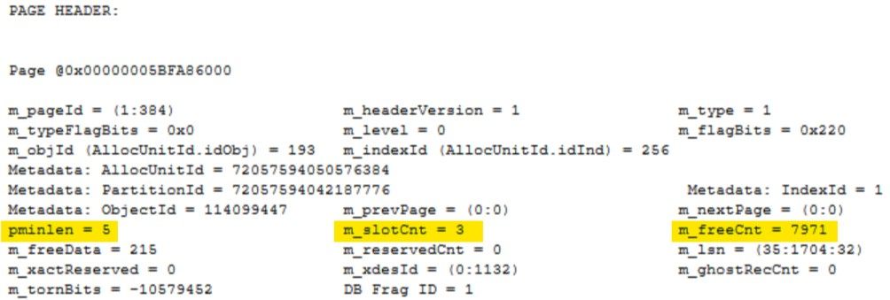
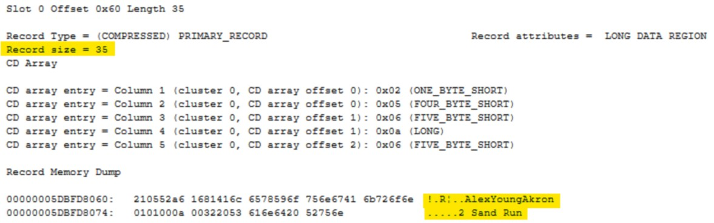
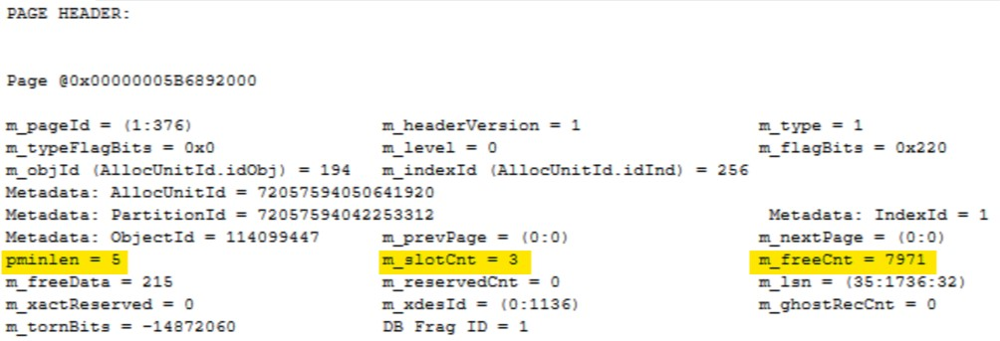
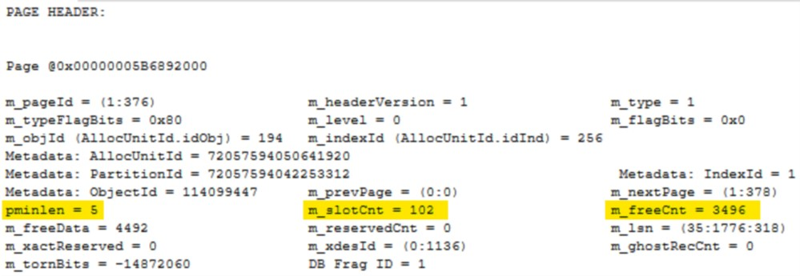
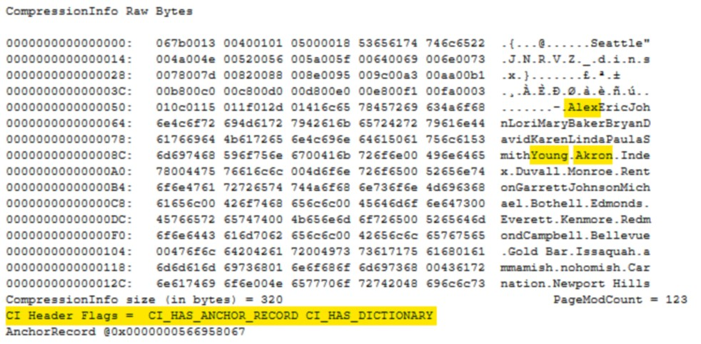
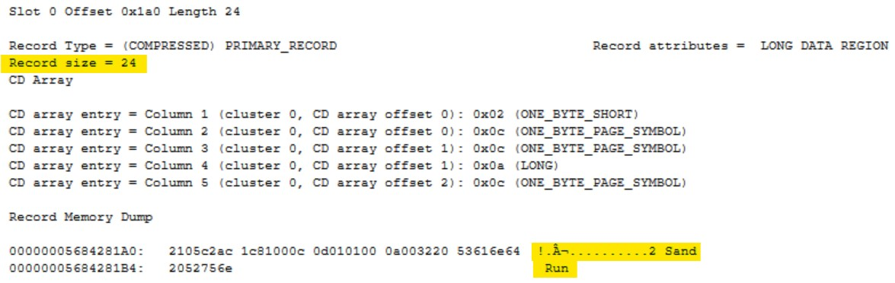

Last year I gave my first user group presentation on data compression and since then I’ve also given this talk at both SQL Saturday Columbus 2018 and SQL Saturday Cleveland 2019. One of my favourite demos from the presentation is taking a look under the covers to see what SQL Server does with compressed data at the page level. This blog post is going to walk through this demo.  If you’d like to follow along you can pull down my docker image and have your own environment up and running in no time. As long as you already have docker running on your machine you can use the following to get setup and the full demo script is available on [GitHub](https://github.com/jpomfret/demos/blob/master/DataCompression/01_Page_Internals.sql).

```bash
docker pull jpomfret7/datacompression:demo

docker run -e ACCEPT_EULA=Y -e SA_PASSWORD=$SaPwd -p 1433:1433 -d jpomfret7/datacompression:demo
```

I’m using an empty database to start this demo so you only really need my containerized environment for the end when we need to load some more sample data.

Within my empty database, named `CompressTest`, I first create a simple table named `employee` and insert three rows. A couple of important things to note on this table. Firstly, the datatypes I’ve chosen are all fixed length, and the values inserted leave a lot of empty space. Secondly, there are a few examples of repeating data, both in the name columns and the city.  These conditions make this table a great candidate for both row and page compression.

```sql
USE CompressTest
GO

CREATE TABLE employee (
employeeId bigint PRIMARY KEY,
firstName char(100),
lastName char(100),
address1 char(250),
city char(50)
)

INSERT INTO employee
values  (1, 'Alex','Young','2 Sand Run','Akron'),
        (2, 'Richard','Young','77 High St.','Akron'),
        (3, 'Alexis','Young','1 First Ave.','Richfield')
```

## Compression Level: None

Once we have our table created we need to use a couple of undocumented, but widely used commands to view the underlying page. Step one is to find the page that contains our data. We'll use `DBCC IND` for this and pass in our database and table name.

```sql
DBCC IND ('CompressTest', 'employee', 1);
```


The `employee` table has two types of pages shown here. The `PageType` of 1 is our data page and the one we are interested in today. Once we have our `PageFID (1)` and `PagePID (376)`, we’ll take these values and use them as parameters for `DBCC PAGE`.

We first need to switch on trace flag `3604`: this will write the output of our `DBCC PAGE` command to the messages tab instead of the event log.

There are 4 parameters for `DBCC PAGE`: we will need to pass in the database name (or id), the file number, the page id and the print option.  Using a print option of 0 will give us just the page header. In these examples I’m going to use option 3 which gives us more details on the rows stored on the page. For more information on using `DBCC PAGE` I’d recommend Paul Randal’s post "[How to use DBCC PAGE](https://blogs.msdn.microsoft.com/sqlserverstorageengine/2006/06/10/how-to-use-dbcc-page/)".

We will run the following to inspect our page:

```sql
DBCC TRACEON (3604);
GO
DBCC PAGE('CompressTest',1,376,3)
```

There is a lot of information returned. Before you get overwhelmed, we are only going to look at a few data points from this so we can show the changes as we apply compression.  If you are interested in learning more about page internals, another Paul Randal post worth checking out is "[Inside the Storage Engine: Anatomy of a page](https://www.sqlskills.com/blogs/paul/inside-the-storage-engine-anatomy-of-a-page/)".

From the output below we’ll note the following: the `pminlin` (the size of the fixed length data fields) is 512, the `m_slotCnt` (the number of records on the page) is 3, and finally the `m_freeCnt` (the number of free bytes on the page) is 6545.



Since we used option 3 for `DBCC PAGE` we can also scroll down and see the data on our pages. The first record is below and is currently 515 bytes, and you can see on the right there is a lot of unused space.



## Compression Level: Row

We’ll now take our employees table and apply `ROW` compression to the clustered index. This physically changes how the data is stored on the page.  Any fixed length datatypes will now be stored in variable length fields where the data only uses the minimum number of bytes needed.

```sql
ALTER TABLE employee REBUILD PARTITION = ALL
WITH (DATA_COMPRESSION = ROW)
```

When compression is applied the pages are rewritten to disk, we need to use `DBCC IND` to retrieve the new page information:

```sql
DBCC IND ('CompressTest', 'employee', 1);
```


We then use these values for `DBCC PAGE`. The trace flag we set earlier is good for the session, therefore if we’re in the same query window we don’t need to rerun that command.

```sql
DBCC PAGE('CompressTest',1,384,3)
```



Now that our table is ROW compressed you can see the `pminlength` is only 5, this is reduced from 512 when our table wasn’t compressed. You can also note `m_slotCnt` is still 3, which is expected, and the amount of free space on the page `m_freeCnt` has increased to 7971.

If we again scroll down to inspect our first row we can see it is now only 35 bytes and the highlighted area on the right clearly shows that the unused space within our row has been removed.



## Compression Level: Page

Our final type of compression is `PAGE` compression. This compresses the data using three steps:

1. Row compression: removing any wasted space from fixed length datatypes as we have already seen.
2. Prefix compression: the engine will look for repeating data at the start of each column on each page and store that once in the anchor record.  Each row will then store a pointer back to that anchor record which is stored within the compression information section of the page.
3. Dictionary compression: similar to prefix compression except the repeating data can be anywhere on the page instead of being restricted to the same column.

```sql
ALTER TABLE employee REBUILD PARTITION = ALL
WITH (DATA_COMPRESSION = PAGE
```

Running `DBCC IND` again will get us our newly written page:

```sql
DBCC IND ('CompressTest', 'employee', 1);
```


We’ll examine it with `DBCC PAGE`:

```sql
DBCC PAGE('CompressTest',1,376,3)
```



The interesting thing here is that nothing has changed, but if I check the DMVs the `employee` table shows as `PAGE` compressed.

```sql
Use CompressTest

SELECT
    schema_name(obj.SCHEMA_ID) as SchemaName,
    obj.name as TableName,
    ind.name as IndexName,
    ind.type_desc as IndexType,
    pas.row_count as NumberOfRows,
    pas.used_page_count as UsedPageCount,
    (pas.used_page_count \* 8)/1024 as SizeUsedMB,
    par.data_compression_desc as DataCompression,
    (pas.reserved_page_count \* 8)/1024 as SizeReservedMB
FROM sys.objects obj
INNER JOIN sys.indexes ind
    ON obj.object_id = ind.object_id
INNER JOIN sys.partitions par
    ON par.index_id = ind.index_id
    AND par.object_id = obj.object_id
INNER JOIN sys.dm_db_partition_stats pas
    ON pas.partition_id = par.partition_id
WHERE obj.schema_id <> 4
ORDER BY SizeUsedMB desc
```


SQL Server outsmarted us a little here. I have only inserted three rows into the employee table and we know after looking at the `DBCC PAGE` output that there is plenty of free space on this page.  SQL Server will only apply PAGE compression if it needs to as there is a higher CPU cost to use prefix and dictionary compression. If page compression isn’t going to save any pages the engine leaves the table with just `ROW` compression applied.

Running the following will insert 200 more rows into my employee table. I’m getting the data from the `vEmployee` view within `AdventureWorks2017`.

```sql
INSERT INTO employee (employeeId, firstName,lastName, address1, city)
SELECT TOP 200 BusinessEntityID, FirstName, LastName, AddressLine1, CITY
FROM AdventureWorks2017.HumanResources.vEmployee
WHERE BusinessEntityID > 3
```

Now when I run `DBCC IND` I can see the employee table uses four pages, two of them being data pages.

```sql
DBCC IND ('CompressTest', 'employee', 1);
```


Finally, we’ll look at `DBCC PAGE` to see page compression in action:

```sql
DBCC PAGE('CompressTest',1,376,3)
```



You can now see there are 102 rows on our page (`m_slotCnt`) and our fixed length data types are still 5 (`pminlen`). Directly after the page header is the compression information section. You can see on the right that repeating data values have been pulled out and stored here.  There are two possible `CI Header Flags` and they are both set here. `CI_HAS_ANCHOR_RECORD` shows that prefix compression has been used and `CI_HAS_DICTIONARY` shows that dictionary compression has been used.



If I scroll down a little further, I’ll come to the first row. The record is now only 24 bytes and you can see that a lot of the data has been replaced. The values `Alex`, `Young` and `Akron` all now reside in the compression information and this record just contains pointers.



## Summary

It’s easy to just apply compression to your databases and see massive space savings. This post hopes to shed a little light on what happens to your pages when using row and page compression. I recently gave this talk to the DBA Fundamentals virtual chapter so if you’d like to see the rest the recording is available on [YouTube](https://www.youtube.com/watch?v=F02NqGP2Gyg).
