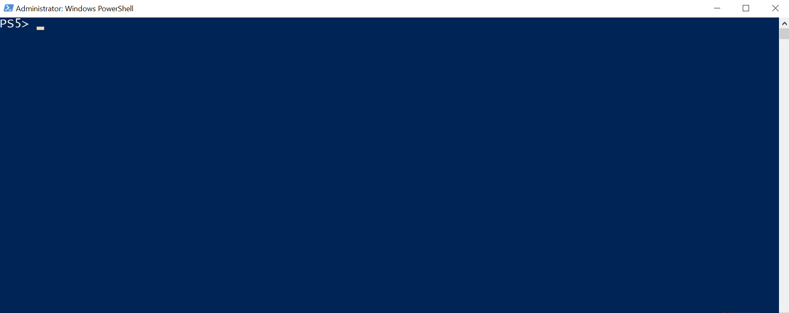
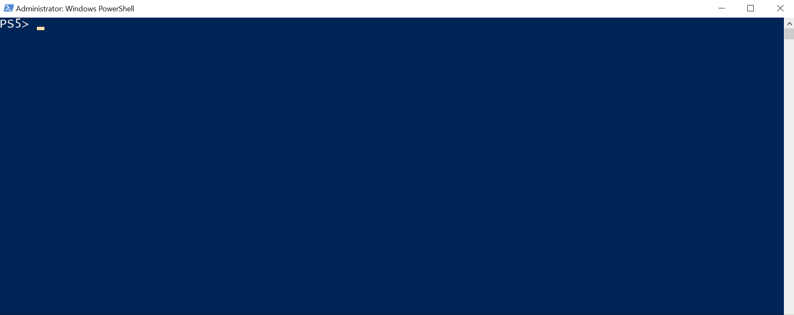
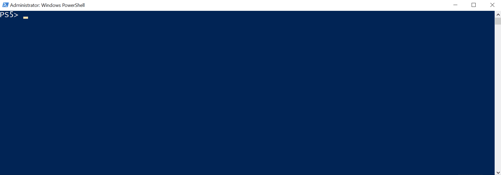
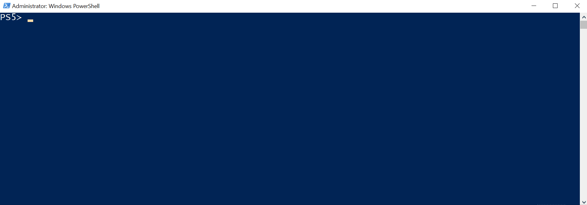

This weekend, while I was having a great time at SQL Saturday Cleveland, I ran into my friend Bert ([b](https://bertwagner.com/)|[t](https://twitter.com/bertwagner)). He had some dbatools questions, which I was happy to help him with.  Now that dbatools has over 500 commands, it is both awesome and terrifying.  Bert wanted to know how to automate his database backups and then check he was using the correct recovery model.

<!-- TODO youtube video timeout?  -->

## Backup your databases

Bert’s first question was how to automate his database backups. I showed him the `Backup-DbaDatabase` command and explained some of the parameters available.

First, we backed up all the databases on his instance:

```PowerShell
Backup-DbaDatabase -SqlInstance localhost\sql2017
```



We then looked at specifying a specific database to backup:

```PowerShell
Backup-DbaDatabase -SqlInstance localhost\sql2017 -Database ApplicationDatabase
```


This command will backup to the default backup location for your instance. If you want to override that you can use the `BackupDirectory` parameter:

```PowerShell
$backup = @{
  SqlInstance     = 'localhost'
  Database        = 'ApplicationDatabase'
  BackupDirectory = 'C:\backups\'
}
Backup-DbaDatabase @backup
```


The final options we looked at were two switches: `CompressBackup,`which will make use of backup compression, and `CopyOnly,` which will leave your LSN chain intact by taking a copy only backup.

```PowerShell
$backup = @{
  SqlInstance     = 'localhost'
  Database        = 'ApplicationDatabase'
  CompressBackup  = $true
  CopyOnly        = $true
}
Backup-DbaDatabase @backup
```



Once we had Bert’s databases all backed up and safe he realized he also needed to make sure the database recovery model was set correctly.

## Check Database Recovery Model

Bert wanted to make sure he was using the Full recovery model for his databases. We went about finding any that were in Simple with the following:

```PowerShell
Get-DbaDbRecoveryModel -SqlInstance localhost -RecoveryModel Simple
```



We also talked about running this command against multiple instances, either by using a central management server or from a text file:

```PowerShell
$model = @{
  SqlInstance   = $(Get-Content C:\servers.txt)
  RecoveryModel = 'Simple'
}
Get-DbaDbRecoveryModel @model
```

We found some databases in the simple recovery model that we wanted to change. This can easily be accomplished by piping the output of our get command into the set command:

```PowerShell
Get-DbaDbRecoveryModel -SqlInstance localhost -RecoveryModel Simple |
Set-DbaDbRecoveryModel -RecoveryMode Full
```


## Search dbatools Commands

The final tip I had for Bert was how to use `Find-DbaCommand` to help him find the commands he needed to complete his tasks.

A lot of the commands have tags, which is a good way to find anything relating to compression. For example:

```PowerShell
Find-DbaCommand -Tag Compression
```



You can also just specify keywords and the command will search for any reference of these within the inline command based help for all the commands.

```PowerShell
Find-DbaCommand triggers
```


## Summary

There are many more resources to get help with dbatools. Firstly, their website, [https://dbatools.io/](https://dbatools.io/), has a lot of great information on how to get started.

Secondly, the dbatools slack channel is always full of people who can lend a hand. You can get an invite here: [https://dbatools.io/slack/](https://dbatools.io/slack/).

Finally, feel free to get in contact with me if you have any questions or need some help finding the commands you need to get going with dbatools.
