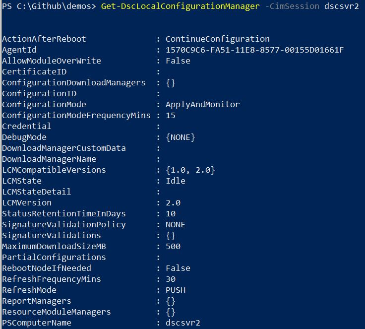

Once we have crafted the perfect configuration and shipped it out to our target nodes, it’s time for the magic to happen. The [MOF file that we created](https://jesspomfret.com/dsc-mof-files/) by executing our configuration is translated and enacted by the Local Configuration Manager (LCM) on each target node. The LCM is the engine of DSC and plays a vital role in managing our target nodes.

The LCM on each target node has many settings that can be configured using a meta configuration. This document is written very similarly to our regular DSC configurations and then pushed out to the target node.  I’m going to cover a few of the important LCM settings for use in `push` mode. This is where the LCM passively waits for a MOF file to arrive. The other option is `pull` mode- this is a little more complicated to set up and in this scenario the LCM is set to actively check in with a pull server for new configurations.

## Important LCM Settings

As mentioned we are going to look at a subset of LCM settings. A full list is available at books online “[Configuring the Local Configuration Manager](https://docs.microsoft.com/en-us/powershell/dsc/managing-nodes/metaconfig)”.

Setting | Definition|
--------|-----------|
ActionAfterReboot | What should happen after a reboot. ContinueConfiguration or StopConfiguration.|
CertificateID | Thumbprint of the certificate used to encrypt the MOF file. If this isn’t used passwords are stored in | plain text in the MOF.
ConfigurationMode | What the LCM does with the configuration document. This setting can be used to automatically keep your | node in the desired state. ApplyOnly, ApplyAndMonitor or ApplyAndAutoCorrect.
ConfigurationModeFrequencyMins | How often should the LCM check configurations and apply them. If the ConfigurationMode is | ApplyOnly this is ignored.
RebootNodeIfNeeded | If during the configuration a reboot is required should the node automatically reboot.|
RefreshMode | Does the LCM passively wait for configurations to be pushed to it (push), or actively check in with the pull | server for new configurations (pull).

## Configure the LCM

We are going to change a couple of the LCM settings by writing a meta configuration document, compiling it as a MOF and pushing it to our target node. The LCM on that target node will receive this MOF file and enact it to put the LCM into the desired state. To start with we can check out the available settings by using the `Get-DscLocalConfigurationManager` cmdlet.

```PowerShell
Get-DscLocalConfigurationManager -CimSession dscsvr2
```



We are going to change two settings in this example. First, I’m going to change the ConfigurationModeFrequencyMins to 20 minutes, instead of the default of 15.  Secondly, I will change the RebootNodeIfNeeded to true. This means if I push out a configuration that requires a reboot my node will automatically reboot.

```PowerShell
[DSCLocalConfigurationManager()]
configuration LCMConfig
{
    Node dscsvr2
    {
        Settings
        {
           ConfigurationModeFrequencyMins = 20
           RebootNodeIfNeeded = $true
        }
    }
}
```

I’ll then execute the `LCMConfig` configuration to generate a meta MOF file. You can see this is named with the target node name and then the extension is `.meta.mof`. For a regular configuration the file would just be named with the target node name and the extension of just `.mof`.

```PowerShell
LCMConfig -Output .\output\
```


We will then enact this configuration using `Set-DscLocalConfigurationManager`:

```PowerShell
Set-DscLocalConfigurationManager -Path .\output\ -ComputerName dscsvr2 -Verbose
```


Once this is complete we can check our settings using the following:

```PowerShell
Get-DscLocalConfigurationManager -CimSession dscsvr2  |
Select-Object ConfigurationModeFrequencyMins, RebootNodeIfNeeded
```


Now our LCM is in our defined desired state and we are ready to push out a configuration to set the desired state of our server.

## ApplyAndAutoCorrect

The LCM can also play an important role in keeping our servers in the desired state. If we changed the `ConfigurationMode` to `ApplyAndAutoCorrect` the LCM would check every 15 minutes (default value for `ConfigurationModeFrequencyMins`) to ensure the server was still in the desired state. If it found it was not, the LCM would reenact the current MOF to put the server back to desired state. This is a pretty powerful feature but one that definitely requires some thought. I can imagine a 3rd party vendor wouldn’t be too happy if they set something on installation and my DSC configuration reverted that automatically.
