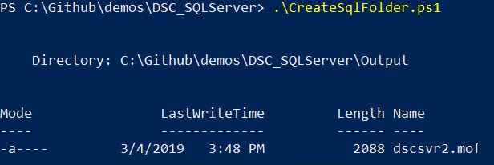
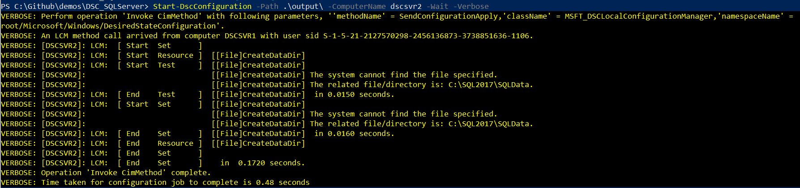
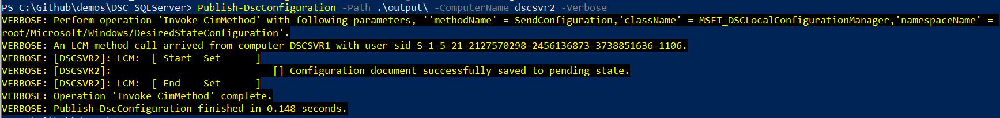
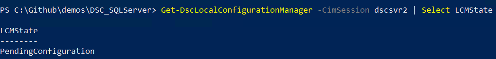
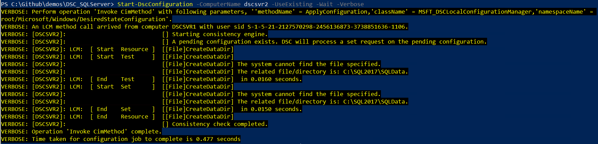

In my [last Desired State Configuration (DSC) post](https://jesspomfret.com/introduction-to-dsc/) a couple of weeks ago I covered some of the concepts involved with DSC, and I also have a [T-SQL Tuesday post](https://jesspomfret.com/t-sql-tuesday-110/) to get you started writing your first configuration. So today we are going to look at the next step in the process: what happens after we’ve written a configuration?

Here’s a quick recap on how to write a simple configuration. I’ve named this configuration `CreateSqlFolder`. I’m targeting the node `dscsvr2` and within that node block I’m using the `File` resource to define my desired state of having a directory `C:\SQL2017\SQLData` exist. With the final line of the script I’m calling the configuration and specifying where the output should land.

```PowerShell
Configuration CreateSqlFolder {

    Import-DscResource -ModuleName PSDesiredStateConfiguration

    Node dscsvr2 {
        File CreateDataDir {
            DestinationPath = 'C:\SQL2017\SQLData\'
            Ensure          = 'Present'
            Type            = 'Directory'
        }

    }
}

CreateSqlFolder -Output .\Output\
```

## Generate a MOF file

When I run this script I see the output in the screenshot below, a MOF file has been created in my output folder. Managed Object Format (MOF) files are used to describe Common Information Model (CIM) classes, these are industry standards which gives us flexibility in working with DSC. In DSC this is important as the MOF file is the artefact that will actually be used to configure our nodes. This MOF will be delivered to our target node and enacted by the Local Configuration Manager (LCM).

The LCM will be covered in more detail in a later post, but for now know that it can be configured to be in either ‘Push’ mode or ‘Pull’ mode.  Pull mode is more complicated to set up but perhaps more appropriate for managing a large number of servers.  For now, we will look at the ‘Push’ mode where we will deliver the MOF manually to the target node for the LCM to enact.



Executing configuration to create a MOF file for target node.

## Publish a MOF File

To get the MOF from my authoring station out to the target node I have a couple of options.  First, I can run `Start-DscConfiguration`. This will push out the MOF and immediately enact the configuration.  Using the `-wait` and `-verbose` switches we can see the output returned to our PowerShell console as the configuration is applied.

```PowerShell
Start-DscConfiguration -Path .\output\ -ComputerName dscsvr2 -Wait -Verbose
```

[](https://jesspomfret.com/wp-content/uploads/2019/03/startDscConfiguration.png)

If we want to push out the configuration but not immediately enact it we can use `Publish-DscConfiguration`. I again used the `-Verbose` switch to return output:

```PowerShell
Publish-DscConfiguration -Path .\output\ -ComputerName dscsvr2 -Verbose
```

[](https://jesspomfret.com/wp-content/uploads/2019/03/publishDscConfiguration.png)

You can see this in this screenshot it says ‘Configuration document successfully saved to pending state’, letting us know this is now ready for the LCM to enact. We can confirm our `PendingConfiguration` by running the following:

```PowerShell
Get-DscLocalConfigurationManager -CimSession dscsvr2 | Select LCMState
```

[](https://jesspomfret.com/wp-content/uploads/2019/03/getDscConfiguration.png)

To enact the pending configuration we would again use `Start-DscConfiguration`, only this time instead of specifying a path we’d add the `-UseExisting` switch.

[](https://jesspomfret.com/wp-content/uploads/2019/03/startDscConfiguration_useexisting.png)

It is important to note that if the LCM settings are currently set to the defaults this configuration will be automatically applied when the next consistency check runs within 15 mins.

Look for a post coming soon where we’ll look at the LCM in more detail and examine some of the settings we have to manage how it works within DSC.
