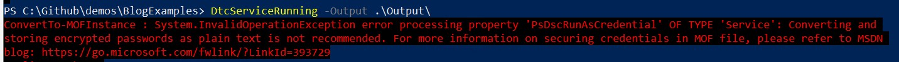
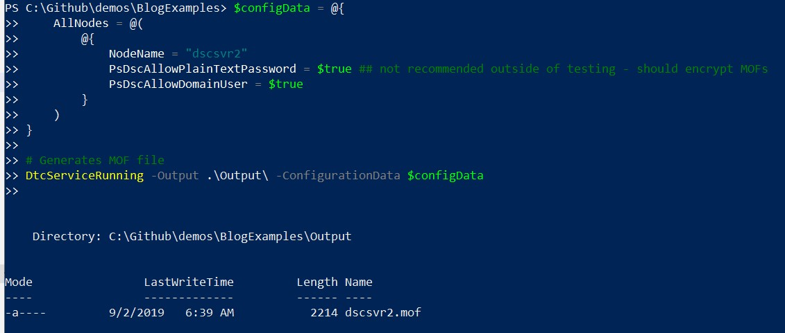
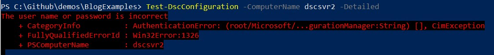
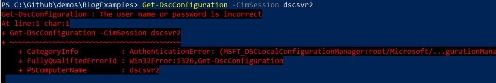
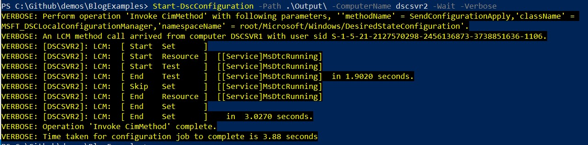
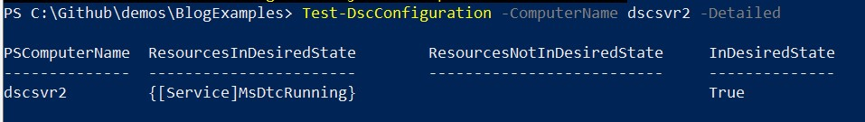

When you enact a configuration against a target node by default the process runs as the local system account.  For most of your DSC resources this is fine. However, if you need to access something like a file share, active directory or user registry settings, you might start to run into permission issues.  

DSC Resources have a built in property, `PSDscRunAsCredential`, that when configured changes the account that the resource will be executed under.

To use this you will use a `PSCredential` object in your resources as shown below. Note that this example doesn’t require the use of other credentials and would have had the required permissions as the local system account.

```PowerShell
$Cred = Get-Credential
Configuration DtcServiceRunning {

    Import-DscResource -ModuleName PSDesiredStateConfiguration

    Node 'dscsvr2' {
        Service MsDtcRunning {
            Name                 = 'MSDTC'
            Ensure               = 'Present'
            State                = 'Running'
            PsDscRunAsCredential = ($creds)
        }
    }
}
```

## Generates MOF file

```PowerShell
DtcServiceRunning -Output .\\Output\\
```

When you use credentials in your configurations there are a couple of gotchas- we’ll talk through these next.

### Warning 1: Plain Text Passwords

Although it feels like you are handling the credential securely, when you run the code above you will get an error explaining that storing passwords in plain text is a bad idea.



When you run your configuration, `DtcServiceRunning` in my example, a MOF file is generated and with our current setup the passwords will be stored in plain text (you can read more about generating [MOF files here](https://jesspomfret.com/dsc-mof-files/)).

The correct way to handle this issue is to generate a certificate and use that to encrypt the MOF file, a topic I will blog about one day soon. To skirt around this issue in test we can add a configuration property that basically forces us to accept we know this is a bad idea, but we’re going for it anyway.

```PowerShell
$configData = @{
  AllNodes = @(
      @{
          NodeName = "dscsvr2"
            PsDscAllowPlainTextPassword = $true
            PsDscAllowDomainUser = $true
      }
  )
}
DtcServiceRunning -Output .\\Output\\ -ConfigurationData $configData
```

Once we run this we’ll see our MOF file has been successfully generated.



### Warning 2: Changing the password used in a MOF file

Once you push your MOF file out to the target node and it is enacted, the MOF remains on the target node in a designated folder and is named `current.mof`. The credentials, including the password (hopefully encrypted by a certificate!), are within the file.

You can run a couple of commands to check your current configuration that compare the desired state, defined in the `current.mof` file, to the nodes current state.

If the password you used for the `PsDscRunAsCredentials` property has changed since the MOF file was enacted you’ll get the following errors when you try and run `Get-DscConfiguration` or `Test-DscConfiguration`.





```text
The user name or password is incorrect.
```

To fix this you must rerun your configuration, which will in turn generate a new MOF file that contains the new password. Once this MOF file has been generated you’ll push it out to your target node.



Now that the MOF file contains the new password you are able to check in on your current configuration again.



This wasn’t something I thought about before I used `PsDscRunAsCredential` on all the resources in my configuration.  A while later I went to check on my target nodes and realized I couldn’t without pushing out a new MOF file. After some discussion in the DSC Slack channel around this, the recommended approach is to only use `PsDscRunAsCredential` if necessary, and to be aware of the requirement to generate a new MOF file once you change the password.
