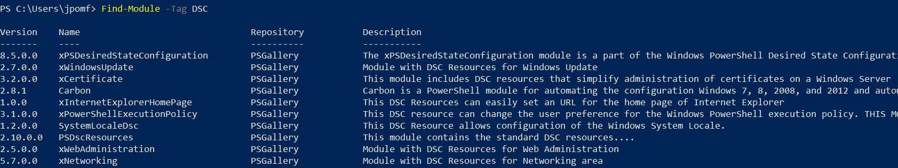
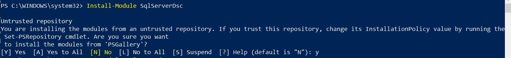

A critical part of our DSC configuration is made up of resources. These are the building blocks we need to to define our desired state.  There are two kinds of resources that we can use: class based and MOF based (most common). We are going to focus our efforts today on looking at MOF based resources.

Resources come packaged up as modules and our servers, which use at least WMF 4.0, come with several built-in. We have two main options for additional resources; we can find DSC resource modules in the PowerShell Gallery or we can write our own.

## Finding DSC Resources

To find existing resources we have a few options. We could navigate to the [PowerShell Gallery](https://www.powershellgallery.com/packages?q=Tags%3A%22DSC%22) website and browse through the modules with the ‘DSC’ tag. We could also use PowerShell by using the `Find-Module` command and the `-Tag` parameter to match our results from the PowerShell Gallery.

```PowerShell
Find-Module -Tag DSC
```



Our second option using PowerShell is to use `Find-DscResource`. This cmdlet finds specific resources that are contained in modules. Running a count against that right now (4/1/2019) would return 1,413 resources that are available to configure our environment. Using the `-Filter` parameter you can search for a keyword throughout the names, descriptions and tags of all these resources.

## Installing Resources

If you find a DSC Resource you want to use in your configurations, for example to install SQL Server we will want to use SqlSetup from the SqlServerDsc module, you can install the module as you would a regular PowerShell module. For example, using `Install-Module`.



Once the module is installed you can use these resources in your configurations. One thing to remember is the resources need to be available on both your authoring station and your target node.

## Five Useful Resources

To wrap up I’m going to look at five resources I’ve used in my configurations to give you an idea of what is available.

### File

The `File` resource is one of the built-in resources and is useful for creating files and folders. For my SQL Servers I use it to create separate folders for the data, log, and tempdb files. Another use case would be to create a file and, by using the `contents` property, we could even add data to it.

### Firewall

Part of the `NetworkingDsc` module, the `Firewall` resource can be used to configure firewall rules on your target node. This is useful when installing SQL Server so you can open up access remotely. There is also a `SqlWindowsFirewall` resource that will accomplish this task, but has less properties to configure. However, depending on your preferred setup, this may suffice.

### SqlSetup

`SqlSetup` is the resource that installs SQL Server. Included in the `SqlServerDsc` module there are many properties available to configure the installation just right.

### Script

One of the most flexible resources is the `Script`. This is also a built in resource and gives you the ability to code any PowerShell script into a simple resource. You basically write three mini functions: one that gets the current state, one that tests if it’s in the desired state, and finally one to ‘make it so’.

### [SqlAgentOperator](https://github.com/PowerShell/SqlServerDsc#sqlagentoperator)

The final resource I’ve picked is part of the `SqlServerDsc` module and allows you to create a SQL Agent operator. This is useful if you like to send alerts or notifications from your SQL Servers. The reason I picked this resource is that I wrote it. One of the best parts of DSC is that most of the modules are open source and available on Github. If there is a resource missing that you’d find useful, you are encouraged to write it and submit it to the Microsoft repos. That’s pretty cool if you ask me.
