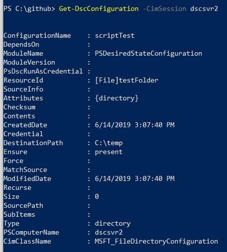
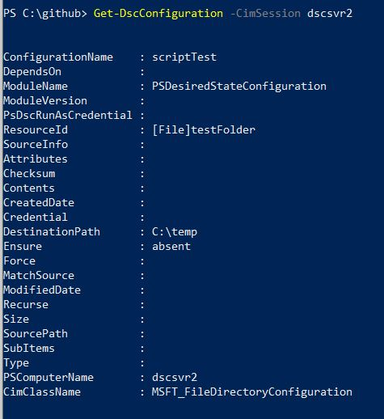
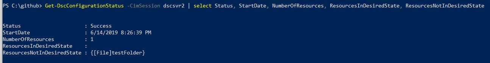
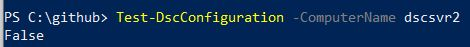
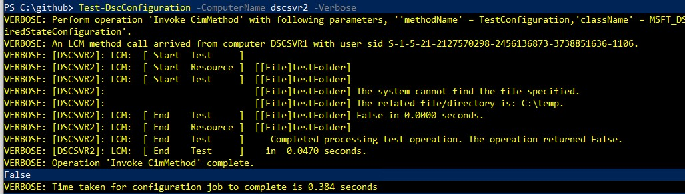
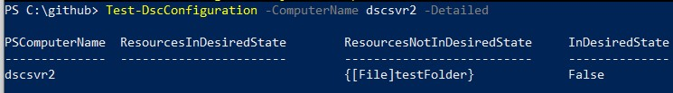
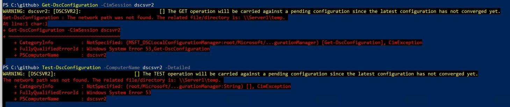
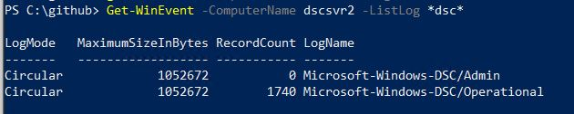
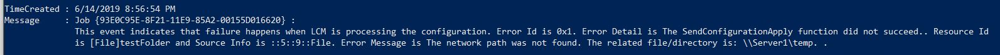

One of the biggest obstacles people face when using DSC is the troubleshooting and reporting pieces. There are options here to integrate with third party tools to create a more polished enterprise solution, but if you’re going with just straight DSC you might feel it is lacking some in this area.

We do however have several tools available to troubleshoot issues with configurations or to monitor our nodes to determine whether they are still in the desired state. I’m specifically going to look at the options available if you’re using DSC in the Push refresh mode. If you are using DSC in pull mode with a web server or if you’re using Azure Automation you have some other options available. You can configure the Local Configuration Manager (LCM) to send reports to the pull server. These reports are stored in a database on the server and can be accessed by calling the web service. Perhaps the topic of another blog post.

The options we’ll look at today are the functions available within the `PSDesiredStateConfiguration` module, and the DSC Windows event logs.

## PSDesiredStateConfiguration Functions

We should be fairly familiar with this module as it comes built in with WMF 4.0+ and contains several base resources as well as functions to manage and use DSC.

In order for us to explore these commands we need to have a target node with an active configuration. I pushed out a simple configuration that will ensure the directory `c:\temp` exists on the target node. The configuration was successful and the folder was created.

First up we have `Get-DscConfiguration`. The command based help for this function says it will get “the current configuration of the nodes.” When I run this against my target node it returns details about the file resource I used to create the `C:\temp` directory and notes that `Ensure` is `Present`. This is as I would expect.



If I manually delete the `C:\Temp` folder, the node is no longer in the desired state. When I rerun `Get-DscConfiguration` it shows the folder is absent, which is not the behaviour I expected from the help. I was expecting to get the current configuration that had been pushed out to the node. It seems that this function returns the resources included in the configuration and their current state. It does not however indicate if this is the desired state.



The next function available is `Get-DscConfigurationStatus` The description of this function states it will retrieve “detailed information about completed configuration runs on the system.”   If we run that with just the `-CimSession` parameter to connect to our node we get some useful information about the last run.

However, there is a lot of information available from this function that is not within the default columns returned. If we look into the output further we can in fact see whether resources are in the desired state or not.  



During my testing using `Get-DscConfigurationStatus` it did not always accurately report when there were resources not in the desired state. Therefore I wouldn’t rely on it for reporting, I would instead look at our third option below.

The third and final function I’ll highlight from this module is `Test-DscConfiguration`. The comment based help for this one states it “tests whether the actual configuration on the nodes matches the desired configuration.”

Just running this with the target node as the `-ComputerName` parameter does not provide much information. It returns `False` telling us it is not in the desired state, but doesn’t explain why.



Running with the `-Verbose` switch goes into details. It returns the same verbose output you would get from running the configuration in the first place. However, reading through the output of a large configuration file with many resources could get time consuming and it would be easy to miss resources not in their desired state. 



Finally, we can use the `-Detailed` parameter which will return a PowerShell object with exactly the information we’re looking for.  This object gives us more options on how to use this information. For example, we can return whether it is in the desired state and a list of resources not in the desired state is available.



This gives us some good information if our configuration was successful, but what happens if we’re troubleshooting a failed configuration? Running both `Get-DscConfiguration` and `Test-DscConfiguration` state they will run against a pending configuration and both return the error that the network path wasn’t found.  No information is returned on which resource threw this error. If you have a large, complicated configuration it would be nice to receive a little more guidance on where to look next. Hint, it’s the event logs.



## Windows Event Logs

The next step in the troubleshooting handbook is to head to the windows event logs.  DSC has four event logs, but only two are enabled by default, and it doesn’t seem like much gets written to the Admin log.

Running the following will show you the enabled logs and the number of records:

```PowerShell
Get-WinEvent -ComputerName dscsvr2 -ListLog *dsc*
```



Looking in the Operational log you can find the error and the related resource:

```PowerShell
Get-WinEvent -ComputerName dscsvr2 -LogName Microsoft-Windows-DSC/Operational -MaxEvents 10  |
Select-Object TimeCreated, Message |
Format-List
```



The event log also points to a json file that contains more detailed logging, this matches what would be returned if you ran the `Start-DscConfiguration` with the `-Verbose` and `-Wait` switches.

```Text
Message     : Job {93E0C95E-8F21-11E9-85A2-00155D016620} : Details logging completed for C:\Windows\system32\configuration\ConfigurationStatus\{93E0C95E-8F21-11E9-85A2-00155D016620}-0.details.json.
```

If more detail is needed you can enable the debug and analytic logs for DSC and rerun the configuration. The analytic logs will contain a lot more messages that will help you get to the bottom of why your configuration failed.
