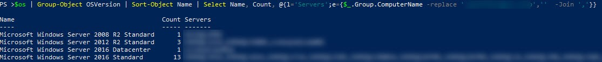
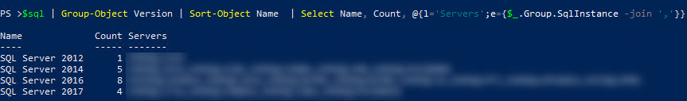

There have been a lot of blog posts and talk around upgrading your servers in the past. However, the chatter always seems to intensify when we start getting close to that dreaded ‘end of support’ date for your older Windows and SQL Server versions.  I hope this isn’t the first place you are discovering this, but July 9th 2019 marks the end of support for both SQL Server 2008 and 2008R2, closely followed on January 14th 2020 with the end of support for Windows Server 2008 and 2008R2.

With these dates on the horizon it’s a good time to look at our estate and make sure we have a good understanding of the versions we currently support. I’m going to show you how to do that easily with a couple of [dbatools](https://dbatools.io/) functions. Then, bonus content, I’ll show you how to present it for your managers with one of my other favourite PowerShell modules [ImportExcel](https://github.com/dfinke/ImportExcel).

First things first, I need an object that contains our servers.  At my work we use a central management server to keep track of servers, but you could just as easily pull server names in from a text file, or a database.

$servers = Get-DbaCmsRegServer -SqlInstance CmsServerName

Let’s first look at what operating systems we are running. The dbatools function we need for this is `Get-DbaOperatingSystem`. I’ll use the name property of my `$servers` object to get the OS information for all my servers and save it to a variable.

```PowerShell
$os = Get-DbaOperatingSystem -ComputerName $servers.name
```

I chose to save the results to a variable for this since I’m going to examine the results using PowerShell and then also output them to Excel, saving me from having to gather the information from each server multiple times. If I only planned on looking at the results on screen I could instead have just piped the `Get-DbaOperationSystem` results straight into `Group-Object`.

Using `Group-Object` I can quickly see how many servers I have for each versions of windows, and how many I have going out of support in the near future.

```PowerShell
$os | Group-Object OSVersion |
Sort-Object Name |
Select-Object Name, Count, @{l='Servers';e={$\_.Group.ComputerName -Replace '.domain.name,''  -Join ','}}
```

I have used the -Replace option in my `Select-Object` to remove the domain name from the output and instead only return the server name.

[](https://jesspomfret.com/wp-content/uploads/2019/05/os-2.jpg)

We can do the same with `Get-DbaProductKey` to get the SQL version information.

$sql = Get-DbaProductKey -ComputerName $servers.name
$sql | Group-Object Version |
Sort-Object Name  |
Select Name, Count, @{l='Servers';e={$\_.Group.SqlInstance -join ','}}

[](https://jesspomfret.com/wp-content/uploads/2019/05/sql.jpg)

With just 5 lines of code we can review our entire estate and make sure we know what we have nearing the end of support. This is pretty useful information, and also a good thing to export into a pretty spreadsheet and share with your team or management. Enter [ImportExcel](https://github.com/dfinke/ImportExcel).

If you haven’t used this module before, prepare to have your mind blown. Doug Finke has crafted some PowerShell magic to enable you to both import from and export to Excel, using PowerShell, without needing Excel installed even.

The full code is below. We’ve already done the work of gathering our data so if you are following along skip the first 3 lines below.

I’ve separated out the properties I want to select and will therefore end up in my spreadsheet. I’ve also used [splatting](https://dbatools.io/splat/) to make the call to `Export-Excel` easier to read.

<script src="https://gist.github.com/jpomfret/3e3449146f0d72fba9654ac09472cc0f.js"></script>

The important part of this script is the parameters used for the `Export-Excel` call so I’ll go through them here:

\[table id=7 /\]


There you have it, a simple script to get the current OS and SQL versions you are running with a good looking Excel sheet as the output. Hope you don’t find too many instances out there nearing the end of support.
