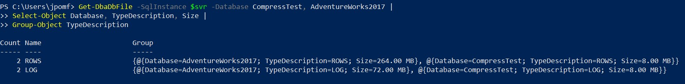
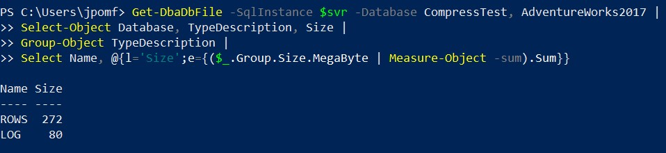

As a SQL Server DBA, aggregating data is first nature.  I can easily throw together some T-SQL if I need to get the average sales per product group, or perhaps the number of employees hired per month. Yesterday I was writing a little PowerShell when I came across a problem. I needed to get the size of my database data and log files for several databases on a server, when I realized I didn’t know how to group and sum this data in PowerShell.

[dbatools](http://dbatools.io) has the `Get-DbaDbFile` command, which easily allowed me to collect information about the databases I needed.

```PowerShell
Get-DbaDbFile -SqlInstance $svr -Database CompressTest, AdventureWorks2017
```

Once I had this data, I wanted to group by the type of file and get the total size.  To start I piped the output to `Select-Object` to trim down the fields in the result set, then piped this output to the `Group-Object`, specifying the field I wanted to group by.

```PowerShell
Get-DbaDbFile -SqlInstance $svr -Database CompressTest, AdventureWorks2017 |
Select-Object Database, TypeDescription, Size |
Group-Object TypeDescription
```



Now that the data is grouped you can aggregate the size property for the files, which is within the `Group`.  We’ll add an expression to the final `Select-Object` which uses the `Measure-Object` to sum the sizes.

```PowerShell
Get-DbaDbFile -SqlInstance $svr -Database CompressTest, AdventureWorks2017 |
Select-Object Database, TypeDescription, Size |
Group-Object TypeDescription |
Select-Object Name, @{l='Size';e={($_.Group.Size.MegaByte | Measure-Object -Sum).Sum}}
```



Another interesting note here is that since dbatools returns the Size as a special type, `Sqlcollaborative.Dbatools.Utility.Size`, you can specify that you want it to be returned in MBs.  If you have very small databases you might want to change that so you don’t lose accuracy with any rounding.

The code for the examples in this post was run against a Docker Container I use for demos. You can read more information on getting that set up in my post [Data Compression Demos in Containers](https://jesspomfret.com/data-compression-containers/).
