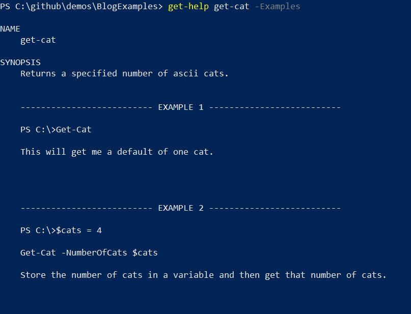
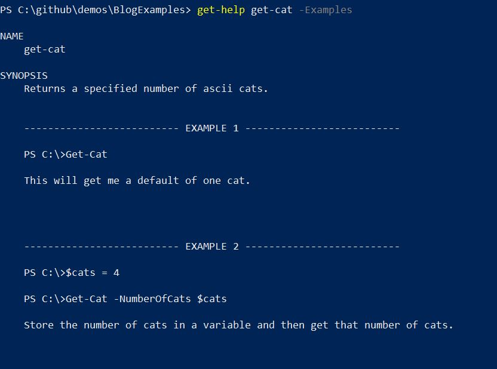
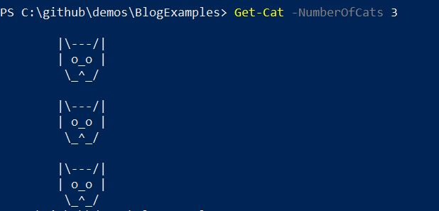

One of the reasons I love PowerShell is the comment based help. This allows you to easily get documentation for functions directly within your PowerShell session. By using `Get-Help` for a function you can retrieve a description, information on the parameters, and examples of how to use the function.

Recently I was adding help to a function  and wanted to add two lines of code to my example. Usually the syntax for an example looks like this:

```PowerShell
.EXAMPLE
Get-Cat

This will get me a default of one cat.
```

The first line under `.EXAMPLE` will be formatted with a PowerShell prompt in front to show it is code. The second line is a description of the example.

If I want to add two lines of code, and I used the following, it would only display the first line with a prompt as shown in the screenshot below.

```PowerShell
.EXAMPLE
$cats = 4
Get-Cat -NumberOfCats $cats

Store the number of cats in a variable and then get that number of cats.
```



You can see above the first example looks good, however in the second example the first two lines should both have a prompt to show they are code. I spent a little while Googling this without much avail. I then figured, somewhere within [dbatools](http://dbatools.io) there must be an example with two lines of code. Sure enough I found my answer, and it’s pretty straightforward. You just add the prompt to the code yourself and then when the example is displayed it is formatted properly.

I changed my examples to the following and you can see now they display as expected.

```PowerShell
.EXAMPLE
PS C:\>Get-Cat

This will get me a default of one cat.

.EXAMPLE
PS C:\>$cats = 4
PS C:\>Get-Cat -NumberOfCats $cats

Store the number of cats in a variable and then get that number of cats.
```



I know you’re all dying to see the result of my `Get-Cat` function so here you go. If you need to add this to your PowerShell profile etc. so you can quickly brighten any day, the code is on my [github](https://github.com/jpomfret/demos/blob/master/BlogExamples/02_CommentBasedHelp_Examples.ps1).


