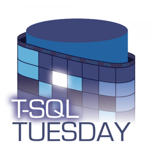

It’s T-SQL Tuesday again and thanks goes this week to our host Andy Leonard ([b](https://andyleonard.blog)|[t](https://twitter.com/AndyLeonard)). Andy has picked a great topic on why we do the things we do. With our hectic lives it’s good sometimes to sit down and have a think about something like this.  I’ve split my ‘what I do’ up into three buckets that, although are separate, have a lot of common ‘whys’.

### Database Administrator

I have been a SQL Server DBA since 2011, and it was kind of an accident.  I graduated from The University of Akron with an undergraduate degree in Information Systems and a Masters in Business Administration, and marched off into the real world to find the perfect job.  I had many interviews for all kinds of IT related positions and although I thought most of them went well and would provide a good first job for me, the folks on the other side of the table didn’t seem to agree. Part of this was I required a visa to work in the US. It was always going to be challenging to convince someone to take a chance on a new graduate and then spend a lot of money and effort to file paperwork.

I was about a week or two away from having to leave the country as my current visa was expiring, when I got a job offer as a SQL Server DBA.  I had gone on this interview without much hope. I didn’t feel like I was qualified, and although I enjoyed my databases classes in college I had very little experience actually doing this kind of work (I’d worked as a grad assistant CMS web admin for the past two years).

The first few weeks of this position were rough. I still remember one of the first days, I was being trained to handle simple change requests (adding permissions, changing agent jobs, creating tables etc.), my colleague told me to right click on a particular job and select properties so we could change the schedule.  I had zero idea how to even find the job in management studio. I just looked at him blankly as he had to walk me through expanding ‘SQL Server Agent’ and then ‘Jobs’.

One thing I’m pretty proud of is I work hard at learning and growing. I like to know how things work and why, and although I was well out of my depth to start with I managed to gain a lot of knowledge in this role.  I got more comfortable handling change requests and eventually got to the point where I could get through a two week on call rotation without having to wake up the senior DBA, even when our reasonably complicated replication setup caught fire in the middle of the night for no reason.

After four years I moved companies to my current role, still working as a SQL Server DBA.  It’s been over 8 years since that first day, and I still love what I do.  I think the main reason is that the learning never stops.  There is always new challenges to attack, new ideas to test out, and with that comes so many opportunities.

### Crossfitter

[CrossFit](https://www.crossfit.com/), for those of you that don’t know, is a workout regime consisting of “constantly varied high-intensity functional movements”. It combines cardio, weightlifting and gymnastics into a workout that will leave you led on the floor wondering why it was so hard. In my opinion though the beauty of CrossFit is what happens around the workout. You end up with a random group of people all struggling through the workout of the day (WOD) together, cheering each other on and then reminiscing about how they made it through.  It’s not at all unlike team sports, and that’s why when I found CrossFit it filled a huge void.

I played soccer (proper football) for the first 23 years of my life. I’m pretty sure as soon as I could walk I had a football at my feet.  When my senior season of college was over in 2009 I stopped playing and I stopped working out. I didn’t stop eating like an athlete though – bring on the weight gain!  Once I started CrossFit I found the same things I’d loved about football - a group of people all working towards the same goals coupled with the challenge of trying to constantly improve at something.

CrossFit never seems to get any easier and I think that’s why I love it. I recently had a memory pop up on Facebook that 7 years ago I had got my first handstand pushup.  These days I can (not going to say easily) get 50 in a workout, but now I’m working towards being able to walk on my hands.  The challenges never end.  Whenever I reach a goal, there is always the next one. Can I lift more weight, can I do that workout faster, can I catch my wife (no is the answer here…). These challenges, and the amazing community at my gym, are why I’ll keep on Crossfitting.

### Community Collaborator

At some point in 2018 I decided it was time. Time to stop being a lurker and to give something back to the amazing SQL Server and PowerShell communities. I started this blog, actually with a [T-SQL Tuesday post](https://jesspomfret.com/t-sql-tuesday-99/), and I signed up to present at my local user group in Cleveland.  I’ve mentioned this before, but this was way out of my comfort zone. The thought of standing in front of people and sharing what I think I know is terrifying. However, it has also turned out to be an amazing experience so far.

When I started out as a DBA, remember - knowing almost nothing, I leaned heavily on the community. I signed up for newsletters and RSS feeds, trying to read as much as I could.  I also attended our user group meetings and some nearby SQL Saturdays and although I was terrible at the networking portion of the events, I got a lot of great tips from the sessions.

This past weekend I presented at SQL Saturday Cleveland. This was my second SQL Saturday as a speaker and I still can’t believe how much I loved it.  The whole day I was on a high. I gave my session at 8:30am and it went pretty well. I attended a few great sessions, had lunch with some amazing friends and even recorded a [video with Bert](https://www.youtube.com/watch?v=9Zk3R7_Pr-U) for his famous YouTube channel.  I got to work on Monday and had a notification from LinkedIn that I had a message. Someone had taken the time to write and let me know they’d enjoyed my session and that it had been useful.  This made my day, and made me realize I’m actually giving something back.  I still have a long way to go but I’m definitely making steps in the right direction.

### Summary

Throughout the three parts of my life I’ve talked about there have been a few common themes.  I love a good challenge - from standing in front of a room of peers and giving a presentation to trying to walk on my hands, these targets that are just out of reach provide a lot of motivation to me.  What goes hand in hand with this is my desire to keep learning and growing. The DBA landscape is never going to stay still or constant, and with that there are forever going to be opportunities for me to evolve as a data professional.  That’s pretty exciting, and that’s why I do what I do.
