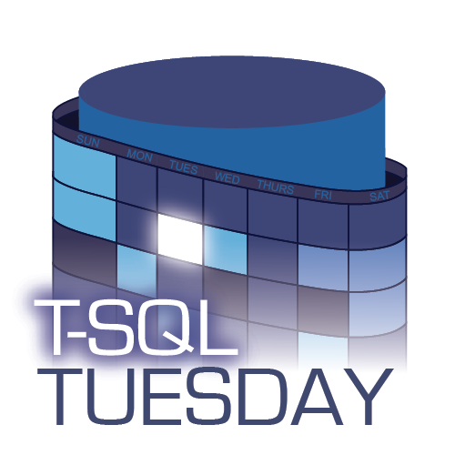

This month’s T-SQL Tuesday is all about [Memory Optimized Tables](https://docs.microsoft.com/en-us/sql/relational-databases/in-memory-oltp/overview-and-usage-scenarios?view=sql-server-2017) (MOT), a topic I will admit I know almost nothing about. When they first came out in 2014 I was excited about the new technology and the options that would bring, however I never found a good reason to implement them.

Thanks to Steve Jones ([b](https://voiceofthedba.com)|[t](https://twitter.com/way0utwest)) for hosting this month’s edition and after reading about MOT this week I’m looking forward to learning how people are using them.

I’ve heard many times in the technology world that the third release of a software or new feature is the best time to adopt it.  Reading about MOT, it seems like this theory fits here also. 

When Hekaton, as it was known then, was released with SQL Server 2014 there were a lot of restrictions.  With the subsequent releases, presumably guided by feedback, some of these restrictions have been lifted.  I’ve picked a couple to discuss here that I think could have a big impact on adoption rates.

### Schema Changes

In 2014 schema changes were not supported. This meant you couldn’t ALTER a Memory Optimized Table or a natively compiled stored procedure, instead you had to DROP and recreate the object.  This isn’t a huge concern for stored procedures. The main issue here would be losing any object level permissions that had been set.

With Memory Optimized Tables however, this means you need to make sure you handle the data within that table. There are ways around this obviously. You could copy it off into a staging table, drop and recreate your table and then re-insert the data.  This does however add some complexity to managing your environment, and I could see this putting some people off.

With the 2016 release ALTER TABLE and ALTER PROCEDURE support was introduced, effectively removing this barrier to use.  A further enhancement, the ability to use sp\_rename, was then introduced with the 2017 release.

Although there are still some restrictions on schema changes, including no extended properties, they are minimal compared to what was available in the 2014 release.

### Foreign Keys

Another huge missing piece when this technology was introduced in 2014 was foreign key support.  My understanding was that this technology could be (reasonably) easily swapped in to help with I/O and contention bottlenecks in your current SQL Server environment. This idea becomes less of a possibility when you realize this lack of support. Most well designed databases use foreign keys to enforce referential integrity, so having to remove those in order to use In-Memory technology seems like an unlikely ask.

Again, with 2016 we saw this barrier removed. Not only was foreign key support introduced, so too was the ability to use UNIQUE and CHECK constraints on Memory Optimized Tables.  This will make it much easier to take existing SQL Server workloads and move some key tables into memory.

Although not directly related to foreign keys, 2017 saw the previous restriction of having a maximum of 8 indexes per Memory Optimized Table lifted. This gives you more freedom to add unique indexes and to index foreign key columns.

### Summary

To wrap this up, although I haven’t myself used Memory Optimized Tables, it does seem like the barriers to use have been significantly reduced in the last two releases of SQL Server (2016, 2017).  This technology has now had time to mature and grow in features, hopefully now it’ll be easier to find a good use case for implementation.
