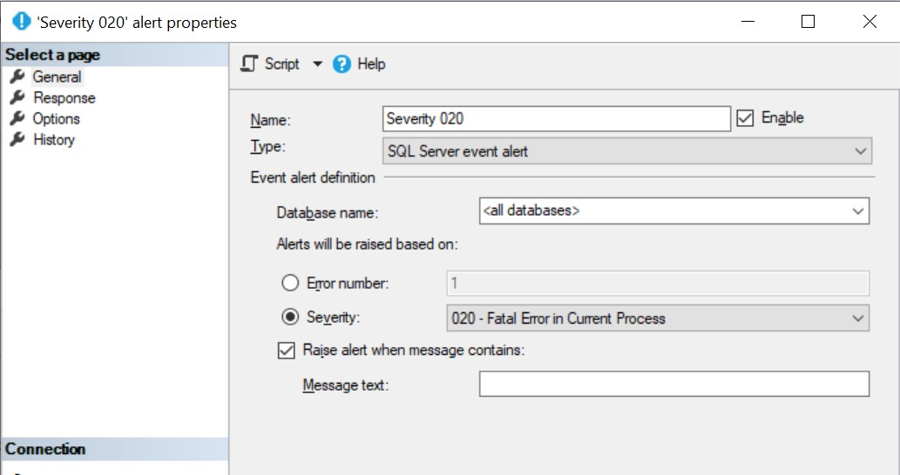

[](https://www.kevinrchant.com/2019/09/03/t-sql-tuesday-118-your-fantasy-sql-feature/)

This month our T-SQL Tuesday host, Kevin Chant ([b](https://www.kevinrchant.com)|[t](https://twitter.com/kevchant)), has challenged us to propose a new fantasy feature for SQL Server. Firstly, thanks to Kevin for hosting this month’s blog party.

When I first read the invitation I didn’t have any ideas jump straight into my mind. Since then, I’ve come up with two. I’m going to share both since they are for different areas… cheating I know ?.

## LIKEIN Operator

First up, I am proposing the introduction of the `LIKEIN` operator for T-SQL queries. It would be useful to be able to combine the functionality of the `LIKE` and `IN` operators. To be able to select multiple strings that include wildcards, without having to use multiple `OR` clauses would be a great addition to our T-SQL tool belts.

My example comes from the AdventureWorks2017 database where we need to select the addresses we have listed within two regions. In the United Kingdom postal codes are split into two parts. For example, the postcode for Wembley Stadium is HA9 0WS (Yes, I’m currently watching the England Vs Bulgaria game). The first half, HA9, is known as the outward code and can be 3 or 4 digits long. This specifies the postcode area and district. The second half of the postcode helps to identify a specific address.

Using my new `LIKEIN` operator this can easily be accomplished:

```SQL
select AddressId, AddressLine1, AddressLine2, City, StateProvinceID, PostalCode
from Person.Address
where PostalCode likein ('RG41%', 'V9B%')
```

Since we don’t currently have this functionality I’ll suggest a few other options.

First, as mentioned above we could use multiple `OR` clauses.  The main downside to this option is as soon as we add `OR` into our `WHERE` clause we lose the ability to do index seeks and instead are forced to scan the entire index.  Hopefully with the implementation of `LIKEIN` we would still be able to use index seeks, as long as the string doesn’t start with a wildcard.

```sql
select AddressId, AddressLine1, AddressLine2, City, StateProvinceID, PostalCode
from Person.Address
where PostalCode like 'RG41%'
or PostalCode like 'V9B%'
```

We could also use the `substring` and `charindex` functions to match just the first part of `PostalCode`, before the space with our two desired areas. This also removes our ability to use index seeks. Anytime you add a function onto the right side of the `WHERE` clause you are forced to scan the whole index or table.

```sql
select AddressId, AddressLine1, AddressLine2, City, StateProvinceID, PostalCode
from Person.Address
where substring(PostalCode,0,charindex(' ',PostalCode,0)) in('RG41','V9B')
```

Finally, here’s an option that allows us to effectively use our index. We could use two separate queries and combine them with `UNION ALL`. This results in two seeks and then a concatenation operator in the execution plan to combine the results.  Also, since these result sets are not overlapping, `UNION ALL` can be used instead of `UNION` since we won’t have duplicate results to remove.

```sql
select AddressId, AddressLine1, AddressLine2, City, StateProvinceID, PostalCode
from Person.Address
where PostalCode like 'RG41%'
UNION ALL
select AddressId, AddressLine1, AddressLine2, City, StateProvinceID, PostalCode
from Person.Address
where PostalCode like 'V9B%'
```

## Agent Alerts – Raise error when message doesn’t contain text

My second new feature is a lot simpler. When configuring SQL Server alerts you have the option to only raise the alert if the message contains certain text. My proposed feature is the opposite- don’t raise the alert if it contains certain text.

A severity 20 alert, such as the one below contains the client IP address. It would be really nice to exclude any alerts that contained a certain misbehaving client IP, to help keep the noise down.

```text
Error: 17836, Severity: 20, State: 17.
Length specified in network packet payload did not match number of bytes read;
the connection has been closed. Please contact the vendor of the client library.
\[CLIENT: xx.xx.xx.xx\]
```



Thanks for reading my fantasy features. I’m looking forward to reading all the other new ideas out there.
