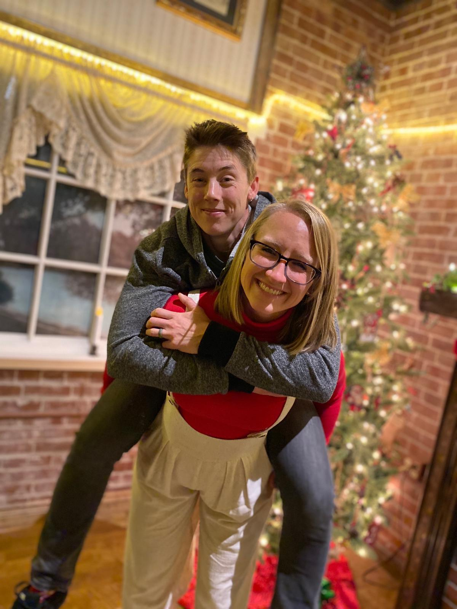



> This is a time for material gift giving, for many of us. It might also be a time to consider the many gifts we have received through the year, and perhaps use this opportunity to appreciate people or situations that we were blessed with.

When I first saw Mala’s post last week for the last T-SQL Tuesday of the year I immediately started thinking of all the gifts I have received this year and how thankful I was with how 2019 has turned out. So first things first, thanks to Mala ([b](https://curiousaboutdata.com/)|[t](https://twitter.com/sqlmal/)) for hosting this final prompt of 2019.

## The gift of #SQLFamily

Around this time I found my local user group in Cleveland and started attending meetings. Attending meetings, talking to no one and going home, but still learning a lot from the great speakers and topics that were shared. This really started my journey as I started to interact with the community.

I was also starting to follow members of the SQL Server community on Twitter. I occasionally used the [#SQLHelp](https://twitter.com/hashtag/sqlhelp?src=hashtag_click) hashtag to get some guidance, but mostly played the role of lurker. I’d read articles that were shared, learning plenty, but not fully realizing the potential here.

In 2015 I changed jobs, which meant in 2016 I had the chance to attend my first PASS Summit. What an experience. It was like our local user group on steroids, all day, for 3 whole days.  I was exhausted by the end of the week and that was just from the conference portion as I mostly kept to myself during the evenings.

As time went on I still attended my local user group almost every month. I started talking to the people there more and more and began to understand this concept of #SQLFamily that I had heard mentioned so many times before.

My friends at the user group continually provided support, guidance, and encouragement and eventually I started to believe I could give something back to the community. I started this blog in February 2018 and gave my first user group presentation in June 2018. This is when I really started to believe in the magic of the #SQLFamily.

Since that slightly shaky presentation on Data Compression in June 2018, I’ve presented 3 different sessions a total of 14 times at various user groups, SQL Saturdays and conferences. Although I still feel like I have a long way to go, it was really great to present back to my local user group this last month to show them I’m getting better and their support is working!

I will also give a special shout out to the Grillen guys. In June 2019 I was lucky enough to present my DSC & SQL Server presentation at DataGrillen. This was my first big conference- I had a few SQL Saturdays under my belt but this felt huge. William ([b](http://williamdurkin.com/)|[t](https://twitter.com/sql_williamd)) and Ben ([b](https://www.solisyon.de/)|[t](https://twitter.com/bweissman)) were the most amazing hosts, not only having created an amazing space to present and learn in, but also ensuring both myself and my wife had the best trip possible. I highly recommend checking this conference out if you can. The good news is, at this time, the c[all for speakers for 2020](https://datagrillen.com/) is still open for 5 more days!

We are so lucky to live and work in a community that has this concept of #SQLFamily. It took me a while to see it but now I can truly appreciate it and I can honestly say I wouldn’t be where I am today without every one of you!

## The gift of supportive family & friends

The second gift I will talk about is I have the most supportive friends and family. Thanks to the #SQLFamily, I have met and made connections with folks from all over the world.  Thanks to Twitter, I randomly stumbled across this tweet one afternoon:

[Tweet from John Martin about builing a team in Southampton](JohnMartin.png)

I’m originally from Chippenham in the South West of England (about 1.5 hours from Southampton), and my wife, who’s American, wasn’t opposed to living in England at some point in our lives. Although it wasn’t in the immediate plan we decided to find out more and it turned out this opportunity was too good to miss. I’m really looking forward to 2020 and this new opportunity.

I’m so excited to move back to England, to be closer to my family, and explore the UK and Europe with my wife. With the excitement comes absolute chaos as we prepare to move the 3,500 miles across the Atlantic. We’re currently working through selling our home, cars, things and packing up our lives in the US. We are very lucky to have the most supportive family on both sides of the pond as well as so many amazing friends that, although are sad to see us move, are being amazing at helping us realize (I guess it’s realise now!) this dream.

The final shoutout is to my wife, who to be fair has the rougher deal here. I am moving towards my family, with a job lined up that I’m excited about. She is stepping into a world of unknown, leaving her family and her dream job in the US for an adventure in England. You wouldn’t know this though, she’s the one keeping us organized and on track while I write blog posts to avoid packing ?. Her support and sense of adventure is the gift I’m most thankful for, as I know I couldn’t have accomplished half the things I did this year without her in my corner.

I’ve had a great 2019. It is ending in no way how I expected, and that’s largely due to the amazing gifts I’ve received from #SQLFamily and my own friends and family. So a big thank you to everyone involved!

I hope everyone has a safe and enjoyable holiday season. Thanks again Mala for hosting!
