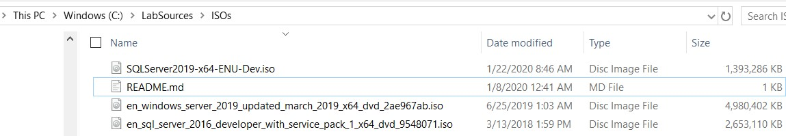
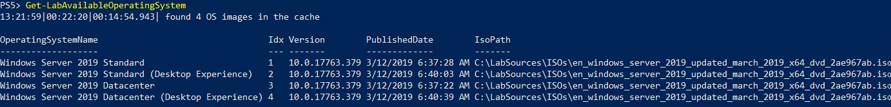
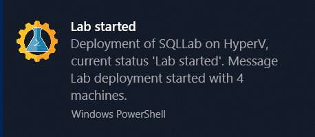
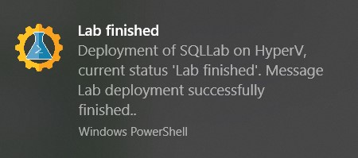

I’ve recently found myself in a few situations where I’ve needed a certain lab setup to test something.  Most scenarios these days I find myself firing up some docker containers to run demos or tests against. However, there are a few circumstances where you may need a little more than that, perhaps to test something Windows OS related (my container setup is using Linux) or just to replicate a production environment more closely than you can with containers.  In these situations I turn to PowerShell.

There is a fantastic PowerShell module called [AutomatedLab](https://github.com/AutomatedLab/AutomatedLab) that can enable you to easily build out a lab for the  specific scenario you need to test. Even better is the module comes with 70 sample scripts that you can start with and adapt to meet your needs.

The module gives you the option to work with Hyper-V or VMWare. I will say most of the examples are using Hyper-V, and that is what I’ll be using also.

For my lab I want a SQL Server 2019 instance joined to a domain, and a separate client machine that I can manage the SQL Server from. On the client I would need to be able to connect to the internet as I want to be able to download PowerShell modules from the gallery easily.

## Step 1: Get the module

There is some setup involved to make sure the pieces needed to build your lab are in the right places.  AutomatedLab gives you two options to ensure you’re set up correctly. [The documentation on GitHub](https://github.com/AutomatedLab/AutomatedLab/wiki/1.-Installation) already does a great job of outlining these so I’ll just point you in that direction for reference.

In my lab I used the second method to download from the PowerShell Gallery and then run the configuration command. I ran the following to get my laptop setup:

```PowerShell
Install-Module -Name AutomatedLab -AllowClobber
New-LabSourcesFolder
```

## Step 2: Stage the ISOs

In order to build our lab we will need to store the ISOs needed for installation where AutomatedLab can access them. We used the defaults during our install so that location is `C:\LabSources\ISOs`.  You can see below I’ve placed the ISOs for Windows Server 2019, SQL Server 2016 and SQL Server 2019 in this folder.



You can test whether AutomatedLab can see the operating system ISOs by using the `Get-AvailableOperatingSystems` command. You can see below it has found my ISO folder and therefore lists the available operating systems that I can use. You’ll notice that the Windows Server 2019 ISO allows me to install two editions, Standard or Datacenter, as well as choosing between installing the core version or the more traditional desktop experience.

It is important to ensure you have the appropriate licensing in place for the OS you install. You can use evaluation editions or enter product keys at a later time.



## Step 3: Craft the lab setup script

Now this sounds like a scary step, but fear not! I mentioned before the AutomatedLab team have included over 70 sample scripts, which means it’s likely there is something similar already written. I found that there were two samples that covered all the parts needed for my lab, so I was able to combine them to create the exact scenario needed.

I’ve added comments throughout the script below so you can easily see the pieces needed:



By default, if you don’t specify a the `-VmPath` parameter on the `New-LabDefinition` function AutomatedLab will test the speed of the available drives and choose the fastest.

## Step 4: Install the lab

With the script written, open the PowerShell console using ‘Run as Administrator’ and execute the script.

```PowerShell
.\AutomatedLab_SQLServer.ps1
```

There will also be some security settings to consider and accept for the first install such as enabling WinRM and adding ‘\*’ to your TrustedHosts. Once those are confirmed and the prework is complete, a toast will pop up showing that the lab has started building:



This is the perfect time to grab a cup of coffee as there are some steps that can take a while, especially if this is the first install.

AutomatedLab uses a base disk for installations of the same OS. Creating this base disk can take a while but once it is created it significantly reduces the amount of disk space you need for your lab. If you deploy 4 VMs with the same OS, as I have here, the base disk will be created and then differential disks can be used for each VM.

If you build a second lab in the same VM folder with the same OS it can again reuse this base disk.

## Step 5: Use the lab

Once the install is complete, another toast will appear and it’s time to log in and start using your lab.



The summary we displayed using `Show-LabDeploymentSummary` will show the machine names, administrator password and some other connection information. We have again used the defaults for these settings but they can be overwritten.

## Remove the lab

Once you are done with your lab you can quickly and easily run the following to destroy all the pieces created by your lab (except the base OS disk).

```PowerShell
Remove-Lab SQLLab
```
