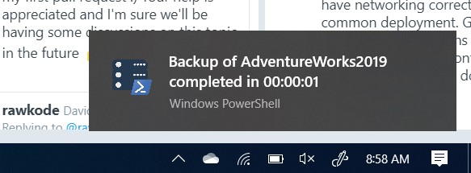

I have just a quick tip for you today using the [BurntToast](https://github.com/Windos/BurntToast) module to notify us when a backup is complete. As DBAs there is always plenty to do, so we don’t want to have to sit and watch a long running script to catch the moment when it finishes.  Usually what happens to me is I kick off the script, move on to something else and then totally forget about it, perhaps until someone asks if it’s done yet. Oops. Well this tip will help avoid that.

The [BurntToast](https://github.com/Windos/BurntToast) module, created by Josh King ([b](https://toastit.dev/)|[t](https://twitter.com/windosnz)), allows you to easily add Windows toast notifications to your PowerShell scripts. I’m going to show you how to use BurntToast to keep track of a database backup.

By this time you should know about my love for [dbatools](https://dbatools.io/), so today we’re going to take a look at how to take a [copy-only](https://docs.microsoft.com/en-us/sql/relational-databases/backup-restore/copy-only-backups-sql-server?view=sql-server-ver15) backup.  This is a backup that doesn’t upset the LSN chain of your regular database backups and can be used to just save a specific point in time for perhaps pre-upgrade, or to restore the database somewhere else.

The following script will take a copy-only backup of the AdventureWorks2019 database on the mssql2 instance. Since I’m not specifying a path it will go to the default backup directory defined for that instance. I’m also saving the results of the command to the `$backup` variable.

The second section below that will run directly after the backup completes will use the results in $backup to notify us using BurntToast:

```PowerShell
## Take a copy only backup, using splatting for readability
$backupSplat = @{
    SqlInstance = "mssql2"
    Database    = "AdventureWorks2019"
    CopyOnly    = $true
}
$backup = Backup-DbaDatabase @backupSplat

## Notify the backup is complete, using splatting for readability
toastSplat = @{
    Text     = ("Backup of {0} completed in {1}" -f $backup.Database, $backup.Duration.ToString())
    AppLogo  = "C:\\temp\\dbatools.png"
}
New-BurntToastNotification @toastSplat
```

That’s it, 2 commands to take a backup and notify us on completion.  I’ve also used the `-AppLogo` parameter to add the [dbatools logo](https://github.com/sqlcollaborative/dbatools/blob/development/bin/dbatools.png). You can see that this backup only took 1 second to complete (hopefully I didn’t get sidetracked in that time) but if the backup takes a few minutes or longer this is a useful tip to let you know when it’s finished.



You could also add some error handling to this script to make it a little more robust by perhaps using try-catch to change the message if the backup was unsuccessful.

This is just one use case for using BurntToast with dbatools You could use this in any script that you’re writing to keep you notified when it’s done. This will allow you to get on with whatever else you have on your plate and not have to worry about remembering that backup you kicked off a while ago.

Since writing this post I saw that Josh has created the [PoshNotify](https://github.com/Windos/PoshNotify) module which allows you to generate popups cross-platform. So if you are not using Windows you can adapt the above script to use this module instead.
