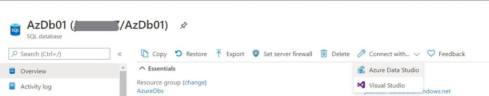
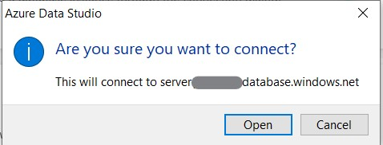
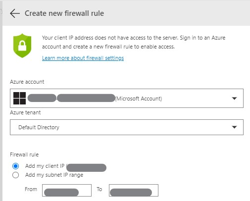
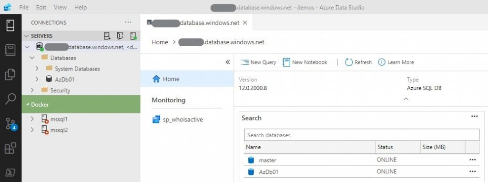
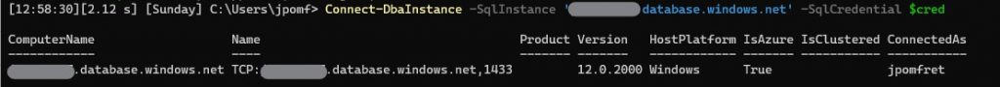
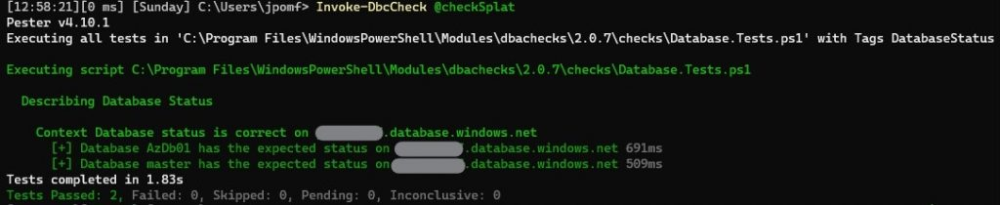
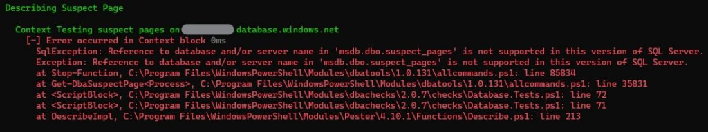

Last week I gave a presentation at [Data South West](https://www.meetup.com/SQL-South-West/) on dbachecks and dbatools. One of the questions I got was whether you could run dbachecks against Azure SQL Databases, to which I had no idea. I always try to be prepared for potential questions that might come up, but I had only been thinking about on-premises environments and hadn’t even considered the cloud.  The benefit is this gives me a great topic for a blog post.

## **Step 1 – Create an Azure SQL Database**

I created a SQL Database through the [Azure Portal](https://portal.azure.com/). The wizard is pretty straightforward and the only real decisions needed were around sizing. Since this is just going to be for a test environment I chose a small ‘Basic’ database.

## **Step 2 – Connect to the Database**

Once the database had been created I navigated to the resource pane in the portal. At the top there is a drop down that helps you get connected using Azure Data Studio.

Once Azure Data Studio opened, I was asked to confirm I wanted to connect:

Then a pane opened which enabled me to easily add a firewall rule so client IP could access the Azure SQL Database.

Once that was completed I was connected through Azure Data Studio and able to interact with my server and database.

Connecting first through Azure Data Studio is not a requirement, but it does help us to get the firewall rules configured and confirm that connecting from our client machine will not be an issue.

Another good check to ensure we can connect to our database from PowerShell is to use dbatools’ `Connect-DbaInstance`:

$cred = Get-Credential
Connect-DbaInstance -SqlInstance 'xxxxxx.database.windows.net' -SqlCredential $cred

The results show we were able to connect successfully.

## **Step 3 – Run some dbachecks**

First of all let’s run a single check to ensure our database is online and in the expected state. For this we can use the ‘DatabaseStatus’ check.

$checkSplat = @{
SqlInstance   = 'xxxxxx.database.windows.net'
SqlCredential = $cred
Check     	= 'DatabaseStatus'
}
Invoke-DbcCheck @checkSplat

Here you can easily see, both because of the green result text and plus icon to the left, that our tests were successful. Both the database we created, AzDb01, and the master database are online and have the expected status.

dbachecks uses tags on the pester tests to enable you to either call specific tests or groups of checks. Each check has a unique tag. In our previous example it was `DatabaseStatus` as well as tags that group like checks, for example `Database`.

$checkSplat = @{
SqlInstance   = 'xxxxxx.database.windows.net'
SqlCredential = $cred
Check     	= 'Database’
}
Invoke-DbcCheck @checkSplat

Running all the database checks against our Azure SQL Database we get some failures.

Tests completed in 70.68s
Tests Passed: 37, Failed: 28, Skipped: 8, Pending: 0, Inconclusive: 0

There are a lot of tests that pass or fail with valid reasons. However, some of the failures are due to errors running the check. These are to be expected since this is a PaaS (Platform as a Service) database offering. One example is the suspect pages check.

The test failed due to an error in the context block, and it clearly states that the 'msdb.dbo.suspect\_pages' table isn’t available in this version of SQL Server.

SqlException: Reference to database and/or server name in 'msdb.dbo.suspect\_pages' is not supported in this version of SQL Server.

There are plenty of tests that do work against an Azure SQL Database though, allowing you to keep tabs on many different aspects of your database including:

- Database Collation
- Database Owners
- Column Identity Usage
- Duplicate Index
- Disabled Index
- Auto Shrink
- Database Orphaned User
- Compatibility Level
- Database Status
- Database Exists
- And more…

## **Summary**

So to answer the question: yes, we can run dbachecks against our Azure SQL Databases. As long as we can connect and the version of SQL Supports the features needed to run the test we can ensure our databases in the cloud are configured just how we like them.
