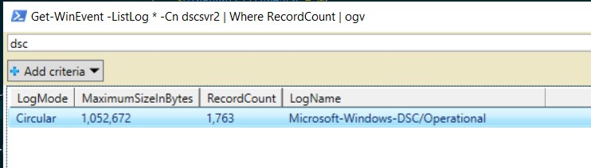
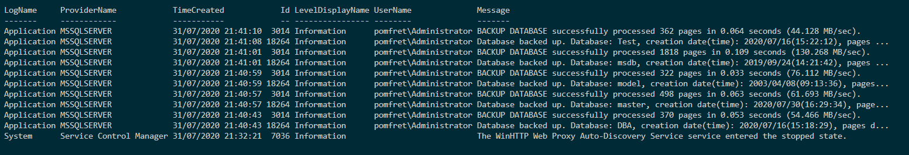

Recently I was tasked with troubleshooting an incident on a SQL Server at a certain point in the past, the issue being a high CPU alert.  It’s hard (without monitoring solutions set up) to go back in time and determine what the issue is.  However, one thing we can check is the windows event log to see if there was anything happening on the server at that time.

Now, you probably know that my favourite tool of choice is PowerShell, so let's take a look at how we can use `Get-WinEvent` to see what was happening in the past.

`Get-WinEvent` is the newer revamped version of `Get-EventLog`, and there are two improvements I believe are worth mentioning. Firstly, with the introduction of filter parameters we can now find certain events much easier, which we’ll talk about a little later. Secondly, the performance of `Get-WinEvent` is much faster than using the legacy command.  I believe this is due to the filtering happening at the event engine instead of within PowerShell.

## Finding some logs

First things first, let's see what logs we have available on our target machine. I’m targeting a remote machine with the code below, but if we’re investigating an issue on our local machine we can just exclude the `-ComputerName` parameter.

This snippet will output all of the logs on my remote machine that contain records to a gridview. I love to use `Out-GridView` for these kinds of tasks because this returned 101 logs and I can now add some text into the search bar to filter for things I might be interested in.

```PowerShell
Get-WinEvent -ListLog * -ComputerName dscsvr2 |
Where-Object RecordCount |
Out-GridView
```

You can see if I add dsc into the search bar of `Out-Grid View` I have one log with records in that I could investigate further.



## Filtering events

I already mentioned this, but the new `Get-WinEvent` gives us three options for filtering events. I’ll show this example using `-FilterHashTable`, but just know there are two other options available, `-FilterXPath` and `-FilterXml`.

The full list of key/value pairs that we can use to filter on are under the `-FilterHashTable` parameter section of the [Microsoft Docs](https://docs.microsoft.com/en-us/powershell/module/microsoft.powershell.diagnostics/get-winevent?view=powershell-7). For now, we’ll look at filtering based on log name and time.

So, say I have an alert for high CPU at 21:30 on 2020-07-31 and I want to know what was happening around that time on the server.

First I’ll set up a few parameters. I’m going to set the `$computerName` (I could add multiple here if I wanted to collect logs from more than one server) and the `$issueDateTime`. I’ve then also specified the `$windowMins`, I’m going to use to create a window of time around my issue to collect events for.

```PowerShell
$computerName = 'dscsvr2'
$issueDateTime = get-date('2020-07-31 21:30')
$windowMins = 30
```

Next we’ll build the filter hash table. You can do this inline when you call the command, but I personally like to break it out just for readability.

```PowerShell
$winEventFilterHash = @{
    LogName = 'system','application'
    StartTime = $issueDateTime.AddMinutes(-($windowMins/2))
    EndTime = $issueDateTime.AddMinutes(($windowMins/2))
}
```

Finally, we’ll call `Get-WinEvent`, then pass in the filter hash table and the computer name.  I’m selecting just a few standard properties, as well as a calculated property to get the username instead of just the sid. The final piece of this pipeline is to use `Format-Table`. I would also recommend using Export-Excel to pipe it straight to an excel file for analysis.

> Note - I use Export-Excel in this post if you're interested in that - [Getting OS and SQL Version information with dbatools](https://jesspomfret.com/getting-versions/))

```PowerShell
Get-WinEvent -FilterHashtable $winEventFilterHash -ComputerName $computerName |
Select-Object LogName, ProviderName, TimeCreated, Id, LevelDisplayName, `
@{l='UserName';e={(New-Object System.Security.Principal.SecurityIdentifier($_.UserId)).Translate([System.Security.Principal.NTAccount])}},
Message | Format-Table
```

As you can see below, the results are returned from both the application and system logs along with the time, level, username and message.  Now, this is just a test box in my lab, but this is a great way of grabbing a window of events from your server to help troubleshoot issues in the past.


