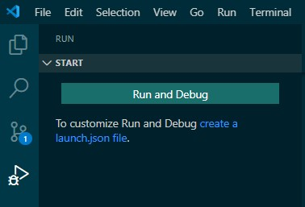
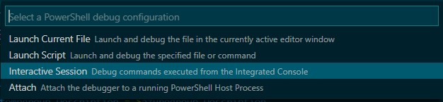
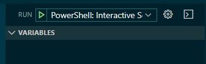
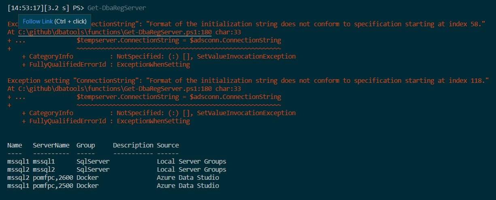
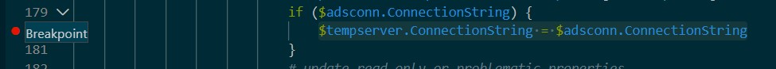

I was browsing twitter the other day when a tweet about dbatools caught my eye (I use [TweetDeck](https://tweetdeck.twitter.com/) and so have a column for tweets that contain [@PSdbatools](http://twitter.com/psdbatools)).

https://twitter.com/way0utwest/status/1242891971473137666

A dbatools bug!! Oh no!

One of the reasons this caught my eye was that I’ve seen this error in my environment with that same command. I had discounted that it was a bug and figured it was instead something in my environment. I presumed it was something related to the fact I was using containers and Azure Data Studio connections.

Step one for dbatools bug fixing is to check for an issue on the [GitHub repo](http://dbatools.io/bugs) and create one if there isn’t one already. It turned out that there was [one already created](https://github.com/sqlcollaborative/dbatools/issues/6292) so we’re covered there.

So I figured I’d take a look and see what was happening and how we could fix it. Now I’m going to be honest with you, my usual method of debugging involves adding `Write-Host 'Hi`', or piping objects to `Out-GridView`. I did start down this route, but the `Get-DbaRegServer` function calls an internal function, and things quickly got complicated.

Luckily, the [PowerShell extension for VSCode](https://marketplace.visualstudio.com/items?itemName=ms-vscode.PowerShell) includes a debugger so we can level up our game and use that to track down our issues. Since I haven’t already used this for my dbatools folder when I click the ‘Run’ icon on the left navigation bar I see the following:

Pressing the ‘Run and Debug’ button will run your active file and, if you have breakpoints set up, then it’ll break at those points for you to troubleshoot. This is really useful if you have written a script and it’s not working correctly. Since I’m troubleshooting the call of a function I could write a simple script with the code to call the function, save it and then press ‘Run and Debug’. However there is another option, and that is to launch an interactive debugger. 

Pressing the ‘create a launch.json file’ link opens the command palette with the option to choose your PowerShell debug configuration. Choosing the ‘Interactive Session’ configuration means we can use the integrated console within VSCode to call functions and launch the debugger.

This will open a launch.json file that you can edit to add more functionality and customization, but we’ll just save it as is right now.

{
    // Use IntelliSense to learn about possible attributes.
    // Hover to view descriptions of existing attributes.
    // For more information, visit: https://go.microsoft.com/fwlink/?linkid=830387
    "version": "0.2.0",
    "configurations": \[
        {
            "name": "PowerShell: Interactive Session",
            "type": "PowerShell",
            "request": "launch",
            "cwd": ""
        }
    \]
}

As soon as you save it the left ‘Run and Debug’ pane will change to look like this. Now we’re ready to run the interactive debugger by pressing the green play button or F5.

So now that we’re set up, let’s start troubleshooting.

Step one is to reproduce this issue. This particular bug was easy to reproduce. The only requirements are that you have Azure Data Studio installed and at least one connection set up, then just running `Get-DbaRegServer` caused the error.

Next we need to add some breakpoints. These need to be the positions in the code where you want to stop execution and take a look at how things are set in the moment. It’s also a great way to see if you entered certain sections of the code that may be guarded by conditional logic.

Running `Get-DbaRegServer` in the integrated console you can see the error, even down to the line from the function where the error is being thrown. In the screenshot below you can see hovering over that line in VSCode allows you to follow the link to open the function and navigate to the exact line.

Line 180 of the Get-DbaRegServer is the following:

$tempserver.ConnectionString = $adsconn.ConnectionString

We’ll insert a breakpoint here by clicking in the gutter at line 180.

Now pressing F5 the interactive debugger will start, and we can rerun `Get-DbaRegServer` in the interactive console. When we do that as soon as the execution gets to line 180 the code will stop, waiting for us to respond.

You can see below that we are able to find the `$adsconn` variable in the variables pane on the left and see that it’s actually an object with three values – which is the issue here – we’re expecting to only have one returned.

I read back through the `Get-DbaRegServer` function to find where the `$adsconn` variable was set and found it was from calling the internal function `Get-ADSConnection`. I added in another breakpoint within that function to dig in deeper.

Adding the breakpoint within the second function means that when we call `Get-RegServer` and then that calls `Get-ADSConnection` the code will wait within the second function and allow you to inspect variables within that function.

This meant that I was able to determine that there were several connection strings being returned for each server and that we needed to filter down to one.

Changing line 174 in the `Get-DbaRegServer` function to include an additional filter, shown below, meant that only one connection string was returned and solved the problem.

$adsconn = $adsconnection | Where-Object { $\_.server -eq $server.Options\['server'\] -and -not $\_.database }

Hopefully this walkthrough shows a useful way of using the interactive debugger to hunt down bugs.
