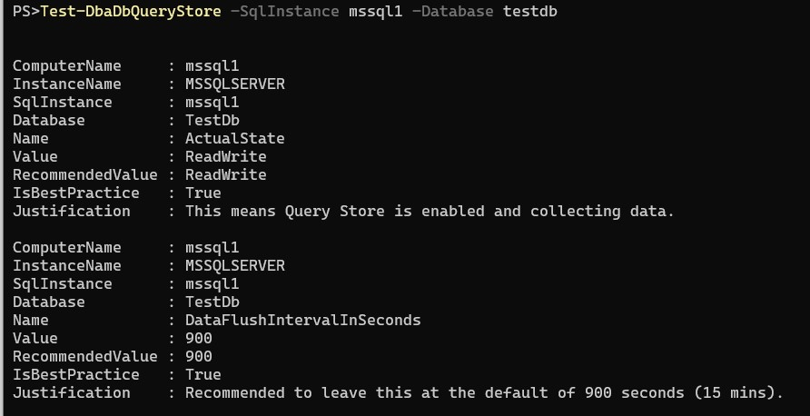

It’s no secret that I love dbatools and dbachecks. I am certain that I run a dbatools command at least once a day. It has fundamentally changed how I work as a dba, and it makes my life so much easier.  I mention this when I’m presenting on these topics, but today I want to highlight what I consider the special sauce of open-source software.

dbatools not only provides us with easy to run functions that get/set/test so many aspects of our environments, but it also encapsulates the knowledge of industry experts, and that right there is part of the magic. For example, I no longer have to remember [Jonathan Kehayias’ detailed calculations](https://www.sqlskills.com/blogs/jonathan/how-much-memory-does-my-sql-server-actually-need/) for max memory. I can just run [Test-DbaMaxMemory](https://docs.dbatools.io/#Test-DbaMaxMemory) to check whether I need to adjust my settings.

I would like to just say I’m in no way suggesting that we can skip the learning here, reading posts from experts and understanding why is vital – just it’s nice to be able to quickly call this knowledge from PowerShell rather from the depths of my brain (and that’s hoping it’s still stored in there).

## Adding Query Store Expertise to dbatools

Last week I was working on configuring Query Store, and knowing that Erin Stellato ([b](https://www.sqlskills.com/blogs/erin/)) is the expert on that I headed over to her blog. I found exactly what I needed. Erin has a bunch of great posts on query store, but this one caught my eye: '[Query Store Best Practices](https://www.sqlskills.com/blogs/erin/query-store-best-practices)'.

I read through her suggestions and could easily translate those using dbatools to optimally configure Query Store. First by setting several query store options using `Set-DbaDbQueryStoreOption`:

```PowerShell
$queryStoreBP = @{
    SqlInstance        = 'mssql1'
    Database           = 'TestDb'
    State              = 'ReadWrite'
    MaxSize            = 2048
    CaptureMode        = 'Auto'
    CollectionInterval = 30
}
Set-DbaDbQueryStoreOption @queryStoreBP
```

Secondly by configuring two trace flags using `Set-DbaStartupParameter` (reboot required):

```PowerShell
Set-DbaStartupParameter -SqlInstance mssql1 -TraceFlag 7745,7752
```

Once I was happy with my settings, I realised we were missing a ‘test’ command for dbatools. The suite of ‘test’ functions in dbatools (a lot that end up as checks in dbachecks btw!), give us an easy way to check our environment against best practices, or our desired settings.

Since dbatools is open-source I was able to write this function ([Test-DbaDbQueryStore](https://docs.dbatools.io/#Test-DbaDbQueryStore)) and get it added into the module. It’s included as of version 1.0.131, so make sure you’re up to date.  Taking Erin’s suggestions and wrapping them in a little PowerShell, I can make it easier for myself and everyone else to make sure we’re following her guidelines.

To test a single database you can use the following. It will output each setting, it’s current value, the recommended value, as well as a note from Erin’s blog post on why we should choose that. Again, I recommend you read her post to fully understand the why.

```PowerShell
Test-DbaDbQueryStore -SqlInstance mssql1 -Database testdb
```



This also means we can find any databases across many instances that aren’t set up to meet best practices:

```PowerShell
$results = Test-DbaDbQueryStore -SqlInstance mssql1, mssql2 |
Where-Object {-not $\_.IsBestPractice} |
Select-Object SqlInstance, Database, Name, Value, RecommendedValue
$results | Format-Table
```

## So, over to you

Step 1 – Go and read the why - '[Query Store Best Practices](https://www.sqlskills.com/blogs/erin/query-store-best-practices)'.

Step 2 – Easily make sure your environment is up to par.
