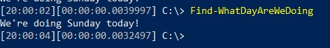
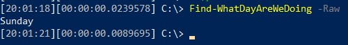
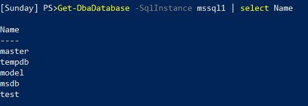
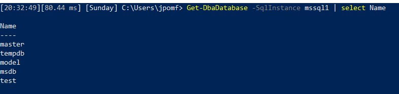

It’s an interesting time we’re living in right now. I’m based in the UK and we just received the announcement last week that we have at least three more weeks of lockdown. I’ve been working at home for over a month now and I feel really lucky that I can work from home. There are a lot of folks who can’t and are instead working hard on the front lines to keep us safe and well. Firstly, a shout out to those folks! Thanks for all your doing.

Now, this is not a post on how to set up your home office, or how to be the most productive work from home employee. This is a post to solve one simple problem.  I’ve no idea what day it is.

Monday through Friday I wake up, drink some coffee and then head to my desk to work my day job. I usually workout in the garden with my wife at lunch and then we walk after work. Every day is pretty much the same, so I’ve written an earth-shattering PowerShell function for you.

function Find-WhatDayAreWeDoing {
    param (
        \[switch\]$Raw
    )
 
    if($raw) {
        (Get-Date).DayOfWeek
    }
    else {
        ("We're doing {0} today!" -f (Get-Date).DayOfWeek)
    }
}

You can add this into your profile and then simply just call the function to remind you what day we’re on.

I’ve also added the `-Raw` switch so you can use that to just return the day, this is useful if you wanted to add it into your prompt.

To change the prompt in PowerShell you just need to create a function called ‘Prompt’. For example, if I run this in my PowerShell session or put it in my profile, I’ll be able to see what day it is constantly.

function Prompt {
    Write-Host ("\[{0}\] PS> " -f (Find-WhatDayAreWeDoing -raw))
}

The prompt is a really useful snippet of code and there are many  great ideas out there. I use the amazing [dbatools prompt](https://dbatools.io/prompt/). Their prompt lists the current time and the execution time for the last statement run. You could change it to add in the day also:

I’ll be honest, development on `Set-WhatDayWeAreDoing` is not going as well. Stay safe folks and keep keeping on.
