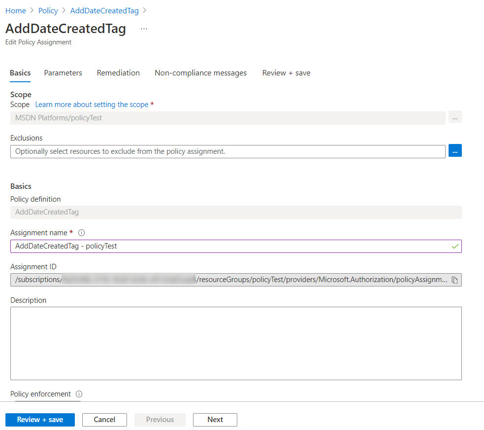
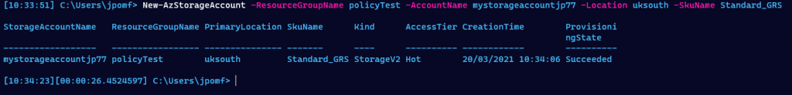
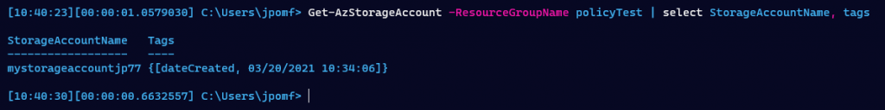
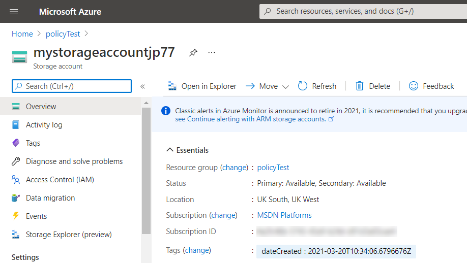
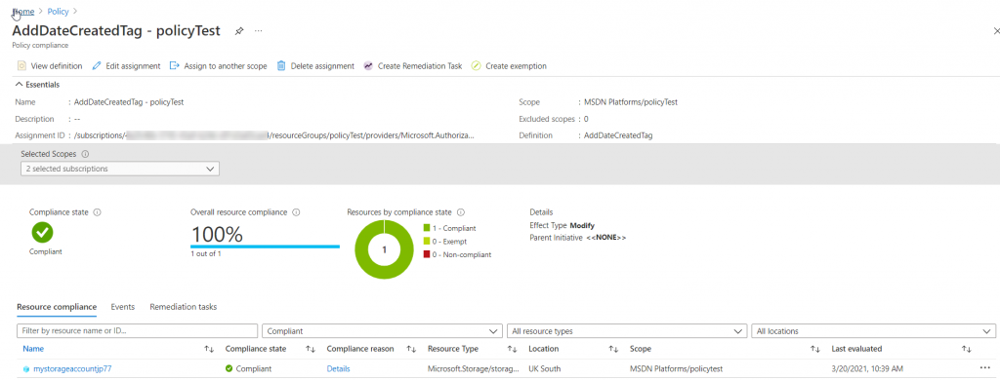

Last week, in [Part 1](https://jesspomfret.com/azure-tags-part1/), we talked about how to easily keep track of our resources with tags. There are many strategies for tagging your resources but I specifically focused on adding a ‘dateCreated’ tag so we could see when resources were created – since this isn’t available by default.  During that post we identified the biggest issue we had was that we were relying on a human to remember to add the ‘dateCreated’ tag for every resource they created. I’ve got two ideas on how to fix that – today we’ll look at the first option, using [Azure Policy](https://docs.microsoft.com/en-us/azure/governance/policy/overview).

Azure Policy is a way of comparing your Azure estate to defined requirements. You can either use predefined definitions (of which there are many) or create your own specific rules.  These definitions can be assigned to certain scopes (subscriptions, resource groups). Azure Policy then reports on whether you’re in the expected state and in some cases can alter resources to ensure you are.

## **Step 1 – Define a policy**

In our example, all resources should have a ‘dateCreated’ tag, and if Azure Policy finds the tag is missing, it should add that tag with the current date.

There are a few steps to set up our policy for ensuring the ‘dateCreated’ tag exists on all resources. First we need to write a policy definition in JSON.  Don’t panic yet though – there are a lot of examples in the [Azure/azure-policy](https://github.com/Azure/azure-policy) GitHub repo that we can start with.  By browsing the repo you can find the ‘[add-tag](https://github.com/Azure/azure-policy/tree/master/samples/Tags/add-tag)’ policy which is the perfect base for us to build off of.  

When viewing that GitHub page there is a ‘Deploy to Azure’ button- clicking that (presuming you’re logged into the portal) will take you straight to the ‘New Policy Definition’ wizard where we can modify our policy to meet our needs and save it. 

You’ll need to choose a ‘Definition Location’ (which is the subscription this policy should reside in), name your policy, and edit the description if needed. The GitHub template has already specified this will go in the ‘Tags’ category,but you can change that if you’re keeping custom policies in a new category. Then we get to the policy rule, it’s JSON time.

Since we imported the sample from GitHub the JSON is almost exactly what we need. The first section defines the rules and the second section defines parameters.  In this case we’re going to remove the parameter section and change the tag name and values expected to be static. This means that the policy will only ever be used for adding the specific ‘dateCreated’ tag.  The reason for this is we’re going to add some logic to the tag value so it contains the current date. (It is possible that this can be achieved with parameters, but I couldn’t get it to work. Please let me know in the comments if you know differently). 

The JSON below is pretty simple. There are two main sections: the condition to be met and then the operation to carry out if the conditions are met.  In the conditions section we’re looking to see if the dateCreated tag exists, if it doesn’t we’ll move onto the second section of the JSON. This defines what to do about it, and in this case it’s pretty simple, we’ll modify the target and add the dateCreated tag.  The tag value is dynamic and uses a [resource manager template function](https://docs.microsoft.com/en-us/azure/azure-resource-manager/templates/template-functions) to get the current date.  There are a [few restrictions](https://docs.microsoft.com/en-us/azure/governance/policy/concepts/definition-structure#policy-functions) on using functions within policy definitions, one being that we can’t overload the uctNow function with a format parameter so we’ll only be able to get a date in ISO 8601 (yyyyMMddTHHmmssZ) format.

{
  "mode": "Indexed",
  "policyRule": {
    "if": {
      "field": "tags\['dateCreated'\]",
      "exists": "false"
    },
    "then": {
      "effect": "modify",
      "details": {
        "roleDefinitionIds": \[
          "/providers/microsoft.authorization/roleDefinitions/b24988ac-6180-42a0-ab88-20f7382dd24c"
        \],
        "operations": \[
          {
            "operation": "add",
            "field": "tags\['dateCreated'\]",
            "value": "\[utcNow()\]"
          }
        \]
      }
    }
  }
}

The final decision to make for our new policy definition is the ‘Role definition’. Since our policy has remediation actions, the operation to add tags if needed, a [managed identity](https://docs.microsoft.com/en-us/azure/active-directory/managed-identities-azure-resources/overview) will be created for the policy.  The ‘role definition’ is the permissions that will be granted to that managed identity.  The default is ‘Contributor’ which assigns ‘full access to manage all resources’. This can be changed based on what your policy needs access to.

## **Step 2 – Assign the policy**

We’ve now defined our policy, but the second part of this process is to assign that policy a scope. This outlines what this policy applies to. The scope can be a subscription or resource group, and can be more finely tuned by excluding specific resources that you don’t want to apply the policy too.  Then it’s as easy as selecting the policy we defined, setting an ‘Assignment name’, which could be a combination of policy name and assigned score, and adding an optional description.

## **Step 3 – Test the policy**

The easiest way to test our policy is to create a resource without the ‘dateCreated’ tag and see what happens. We have scoped our policy assignment to the ‘policyTest’ subscription so I’ll run the following PowerShell to create a new storage account that’s missing my required tag.

New-AzStorageAccount -ResourceGroupName policyTest -AccountName mystorageaccountjp77 -Location uksouth -SkuName Standard\_GRS

You can see there is no `-Tags` parameter specified, so this storage account was created without any tags. If we now run `Get-AzStorageAccount` we can see it has the 'dateCreated' tag.

Get-AzStorageAccount -ResourceGroupName policyTest | Select-Object StorageAccountName, Tags

You can also see the tag in the portal view of our storage account.

Finally, if we check out the Azure Policy we can see that we are in compliance. All resources in the ‘policyTest’ subscription have the required ‘dateCreated’ tag.  We can also see the specific resources that are in compliance, in our case just the storage account we created.

## **Summary**

This is just one option for automatically assigning the ‘dateCreated’ tag on all new resources. In this case we scoped the policy to a specific resource group but have assigned it at the subscription level to cover all resources.  Note – this is specifically to tag resources. If you want to also tag resource groups the policy definition will need to be altered slightly.

One downside of this method is I haven’t found a way to control the format of the date in the tag value. This isn’t a big concern but does lack a little flexibility, especially if we wanted to add the date in a different time zone.

Next week we’ll look at adding the same functionality using Azure Functions to auto tag new resources.
