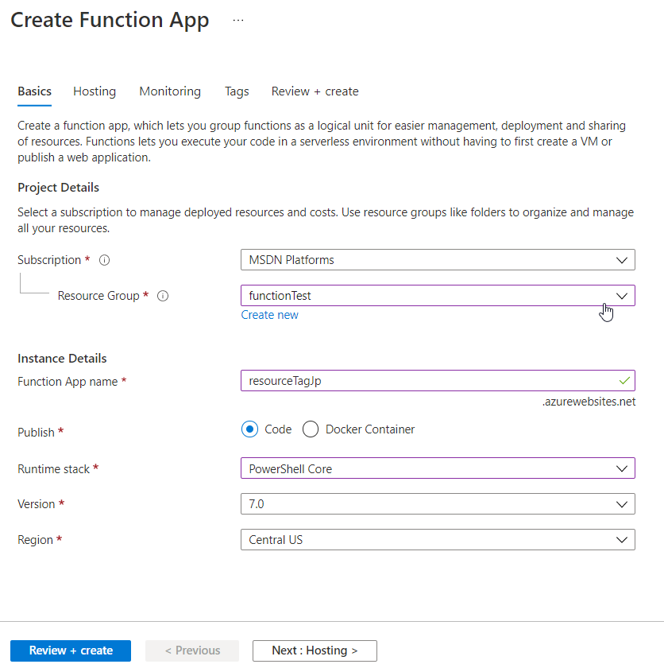
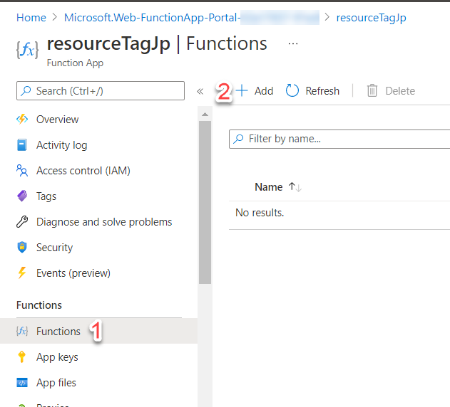
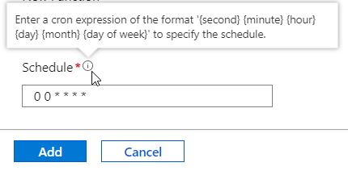
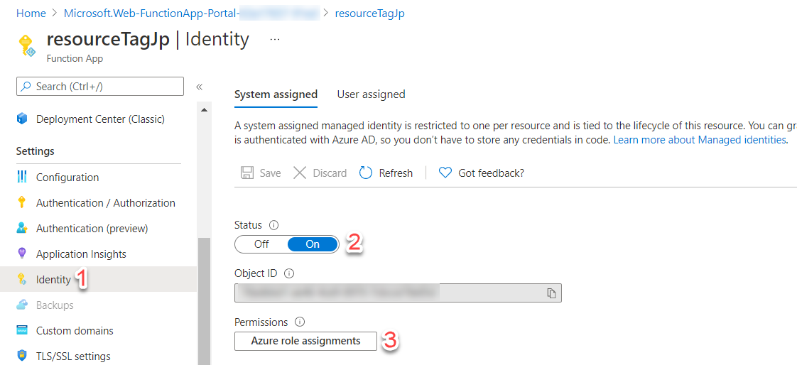
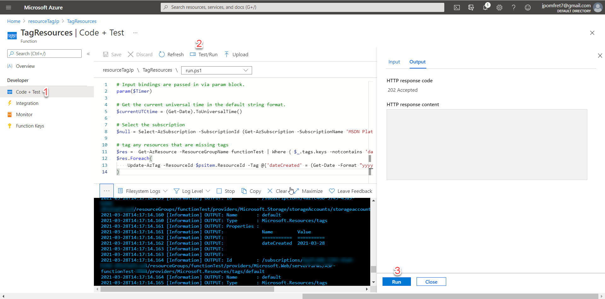
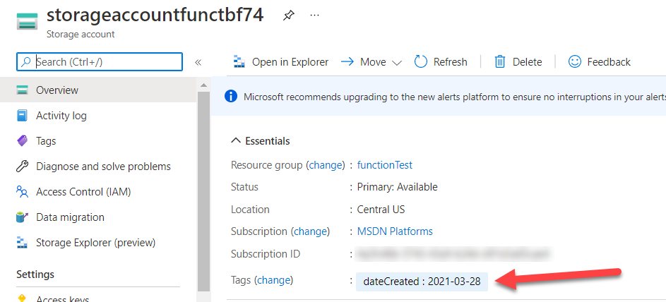

This is now the third post in a series on Azure tags. You can read the other two posts here to get up to speed with where we’ve been, however that isn’t required for this post .

- [Keeping track of Azure resources with tags – Part 1](https://jesspomfret.com/azure-tags-part1/)
- [Keeping track of Azure resources with tags – Part 2](https://jesspomfret.com/azure-tags-part2/)

In part one I discussed how useful Azure tags can be, and specifically about how adding a ‘dateCreated’ tag can help you keep track of your resources, and how to find resources with certain tags using PowerShell.  Part 2 and 3 are based around the fact that adding the ‘dateCreated’ tag is a great idea, but relying on a human to remember to add it is less than ideal. In part 2 we looked at using Azure Policy to automatically add the tag. Today’s post will cover another option using Azure Functions.

Azure Functions gives us a way of running serverless code, written in a number of different languages, triggered by specific events or timings.  Looking through the [documentation](https://docs.microsoft.com/en-us/azure/azure-functions/functions-overview) there are many use cases from processing files to analysing IoT work streams.  Our use case is to run a PowerShell script that tags any resources that are missing the ‘dateCreated’.

## Step 1 - Create a function

Azure Functions live within a function app, so the first thing we have to do is create this logical container. At this level we’ll decide on a ‘Function App name’, I’ve called mine ‘resourceTagJp’, and choosing ‘Code’ for the publish option we can then choose PowerShell as our language of choice. There are some other options for selecting a storage account and configuring ‘Application Insights’, but for now I’ve left those all as the defaults.



Once the ‘Function App’ is created we are ready to create our function.  On the left hand pane choose ‘Functions’ and then ‘Add’. This will open a pane for you to choose how to develop the function, either in the portal or on your local machine in VSCode, for example, and the template to base your function off of.



One of the simplest options is to choose ‘Timer Trigger’, which as expected will execute the function code based on a schedule. The schedule is set using a cron expression. For it to run once an hour at the top of the hour we’ll use the following:

```cmd
0 0 * * * *
```



Once the function is created we’ll choose ‘Code + Test’ on the left hand pane of the portal to actually add the function code. The code for my function is going to be pretty simple, but if you are writing more complicated functions there is a [VSCode extension](https://marketplace.visualstudio.com/items?itemName=ms-azuretools.vscode-azurefunctions) that can be used to develop and test functions locally before publishing them to Azure.

We have three files within our function:

- Readme.md – for documentation in markdown
- Function.json – the config file, currently contains our timer binding information
- Run.ps1 – the main function code, in PowerShell as that’s what we chose

The code for the function is below and makes use of the `Update-AzTag` cmdlet to add the ‘dateCreated’ tag. In this example, since I’m using PowerShell, I can easily format the date to be exactly how I want it to be displayed. If you read part 2 in this series, that was a downfall of using Azure Policy, I only had one datetime format option. The `Update-AzTag` also has a `-Merge` parameter which ensures any tags already on the resource aren’t overwritten by this function.

```PowerShell
# Input bindings are passed in via param block.
param($Timer)

# Select the subscription
$null = Select-AzSubscription -SubscriptionId (Get-AzSubscription -SubscriptionName 'MSDN Platforms')

# tag any resources that are missing tags
$res =  Get-AzResource -ResourceGroupName functionTest | Where { $\_.tags.keys -notcontains 'dateCreated' }
$res.Foreach{
    Update-AzTag -ResourceId $psitem.ResourceId -Tag @{'dateCreated' = (Get-Date -Format "yyyy-MM-dd")} -Operation Merge
}
```

That’s all it is to create our function – however, it doesn’t currently have the authorisation to view or update resources.

## Step 2 - Add a managed identity

To provision access to allow our function to work we can make use of [Azure Managed Identities](https://docs.microsoft.com/en-us/azure/app-service/overview-managed-identity?tabs=dotnet). These are similar to Managed Service Accounts in that there is no need to set or rotate passwords. This means we can configure our function with a managed identity and then forget about it- we know it’ll remain secure and the password/secret will be rotated often.

There are two options for managed identities: system-assigned or user-assigned. The system-assigned identity is tied directly to your application – if we delete the function the identity will also be deleted, and that’s fine for this purpose.

Configuring the system-assigned identity is pretty straightforward. On our function pane under identity, change the status to ‘On’.  After a couple of minutes the identity will be deployed and you’ll see the option to assign ‘Azure role assignments’.

Clicking on ‘Azure role assignments’ will open a pane where you can assign whatever permissions your function will need to run. This can be scoped at the subscription or resource group level. For this example my function is just tagging anything within the ‘functionTest’ resource group so I can set the permissions to that scope.  I have chosen the ‘contributor’ role as that gives us enough permissions to view and tag resources.



## Step 3 - Test our function

We have created our function and set up the managed identity to enable the function to access our resources, now it’s time to make sure it’s working as expected. From the ‘Code + Test’ page there is a ‘Test/Run’ at the top that brings out the pane on the right. In that pane pressing run will simulate the time trigger being met and our function executing.

In the console you can see exactly what the function does and any output you’ve configured – in this example you can see a storage account was tagged.



We can also test this function by creating an untagged resource in the ‘functionTest’ resource group and waiting for the timer to be triggered.

However we test our function we can see the tag is now on our storage account and we no longer have to rely on a human to remember the tag when they create resources.



## Summary

This has been as much a learning experience for me as it hopefully has been for you. My journey into Azure is still pretty new but I’m enjoying the adventure.

To wrap this up, having a tagging strategy is important and there are multiple ways to ensure that tagging strategy is followed. Both Azure Policy and Azure Functions give us a good option for automatically tagging resources that are missing tags. If you’re using Terraform to deploy Azure resources [John Martin has written about adding the a tag for date created to all resources as they are deployed](https://jqmartin.info/2021/03/02/terraform-timestamps-and-tagging/), which is definitely worth a read.
