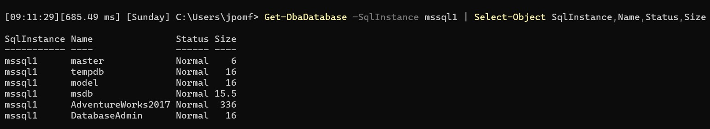
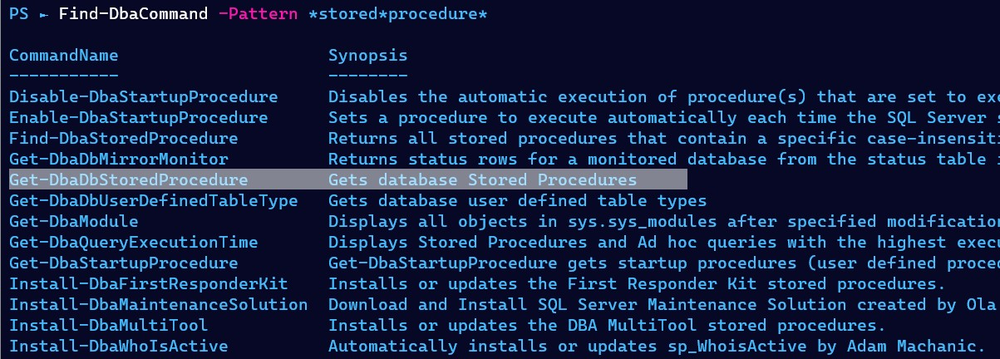
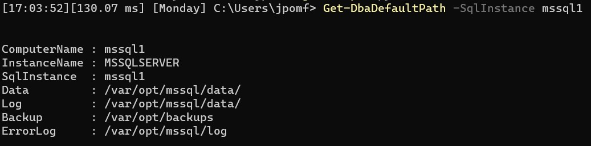
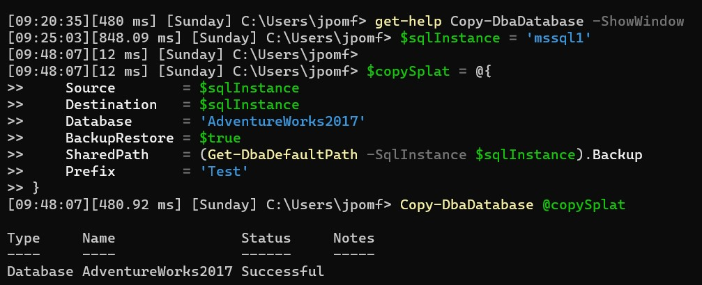
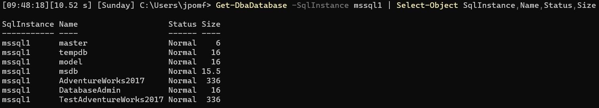
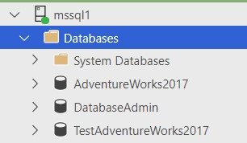

Have you ever wanted to quickly backup/restore a database to the same instance to do some side by side testing? Perhaps to make some index changes or code changes, without actually changing the live copy of the database Ideally you’d already have another environment for this sort of work, but even then sometimes it’s handy to have a quick option.

Let’s first take a look at the databases on my SQL Server- we can use a GUI tool for that (SSMS, ADS) or we can use dbatools.

```PowerShell
Get-DbaDatabase -SqlInstance mssql1 | Select-Object SqlInstance, Name, Status, Size
```



We’re working hard on the AdventureWorks2017 database, perhaps getting it ready for an upgrade – since it’s now 3+ years out of date.

dbatools has so many functions, and I know I’ve mentioned it before, but `Find-DbaCommand` is a great way of looking for what we need. I want to know what the default backup path is set to, and since I’m just backing up and restoring to the same server, we already know that the instance has the required permissions here. If only there was an easy button for this…

```PowerShell
Find-DbaCommand *default*path*backup*
```



Even just reading the synopsis, I can see that `Get-DbaDefaultPath` will give me exactly what I need.  I recommend the next step is running `Get-Help Get-DbaDefaultPath -ShowWindow`, that’ll create a popup that provides all the information you need about the function.

The only required parameter is a SqlInstance, and you can see the backup property returns gives us the path we need for our copy.

```PowerShell
Get-DbaDefaultPath -SqlInstance mssql1
```



That’s all the groundwork done- we have our instance, database, and a location to backup/restore from.  We’re going to want to check we have enough disk space available on both the instance and that backup path, then we’re ready to go.

## Using Copy-DbaDatabase

I’ve already spoken and blogged a lot about the power of this command (related links at the end of this post), but today’s tip is centred around a less than well-known parameter.  Hidden deep in the comment based help (another great reason to read all of `Get-Help Copy-DbaDatabase -ShowWindow`) you’ll find the `-Prefix` parameter. This will allow us to easily add a prefix to both the database and the associated files, meaning we won’t have any issues restoring the database to the same server.

```Text
-Prefix <String>
All copied database names and physical files will be prefixed with this string

This option is mutually exclusive of NewName

Required?                    false
Position?                    named
Default value
Accept pipeline input?       False
Accept wildcard characters?  false
```

Here I’ve set a SqlInstance variable so I can reuse the same value multiple times in my code. Then created a hash table `$copySplat` with the necessary parameters so we can utilise splatting (a way to improve code readability) to pass the whole set into `Copy-DbaDatabase`.

Two parameters I want to highlight- I’ve set ‘Prefix’, meaning the database and files for the restored database will start with ‘Test’.  I’ve also set SharedPath and used the code we already wrote to get the default backup path.

```PowerShell
$sqlInstance = 'mssql1'

$copySplat = @{
    Source        = $sqlInstance
    Destination   = $sqlInstance
    Database      = 'AdventureWorks2017'
    BackupRestore = $true
    SharedPath    = (Get-DbaDefaultPath -SqlInstance $sqlInstance).Backup
    Prefix        = 'Test'
}
Copy-DbaDatabase @copySplat
```



The output below shows the migration was successful, and there were no warnings or errors (those would appear in the notes column).

Finally, let’s confirm it worked by rerunning our `Get-DbaDatabase` command again:



Extra proof, it’s now accessible through Azure Data Studio (ADS) and we’re ready to start our testing.  One note, if you are on the same server it’s important to confirm any code you run isn’t referencing the original database name.



## Additional content

As I mentioned I have already spoken and written about the power of `Copy-DbaDatabase`, one of my favourite commands.  If you’d like to read more, I’ve written a post on the dbatools blog, [migrating application databases with dbatools](https://dbatools.io/migrating-application-dbs/).

I’ve also recorded a short ‘Life hack’ video, [easy database migrations with dbatools](https://www.youtube.com/watch?v=Fraig15pwxE&t=1s) that I’ve published on my YouTube channel.


