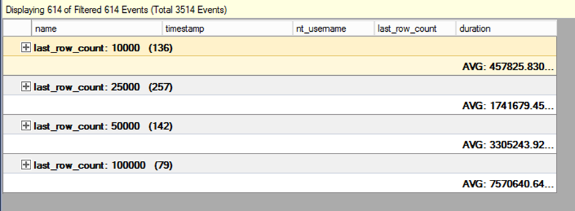

I found myself needing to clear out a large amount of data from a table this week as part of a clean up job.  In order to avoid the transaction log catching fire from a long running, massive delete, I wrote the following T-SQL to chunk through the rows that needed to be deleted in batches. The question is though, what’s the optimal batch size?

It’s worth noting that an index on the date column was required for this to be as efficient as possible. The table I was deleting from had 4 billion rows and I didn’t want to scan that each time!

```SQL
DECLARE @Before      DATE = DATEADD(DAY,-30,GETDATE()),
        @BatchSize   INT  = 50000

WHILE (1=1)
BEGIN

    DELETE TOP (@BatchSize) t
    FROM dbo.bigTable t
    WHERE Date < @Before

    -- if we deleted less than a full batch we're done
    IF @@rowcount < @BatchSize
            BREAK;

    -- add a delay between batches
    WAITFOR DELAY '00:00:01'
END
```

Time for a science experiment. The easiest way to determine the optimal batch size is to run some tests. I decided to test deleting in batches of 10k, 25k, 50k and 100k and measure the delete durations with extended events.

My goal was two part - to delete as many rows as possible in a two-hour maintenance window, but also to reduce the amount of time locks were held on the target table.

The following T-SQL creates an extended events session that captures one event, `sqlserver.sql_statement_completed`, and filters on both my username and the statement like `delete top%`. I didn’t choose a target as I just chose to watch the live data, but you could easily add an event_file if you want to persist the data.

```SQL
CREATE EVENT SESSION [DeleteExperiment] ON SERVER
ADD EVENT sqlserver.sql_statement_completed(SET collect_statement=(1)
    ACTION(sqlserver.nt_username)
    WHERE ([sqlserver].[equal_i_sql_unicode_string]([sqlserver].[session_nt_user],N'JessUserName')
    AND [sqlserver].[like_i_sql_unicode_string]([statement],N'delete top%')
    )
)
GO
```

Once the extended events session had been successfully created and was running, I opened the ‘Watch Live Data’ pane and started running my deletes in another window.  I left each experiment running for a while to make sure I got a decent sample size for each batch size.

Once I’d cycled through the different batch sizes, I used the grouping and aggregation features in the Extended events wizard, shown on the toolbar below:


I grouped by ‘last_row_count’ which is my batch size, and then calculated the average duration for each group. You can see in the screenshot below the values for each.



The duration unit is microseconds for the sp_statement_completed event so after some squinting and calculations the results are as follows:

| Batch Size | Average Duration (Seconds) |
| --- | --- |
| 10,000 | 0.46 |
| 25,000 | 1.74 |
| 50,000 | 3.31 |
| 100,000 | 7.57 |

For now, I’ve decided to go with batches of 50,000 for the deletes. Depending on how things go I might change this to 25,000 as in my mind both those batch sizes met my criteria.

Hope this blog post has given you some ideas for testing out different scenarios with Extended Events.
