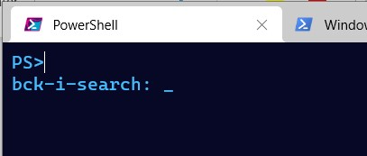

I was listening to a [podcast last week about PowerShell](http://runasradio.com/Shows/Show/760), when one of the hosts mentioned having to ‘up arrow’ back through your history to find a command you wanted to rerun.  This made me realise that I should write this quick post on using [PSReadLine](https://github.com/PowerShell/PSReadLine)’s interactive search function.  This tip is a serious time saver and I rely on it heavily.

The great news is that if you are using Windows PowerShell on Windows 10 or if you’re using PowerShell 6+, PSReadLine is already installed and you can immediately start using this tip.  If you don’t have the module though, it’s easy enough to install from the PowerShell Gallery:    

Install-Module PSReadLine

The main goal of this module is to enhance the command line experience for users. There is a lot of great stuff in this module, some of which you’re probably already using, without even realising it’s coming from PSReadLine. A fun experiment for this is to open a new console, run `Remove-Module PSReadline` and then see what’s missing. The two biggest things I notice (on top of the interactive search) is there’s no history available from previous sessions, and no colour coding to show the differences between variables, parameters and input.

The screenshot above is using Windows Terminal and PowerShell 7, but the same thing happens using older versions of PowerShell. Shout out to [Chrissy LeMaire](http://twitter.com/cl) for the beautiful [Windows Terminal theme](https://blog.netnerds.net/2020/07/my-windows-terminal-retro-theme/).

As I mentioned earlier, when you’re running PowerShell in a console it tracks the commands you run, building up a history of all the things you’ve executed.  This is really useful if you want to slightly change the command you just ran, perhaps fixing a typo, or piping the output to another command. The problem comes when you know you ran something recently, and you start ‘up arrowing’ furiously through the history trying to find what you’re looking for.

You can also view the history of your current session by executing `history`.

PSReadLine makes looking for a specific command in the history haystack even easier with ‘Bash/zsh style interactive history search’.  I have created a gif below to demonstrate this, but it’s as simple as pressing ‘Ctrl+R’ from the console. That will create a second line under your prompt where you can start typing your search terms.

As you type PSReadLine is going back through your history to find the most recent command that matches what you’ve typed so far. As you continue typing it hones in on the exact command you’re looking for.  To look further back in your history, press ‘Ctrl+R’ again to find the next time you used that search term in a command.

If you press \`Ctrl+R\` one too many times, you can press \`Ctrl+S\` to search forward, basically taking you forward in time one search result.

Hope you find this as useful as I do. As I mentioned I rely heavily on interactive search to rerun commands I’ve used before.
