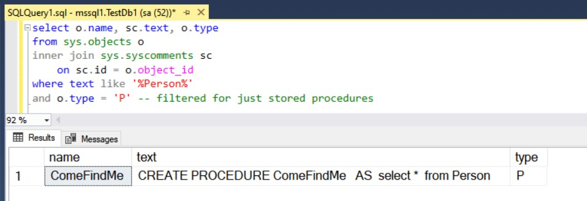
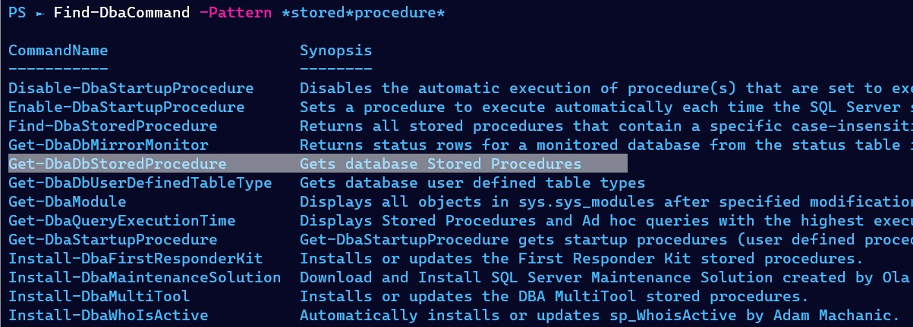
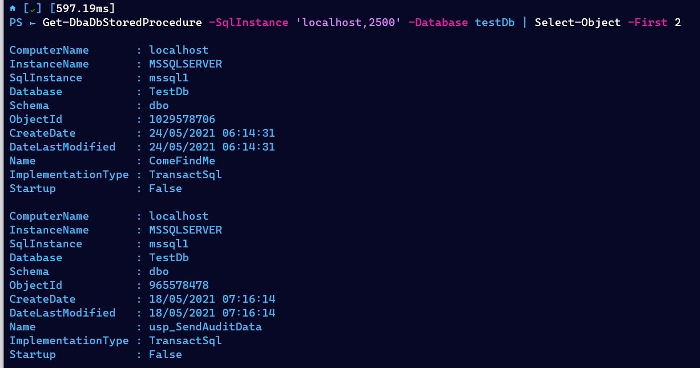
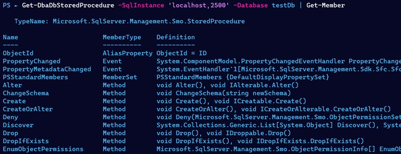

Well folks, after starting the year off on a strong foot it’s been a while since I’ve published any blog posts. Hope you didn’t miss me too much, but I’m back now and I’ve got a useful dbatools snippet for you today.  Last week at the day job I had a situation where I needed to find all stored procedures that referenced a certain string, across any database on a specific server.  This is a pretty trivial task in SSMS when you’re just talking about one database. For example, if we’re looking for any reference to ‘Person’ perhaps we could run this T-SQL within the context of the database:

```sql
select o.name, sc.text, o.type
from sys.objects o
inner join sys.syscomments sc
	on sc.id = o.object_id
where text like '%Person%'
and o.type = 'P' -- filtered for just stored procedures
```

You can see I’ve found one procedure in my TestDb that references the ‘Person’ table, so it has been returned.



However, if I want to search all databases on the server I now need to start thinking about a cursor, or using something like `sp_MSforeachdb` to iterate over the databases.  A quick warning here- `sp_MSforeachdb` is an undocumented procedure and there are some known issues with it.

The natural next step here when we’re thinking about handling multiple databases is to switch to PowerShell and use dbatools.

## Find the dbatools command for the job

When we’re looking for the command we need within dbatools to fulfil our needs I cannot recommend `Find-DbaCommand` highly enough.  This command will search all other commands for the pattern you pass in.  Today we know we want to find references in stored procedures so let’s see if there is a command that will help.

```PowerShell
Find-DbaCommand *stored*proc*
```



Looks like `Get-DbaDbStoredProcedure` is what we need here.  Since this is our first time using this particular command I always have a quick look through the help content. I highly recommend running `Get-Help Get-DbaDbStoredProcedure -ShowWindow`, this will open a separate window from your console and allow you to keep that open to refer back to if needed.  The last section of the help gives us several examples on how to use this command- let’s run a simple one against a test database to see what we get. I’m also going to pipe the output to `Select-Object` so I can just sample the first 2 results.

```PowerShell
Get-DbaDbStoredProcedure -SqlInstance 'localhost,2500' -Database testDb | Select-Object -First 2
```



This is handy, but this output doesn’t look like it’s going to help answer the question and find references of a string within the stored procedure code. There’s more than meets the eyes though.

## SQL Server Management Objects (SMO)

dbatools deals mostly with SQL Server Management Objects (SMO), which means that what you see in the output for commands is not always all there is available.  SMO is a hierarchy of objects which can be easily traversed from the output of the commands.  You can tell that we’re dealing with SMO instead of standard PowerShell objects by using `Get-Member` and looking at the TypeName.

```PowerShell
Get-DbaDbStoredProcedure -SqlInstance 'localhost,2500' -Database testDb | Get-Member
```



`Get-Member` is also really useful for looking to see what’s available from the object that is returned. In the screenshot above you can see multiple methods that can be used. If you run this in your console you’ll also get a list of all available properties.  That’s a hint for what we need for our scenario.

## Find our string within all Stored Procedures in any database

Now that we know the `Get-DbaDbStoredProcedure` command is going to return SMO StoredProcedure objects we can look at some of the properties not returned by default.  We already saw one option for this- using `Get-Member` will list all the properties available to us.  Another option is to select all the properties for the first result.

```PowerShell
Get-DbaDbStoredProcedure -SqlInstance 'localhost,2500' -Database testDb | Select-Object -First 1 *
```


In the output you can see there are a lot of properties available that weren’t returned by default, this includes `TextBody` which is what we need to search for our reference string.  All we need to do now is pipe the output of the command through to `Where-Object` to find what we need:

```PowerShell
Get-DbaDbStoredProcedure -SqlInstance 'localhost,2500' -ExcludeSystemSp | Where-Object TextBody -like '*Person*'
```

You’ll notice two more changes to the code above. I dropped the `Database` parameter, opening the search up to the whole server. I also added `ExcludeSystemSp`, which means I’m only interested in user defined stored procedures. It is important to note if you have a lot of stored procedures this command could take a little while to run.


PowerShell also supports other [comparison operators](https://docs.microsoft.com/en-us/powershell/module/microsoft.powershell.core/about/about_comparison_operators?view=powershell-7.1) by default, including `match` which can be used to find regex patterns within your procedures.  This opens up a lot more possibilities when looking for more complicated patterns within your database.

## So many more options…

Today we were only looking for results on one SQL Server instance, but since dbatools makes handling multiple SQL instances easy we could also widen the search and instead search our entire estate for references to a certain string.

We also only looked at Stored Procedures today, but if you do a little research with `Find-DbaCommand`, `Get-Help` and `Get-Member` you’ll soon find what you need to search through functions, views and more.

Happy searching!
