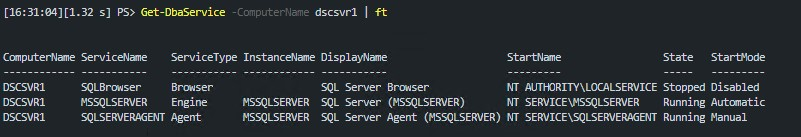
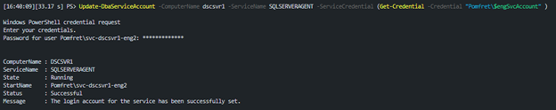
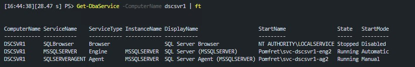
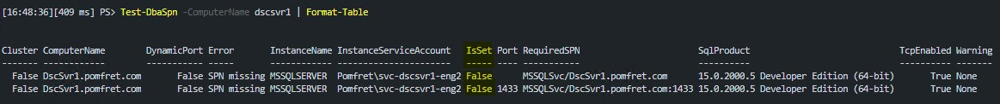
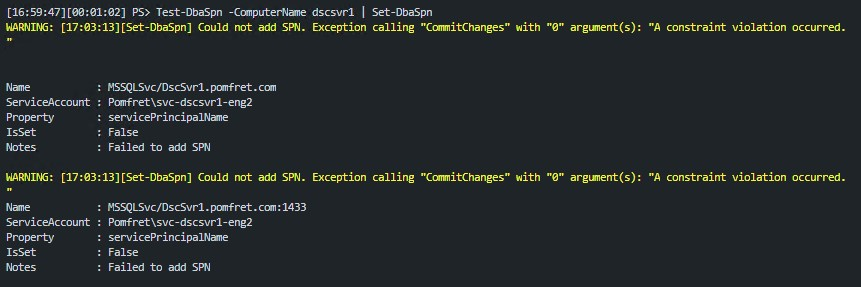
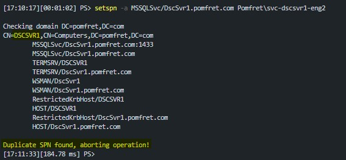
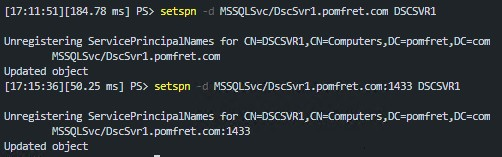
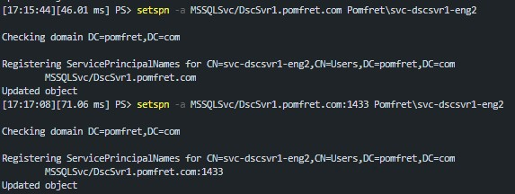
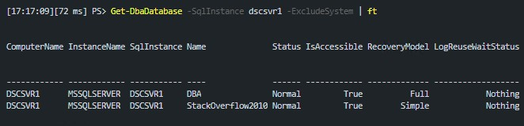

I was working in my lab environment this weekend, playing with some SQL Servers that I had built with PowerShell DSC a while ago.  I had installed SQL Server with mostly defaults, including not changing the engine and agent service accounts.  For the blog post I thought I was going to write next, I wanted to change these to be active directory accounts – it did not go smoothly, and I figured this might be useful to document for future Jess, or anyone else who might stumble across this problem.

## Create the Issue: Change SQL Server Service Accounts

First off, I created two new Active Directory users that I’ll use for my service accounts. The below code will create a prompt for each account for the password to be entered.

```PowerShell
$engSvcAccount = 'svc-dscsvr1-eng2'
$agSvcAccount  = 'svc-dscsvr1-ag2'

$EngSvcAccount = @{
    Name                 = $engSvcAccount
    UserPrincipalName    = $engSvcAccount
    AccountPassword  	 = (Get-Credential -Credential EnterPassword).Password
    PasswordNeverExpires = $true
    Enabled              = $true
}
New-AdUser @EngSvcAccount

$AgentSvcAccount = @{
    Name                 = $agSvcAccount
    UserPrincipalName    = $agSvcAccount
    AccountPassword      = (Get-Credential -Credential EnterPassword).Password
    PasswordNeverExpires = $true
    Enabled              = $true
}
New-AdUser @AgentSvcAccount
```

We can view the current SQL services with `Get-DbaService`. This is useful to see what account they are currently running under, as well as the service names.

```PowerShell
Get-DbaService -ComputerName dscsvr1 | Format-Table
```



There is also a command for updating service accounts in dbatools. I will note, sometimes I have issues with the command being able to update the accounts and I’m not sure why. It worked perfectly in this scenario though running the following.

This again creates a prompt to enter the service account password, before setting the service 'StartName'.

```PowerShell
Update-DbaServiceAccount -ComputerName dscsvr1 -ServiceName MSSQLSERVER -ServiceCredential (Get-Credential -Credential "Pomfret\$engSvcAccount" )
Update-DbaServiceAccount -ComputerName dscsvr1 -ServiceName SQLSERVERAGENT -ServiceCredential (Get-Credential -Credential "Pomfret\$agSvcAccount" )
```



If I rerun `Get-DbaService` I can see all looks good. `StartName` shows my new accounts and the services for both engine and agent are running.

```PowerShell
Get-DbaService -ComputerName dscsvr1 | Format-Table
```



## The Issue

At this point I was still planning on writing a blog post on a totally different topic. I ran the following to determine what databases I already had on dscsvr1:

```PowerShell
Get-DbaDatabase -SqlInstance dscsvr1 -ExcludeSystem | Format-Table
```

But instead of getting a quick answer to my question, I just got the following error:

```text
WARNING: [15:19:49][Get-DbaDatabase] Error occurred while establishing connection to dscsvr1 |
The target principal name is incorrect. Cannot generate SSPI context.
```

I checked a few things as I started troubleshooting:

- Are the services running – we already checked this with `Get-DbaService` and they are
- Was it firewall related – inbound rules were in place, and I was able to previously connect
- Was it certificate related – I’m not forcing encryption, and there are no certificates set up
- Was it Service Principal Name (SPN) related – bingo

I have seen this happen before when changing service accounts for SQL services. I’m not an Active Directory expert, and I’m certainly not a Kerberos expert – in fact I’m as surprised as you that Kerberos has actually appeared on this blog. 

What I do know is that due to permissions, the SPNs needed were not able to be registered for the new service accounts.  The easiest way to investigate SPN issues is with dbatools, saving us again!

`Test-DbaSpn` works out exactly what SPNs are needed for our SQL instances and determines if they are in place.

```PowerShell
Test-DbaSpn -ComputerName dscsvr1 | Format-Table
```



This shows we should have two SPNs set for the default instance (MSSQLSERVER) on DscSvr1.  The ‘IsSet’ column shows they aren’t set – and this is why we can’t connect to our instance remotely.

## Let's Fix It

The fix for this issue seems simple- register the required SPNs.  dbatools again tries to make this as easy as possible for us. We can take the output from `Test-DbaSpn` and pipe it straight into `Set-DbaSpn` and dbatools will take care of the rest – won’t it?

```PowerShell
Test-DbaSpn -ComputerName dscsvr1 | Set-DbaSpn
```



As you can see from the warning message, dbatools wasn’t able to set our required SPNs either. It complains about 'A constraint violation occurred'.

The reason is each SPN can only be registered once, and these SPNs were created for the previous service accounts and never cleaned up due to a lack of permissions.

We now need to use the `setspn` command line tool that is built into Windows and available when you have AD windows features installed, but the output from the dbatools command is still very useful for building the inputs for `setspn`.

First we’ll try and register the required SPNs manually. For this we’ll use the -a parameter on `setspn`, the format being:

```PowerShell
setspn -a <<SPN>> <<ServiceAccount>>
```

So we’ll run the following, getting the SPN from the ‘RequiredSPN’ column of the `Test-DbaSpn` output. You’ll notice there are two required SPNs, one without a port specified and one with 1433 – we’ll want to fix both.

```PowerShell
setspn -a MSSQLSvc/DscSvr1.pomfret.com Pomfret\svc-dscsvr1-eng2
```



You can see in the output, the problem is highlighted – ‘Duplicate SPN found’.  The useful part of this output is on the second line.  I’ve highlighted the current owner of the SPN – we need this to be able to resolve the problem.  Not surprising, it is the computer account since I was previously running SQL Server as the default `NT SERVICE\MSSQLSERVER` account.

Now we know what the duplicate is we can remove it, again using setspn, but this time with the -d parameter. The format is:

```PowerShell
setspn -d <<SPN>> <<ServiceAccount>>
```

We’ll run the following two commands to clear up both old SPNs:

```PowerShell
setspn -d MSSQLSvc/DscSvr1.pomfret.com DSCSVR1
setspn -d MSSQLSvc/DscSvr1.pomfret.com:1433 DSCSVR1
```



Finally we can add the required SPNs. We can either use dbatools with the code we tried earlier or `setspn`.

```PowerShell
setspn -a MSSQLSvc/DscSvr1.pomfret.com Pomfret\svc-dscsvr1-eng2
setspn -a MSSQLSvc/DscSvr1.pomfret.com:1433 Pomfret\svc-dscsvr1-eng2
```



You can see the output now states ‘Updated object’ which means we were successful. If we try and view the databases again now we should see the output we were expecting.



## Summary

As I mentioned, this was not at all what I was expecting to write about – but I hope it’ll be useful if you ever find yourself in this situation while trying to change service accounts for SQL Server.

I was in the end able to resolve the permissions problems for my service accounts by following this great blog post '[SQL Server - Could not register the Service Principal Name](http://www.alexandreviot.net/2014/09/30/sql-server-could-not-register-the-service-principal-name-spn/)'. Once I applied these permissions when I changed service accounts they were able to delete and recreate the required SPNs.

Another great blog post for more reading on SPNs is this post by Drew Furgiuele on how to use the [dbatools SPN commands](https://dbatools.io/schwifty/).
