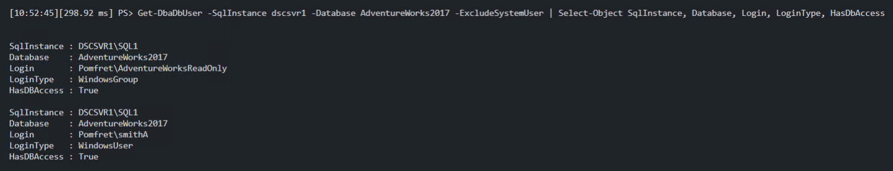
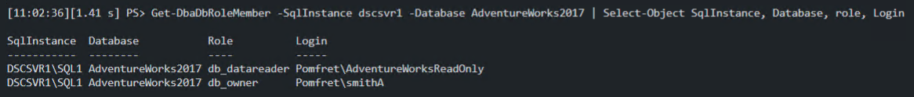
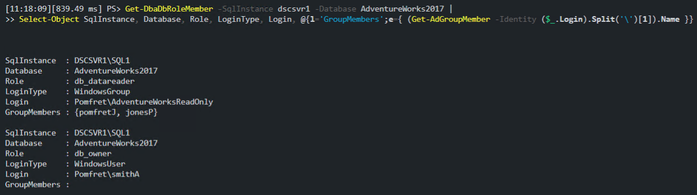

When granting permissions to SQL Server resources we have a few options. One option is to grant permissions to Active Directory groups instead of individual users.  This has several benefits, for example, improved security over using SQL logins, and the ability to create a separation of duties when controlling database access.

However, it does add an extra step when trying to determine who has what access to your SQL Servers. It can also make troubleshooting permission issues more challenging.  This post is going to aim to simplify this by combining dbatools and ActiveDirectory PowerShell modules to provide a clear solution.

## Setup

This is obviously not needed in our actual environments, this is just how I prepared my lab so I could demonstrate how we can solve this problem.  Feel free to skip ahead to the solution if you already have plenty of AD groups to investigate.

The full code sample is available in my [GitHub demos repo](https://github.com/jpomfret/demos/blob/master/BlogExamples/07_PermisssionsGrantedViaADGroups.ps1).

First, I created some AD users and groups to use in my lab. This is easily achieved with the AD PowerShell module using `New-AdUser` and `New-AdGroup`. Then, using `Add-AdGroupMember`, I added two users into the newly created group.

```PowerShell
# setup - create some AD users\groups uing the ActiveDirectory module
# create several new ad users
('pomfretJ','smithA', 'jonesP','barnesR').foreach{New-AdUser $_}

# view newly created users
$date = (get-date).AddHours(-1)
get-aduser -filter {created -gt $date} | select name

# create a new Ad group
$newAdGroup = @{
    Name          = 'AdventureWorksReadOnly'
    GroupCategory = 'Security'
    GroupScope    = 'Global'
    Path          = 'CN=Users,DC=pomfret,DC=com'
}
New-ADGroup @newAdGroup

# add users to group
$addMemberGroup = @{
    Identity = 'AdventureWorksReadOnly'
    Members = 'pomfretj', 'jonesP'
}
Add-ADGroupMember @addMemberGroup
```

The second part of the setup was to add an AD group and an AD user to the SQL Server and grant some permissions using dbatools.

```PowerShell
# setup - grant permissions to ad users\groups using dbatools

# add ad group and grant permissions (db_datareader to AdventureWorks)
New-DbaLogin -SqlInstance dscsvr1 -Login 'Pomfret\AdventureWorksReadOnly'
New-DbaDbUser -SqlInstance dscsvr1 -Database AdventureWorks2017 -Login 'Pomfret\AdventureWorksReadOnly'
Add-DbaDbRoleMember -SqlInstance dscsvr1 -Database AdventureWorks2017 -Role db_datareader -User 'Pomfret\AdventureWorksReadOnly' -Confirm:$false

# add ad user to sql server and provide permissions (db_owner to AdventureWorks)
New-DbaLogin -SqlInstance dscsvr1 -Login 'Pomfret\smithA'
New-DbaDbUser -SqlInstance dscsvr1 -Database AdventureWorks2017 -Login 'Pomfret\smithA'
Add-DbaDbRoleMember -SqlInstance dscsvr1 -Database AdventureWorks2017 -Role db_owner -User 'Pomfret\smithA' -Confirm:$false
```

## Viewing database access

Now that my lab environment is set up, let’s take a look at database users that have access to the AdventureWorks2017 database.  This is an easy task thanks to dbatools, we can just use `Get-DbaDbUser`. Shown below, you can clearly see there is a WindowsUser 'smithA' that has access, as well as a WindowsGroup 'AdventureWorksReadOnly'.

```PowerShell
# Find users that have permissions through group membership
Get-DbaDbUser -SqlInstance dscsvr1 -Database AdventureWorks2017 -ExcludeSystemUser | Select-Object SqlInstance, Database, Login, LoginType, HasDbAccess
```



We can also use `Get-DbaDbRoleMember` to see exactly which database roles these users have been granted.

```PowerShell
Get-DbaDbRoleMember -SqlInstance dscsvr1 -Database AdventureWorks2017 | Select-Object SqlInstance, Database, role, Login
```



The issue is the same for both these examples, we don’t know which users are inheriting the permissions granted to the 'AdventureWorksReadOnly' group. This is where we need to combine these two modules to get the answers we need.

There are several ways you could combine the output of two functions. For this example I’m going to use a calculated property.

If I run the exact same code as before to get a list of role members from the dbatools function `Get-DbaDbRoleMember`, I can add a calculated property in the Select-Object to lookup the members of that specific group from active directory.  In the example below you can see the 'AdventureWorksReadOnly' group has two members, and we now know that both 'pomfretJ' and 'jonesP' have read access to the AdventureWorks2017 database.

You can also still see the WindowsUser, 'smithA', has db_owner permissions.  Since that lookup didn’t return any results (obviously, since it’s a user not a group), the GroupMembers property remains empty.

```PowerShell
Get-DbaDbRoleMember -SqlInstance dscsvr1 -Database AdventureWorks2017 |
Select-Object SqlInstance, Database, Role, LoginType, Login, @{l='GroupMembers';e={ (Get-AdGroupMember -Identity ($_.Login).Split('\')[1]).Name }}
```



You can also use this same code to determine specific user access, for example, by adding a Where-Object to see just the permissions granted to 'pomfretJ'.

## Summary

This should give you an easy option for determining specific user access that is hidden behind AD groups, and I think reduces one of the negatives of using AD groups in this situation.  It also shows us that we can combine multiple functions into one to get all the information we need with one easy line of code.

I would also encourage you to explore the other permission related dbatools functions available, including `Get-DbaServerRole` and `Get-DbaPermission`. These can also be used in combination with `Get-AdGroupMember` to enhance the results.
