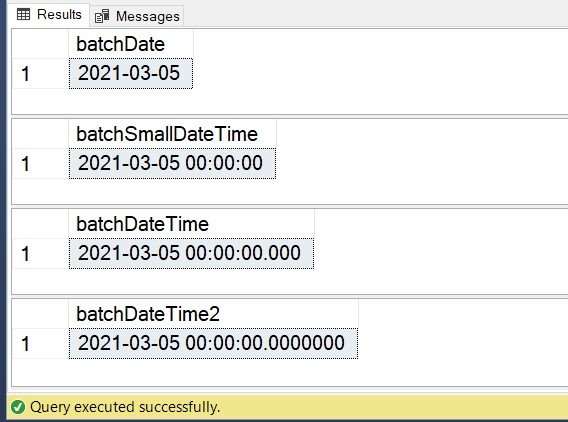

Shout out to Brent Ozar ([b](http://brentozar.com/)|[t](https://twitter.com/BrentO)) for hosting this month's TSQL2sday. It’s time again for this monthly blog party and he wants to know all about our favourite or least favourite data types. To start with I was having a hard time thinking of a favourite data type. I know I have favourite words (merge and plethora, in case you’re wondering), but it seems a bit wrong to pick favourites here – I mean lots of them are great in their own right. Then it came to me- my favourite data type is the right one for the job at hand. Feels like I’m skirting the question a little here, but bear with me.

Let’s talk about accuracy and precision, and how much of it you actually need.  The rest of this post is going to focus on datetime datatypes, but these thoughts could easily apply elsewhere (for example tinyint vs int vs bigint).

First things first, let’s review our options when it comes to storing dates in a SQL Server table. These are the 6 current datatype options for datetime data in SQL Server:

Let’s talk about accuracy and precision, and how much of it you actually need.  The rest of this post is going to focus on datetime datatypes, but these thoughts could easily apply elsewhere (for example tinyint vs int vs bigint).

First things first, let’s review our options when it comes to storing dates in a SQL Server table. These are the 6 current datatype options for datetime data in SQL Server:

| Datatype | Accuracy | Storage Size | Notes |
| --- | --- | --- | --- |
| Date | One day | 3 bytes | Doesn't include time |
| SmallDateTime | One minute | 4 bytes |  |
| DateTime | Rounded to increments of .000, .003, or .007 seconds | 8 bytes |  |
| DateTime2 | 100 nanoseconds | 6 bytes for precision less than 3.
7 bytes for precision 3 or 4.
All other precision require 8 bytes. |  |
| Time | 100 nanoseconds (1 millisecond in Informatica) | 5 bytes | Doesn't include date |
| DateTimeOffset | 100 nanoseconds | 10 bytes | Includes time zone awareness |

This table was created from information on Microsoft Docs, and there is plenty more information if you’re interested: [Data types (Transact-SQL) - SQL Server | Microsoft Docs](https://docs.microsoft.com/en-us/sql/t-sql/data-types/data-types-transact-sql?view=sql-server-ver15).

## The Setup

For this example, let’s say I have a table that gets loaded by a daily batch job. The column we will discuss needs to store just the date, no time and no need for time zone awareness. This leaves us with 4 options to investigate.

In order to demonstrate the importance of choosing the right datatype I’m going to create 4 really simple tables. They will each have one column, with a default value of today's date, and no time information.  These tables are totally unrealistic, but it isolates the storage required for a single column and will allow us to focus in on the differences our decision here can cause in a small test case.

create table dataTypeDate (
batchDate date default (convert(date,getdate()))
)

create table dataTypeSmallDateTime (
batchSmallDateTime smalldatetime default (convert(date,getdate()))
)

create table dataTypeDateTime (
batchDateTime datetime default (convert(date,getdate()))
)

create table dataTypeDateTime2 (
batchDateTime2 datetime2 default (convert(date,getdate()))
)

Once we have four tables we can run the following to load our batch for the day. To simulate this we’re going to insert the default values, 500,000 times.  You can see here I’m using the `GO 500000` syntax to run each insert half a million times.

insert into dataTypeDate
default values;
GO 500000

insert into dataTypeSmallDateTime
default values;
GO 500000

insert into dataTypeDateTime
default values;
GO 500000

insert into dataTypeDateTime2
default values;
GO 500000

## The Comparison

First, let’s take a look at the first row in each table so we can see the different accuracies of our columns:

SELECT TOP 1 batchDate FROM dataTypeDate
SELECT TOP 1 batchSmallDateTime FROM dataTypeSmallDateTime
SELECT TOP 1 batchDateTime FROM dataTypeDateTime
SELECT TOP 1 batchDateTime2 FROM dataTypeDateTime2

We have the exact same data in these columns, just a date, no time. However, because of the different datatypes we used when we defined our tables, you can clearly see the different accuracies that were available to us.  The requirement for the datatype to be able to meet stricter accuracies is where the additional storage comes in. As you saw in the table above, storing just a date, which is all we need in this situation, will cost us 3 bytes. Any other datatype we choose will add unnecessary storage. While we’re talking bytes, and it doesn’t seem like a big deal for one row with one column, it adds up quickly when we’re talking millions of rows with multiple columns that are inappropriate typed.

The following query will display some information about our four tables, including the number of 8k pages that each table is using.

SELECT
    schema\_name(obj.SCHEMA\_ID) as SchemaName,
    obj.name as TableName,
    ind.type\_desc as IndexType,
    pas.row\_count as NumberOfRows,
    pas.used\_page\_count as UsedPageCount,
    (pas.used\_page\_count \* 8)/1024 as SizeUsedMB,
    par.data\_compression\_desc as DataCompression,
    (pas.reserved\_page\_count \* 8)/1024 as SizeReservedMB
FROM sys.objects obj
INNER JOIN sys.indexes ind
    ON obj.object\_id = ind.object\_id
INNER JOIN sys.partitions par
    ON par.index\_id = ind.index\_id
    AND par.object\_id = obj.object\_id
INNER JOIN sys.dm\_db\_partition\_stats pas
    ON pas.partition\_id = par.partition\_id
WHERE obj.schema\_id <> 4
ORDER BY UsedPageCount desc

We can see that there are 500,000 rows in each of our tables and even with only one column there is a sizable difference in the number of pages needed if we chose DateTime or DateTime2 over just the Date type. It’s about a 25% savings- multiply that out by multiple columns across multiple tables and we’re going to start seeing a pretty sizable difference in our storage needs.

This is still a pretty small dataset, but it does clearly show that there is a significant difference in the amount of storage needed if we choose an unnecessarily accurate datatype for our date values.

## **Storage is cheap – why do I care?**

Storage might not be our biggest concern, although enterprise grade storage is not as cheap as the USB drives at the supermarket checkout, but there are several other reasons why this wasted space is a big deal. Here’s a few:

**Buffer Cache** – When SQL Server needs to interact with our data it first reads it into memory. Wasted space on disk then becomes wasted space in memory. That means we can store less data in the buffer cache and will have to flush out pages more quickly than if they were optimised.

**Backup\\restore** – The bigger your database the longer it’s going to take to perform backup and restore activities.

**Transaction log activity** – The bigger the record in SQL Server the more space it’ll need when any operations are written to the transaction log. This means you’ll need more disk space for your transaction log and your t-log backups will be larger. More wasted space.

## Summary

So in a truly diplomatic fashion, I rate all the datatypes equally. We’ve only looked at types specific to datetimes in this post, but each and every datatype is suitable for storing certain data. The most important point is that we make solid decisions on both the type of data we want to store and the accuracy/precision needed to store that data.

Thanks for reading, and thanks again to Brent for hosting.
