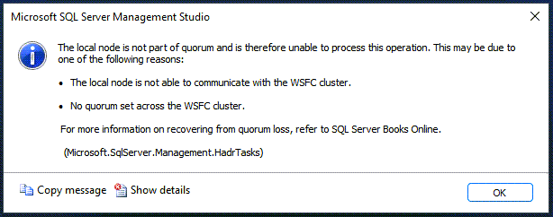

While building out some labs for the training day Rob Sewell and I are giving at [SQLBits 2023](http://sqlbits.io/jessandbeardday) I came across a fun error that I thought I'd document how to fix with PowerShell, in case it comes up for others.

To be honest, if you follow the 'How to setup and Availability Group' guides properly you probably won't stumble across this - but I didn't so there's issue number one.

We are using [Automated Lab](https://automatedlab.org/en/latest/) to build out an environment in Azure - this module is really clever, and I've been impressed with how easy it is to build out a pretty complicated environment.

However, we have 4 servers that are destined to be a SQL Server Availability Group. The problem was I managed to install SQL Server, and configure the instances for Availability groups - before installing and configuring the Windows Server Failover Cluster (WSFC).

No problem, Automated Lab has many pre-defined roles built in and one of those is `FailoverNode` - add this to two or more of your lab machine definitions and AutomatedLab will work it's magic and create a WSFC for you.

After a rerun of the AutomatedLab installation we had a four node cluster - ready to create an availability group. Here's where the problem appeared, when trying to create a new AG on one of the SQL Servers, I got the following error:



```text
The local node is not part of quorum and is therefore unable to process this operation. This may be due to one of the following reasons:

- The local node is not able to communicate with the WSFC cluster.
- No quorum set across the WSFC cluster.

For more information on recovering from quorum loss, refer to SQL Server Books Online.
```

My first step of troubleshooting was to ensure my cluster was actually configured properly and had quorum set. It did - so I should be good to go.

The problem was I had enabled Availability Groups, either in the SQL Server Configuration Manager, or via PowerShell before the WSFC was configured.

Turns out it's an easy fix - turn it off and back on again, or in this case, disable and reenable the availability group setting.

You can easily do that in PowerShell with [dbatools](https://dbatools.io/) across all your nodes:

```PowerShell
$sqlagnodes = 'sqlnode1','sqlnode2','sqlnode3','sqlnode4'

# Disable availability group feature
Disable-DbaAgHadr -SqlInstance $sqlagnodes -Force -Confirm:$false

# Enable availability group feature
Enable-DbaAgHadr -SqlInstance $sqlagnodes  -Force -Confirm:$false
```

Once the services were back up I could create my availability group through SQL Server Management Studio, or with dbatools using the [New-DbaAvailabilityGroup](https://docs.dbatools.io/New-DbaAvailabilityGroup) function.