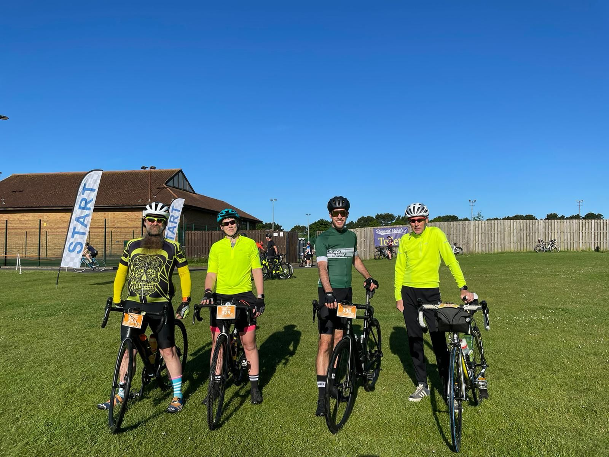

Well 2022 has flown by, there were some definite lows but also some great highs. A lot of travel, a return to in-person conferences and a redesigned blog! I was pretty disappointed with the absolute lack of blogging last year - I only managed 2 posts in the entire year, not at all what I was aiming for. However, I did manage some other good community work that I'll highlight here before setting a few 2023 goals.

Towards the end of 2022 I decided I was done with hosting my blog on Wordpress - I was paying more money than I wanted to spend on it and I started researching static sites instead. Thanks to a great post from [Kendra Little](https://mastodon.cloud/@KendraLittle), [Moving From WordPress to an Azure Static Site with Hugo](https://littlekendra.com/2021/05/03/moving-from-wordpress-to-an-azure-static-site-with-hugo/), I had everything I needed to get started.

I did stray slightly from Kendra's guide - I ended up hosting my site on GitHub Pages and I have a fancy GitHub Action to preview drafts and publish new content. Hopefully I'll write about this setup in the new year! If you're reading this and I haven't... come shout at me!

But what I really want to say here is welcome to the new blog. I love how it's turned out so far. There are still some pieces I'm working on but I'm way happier with where it is and how it looks, and I'm hoping that'll lead to an easier time writing content and publishing some blogs, only time will tell on that one!

## 2022 - Some Wins

While I was redesigning my blog I ended up re-reading a lot of old posts, and some of the ones I enjoyed the most were the previous years wrap up\goal setting posts, like this [2021 goals](https://jesspomfret.com/2021-goals/) post. Did I manage most of those goals - no and did I manage to write a similar post in 2022 - also no, but hey here we are in 2023, so lets give it a go.

First we'll recap some wins. It's always good to highlight some things that were good to give us a boost:

### Back to presenting in person

Although my first scheduled in-person event ended up being virtual for me, I caught covid the week before [SQLBits 2022](https://sqlbits.com/), I finally managed to get back on stage and in front of an audience. That was both scary, as I remembered it would be, and so rewarding. I enjoy presenting online, but since that had been the only option for a couple of years it was really nice to be back in front of real live people.

Both [DataGrillen](https://datagrillen.com/) and [PSConfEU](https://psconf.eu/) were in June so that month was busy, but travelling to Germany and then Vienna really reminded me how much I love participating in in person conferences. I hope there is a lot more of this in 2023!

### All Day Training Sessions

As I mentioned, SQLBits 2022 ended up being a virtual conference for me, however due to their pretty neat hybrid setup I was still able to present my dbatools training day with [Rob Sewell](https://tech.lgbt/@robsewell). This was the first all day session I've given and it was so much fun. I couldn't have asked for a better person to team up with on this, and we had a great time creating and then delivering the content... and one day Rob will forgive me for not showing up in-person!

Rob and I also teamed up for another all day training session, this time at the [South Coast Summit 2022](https://www.southcoastsummit.com/) in Southampton. Here we covered everything from bicep to dev containers to Hugo (the static site generator this blog is now using!)

Some good news here is I get a chance to redeem myself in 2023. Rob and I managed to secure a training day at SQLBits 2023 titled '[Getting your SQL estate in order at scale and keeping it that way with ease.](https://events.sqlbits.com/2023/training-days)'. Here we'll be discussing managing large estates with our favourite PowerShell tools - this is going to be a good one!

### LinkedIn Learning

Another achievement I'm proud of this year is I've managed to become a [LinkedIn Learning Instructor](https://www.linkedin.com/learning/instructors/jess-pomfret) and my first course [Automating SQL Server with dbatools](https://www.linkedin.com/learning/automating-sql-server-with-dbatools/) was released in November. I love sharing dbatools knowledge with folks and this was the perfect platform for me to create some video content.

Also, still top secret at this point, but I'm working on a second course for them now that'll be out in the new year. I can't share topics or dates yet but I'm excited for it so watch this space!

### The book

Finally, probably the biggest project I've been involved in was the writing of the [Learn Dbatools in a Month of Lunches](https://www.manning.com/books/learn-dbatools-in-a-month-of-lunches?utm_source=jpomfret&utm_medium=affiliate&utm_campaign=book_lemaire_learn_8_27_19&a_aid=jpomfret&a_bid=4895c1a2) book. We finally got our hands on a real life copy in June and it was so emotional to finally be able to hold it!

The response to the book has been fantastic, and there is nothing better than someone telling me how they're using it to improve their PowerShell and dbatools skills.

### Other goals

There were also some other goals I set myself last year - one was to cycle 1000 miles on my bike in 2022. I had set this goal in 2021 and ended the year on 954.57 miles - so close. This year I was determined to make it and ended on 1,010.35 miles, out of 10 years of Garmin data this is my biggest yearly total ever. I will say 38.84 miles were completed inside on a Concept2 bike. Next year's goal is 1000 outside miles.

My longest ride this year was 66.82 miles, as a group of us completed the [New Forest 100km](https://www.strava.com/activities/7184619567) ride. I'm thinking about 100 miles this year. I'd love to check a century ride off the bucket list.

## 2023 Goals

Alright let's set some targets for 2023:

- Speaking - I don't have a hard fast number here but I'd like to get to speak at 5 in-person events this year.
  - So far I have 2 scheduled for January at my [local user group](https://www.meetup.com/en-AU/southampton-data-platform-and-cloud-group/) and then [SQLBits 2023](https://events.sqlbits.com/2023/?) in March.
- Blogging - Let's aim for 10 posts this year on this nice new site - here's the first 1!
- Open Source contributions - Another thing that took a hit last year was the amount of time I spent contributing to dbatools and dbachecks - I plan to change that this year.
- Certification - I'm aiming for the AZ-104 early this year to add to my Azure certifications.
- Biking - 1000 outside miles is the goal.

I also have a couple of projects in the works that hopefully will be born in 2023.

Thanks all for reading and hope everyone has a great 2023!
