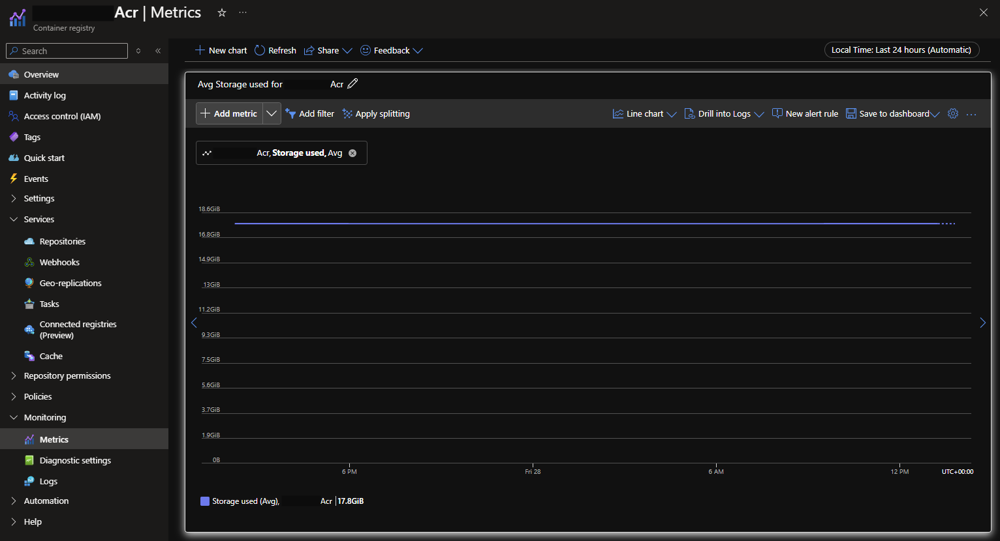
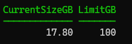
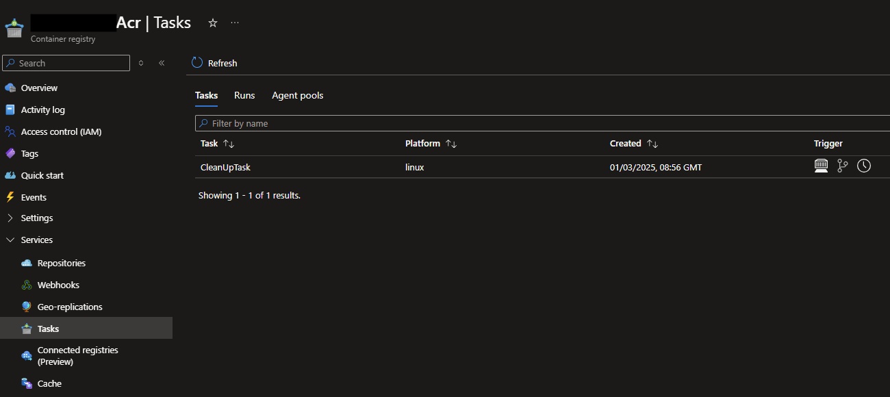
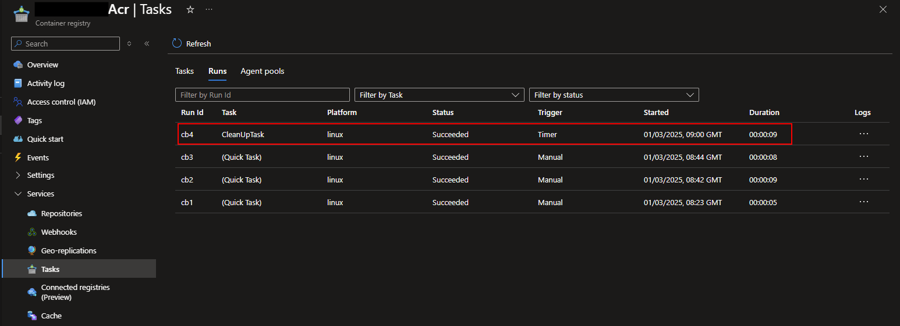
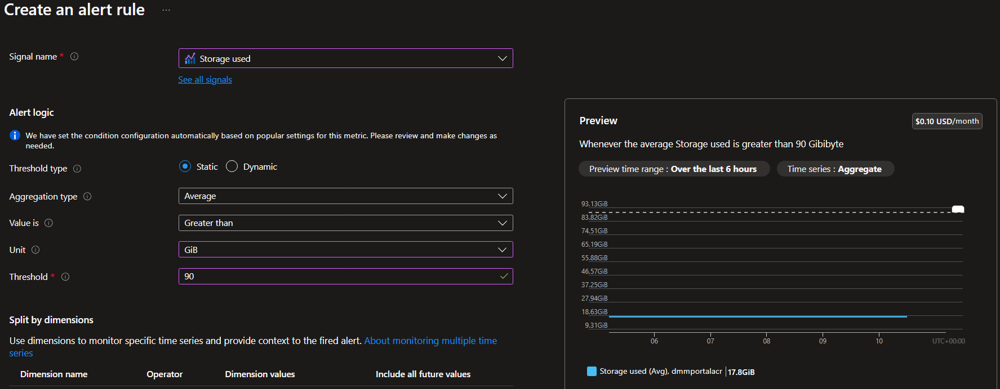



This article is part of the [Azure Spring Clean](https://www.azurespringclean.com/) series, which focuses on promoting well managed Azure tenants. I love cloud technologies, but it is incredible easy to spin something up without best practices or guardrails - that then goes on to create unnecessary cloud spend. When I saw the call for papers for this series, I knew I had the perfect post for it.

Keeping your Azure Container Registries clean and tidy.

## What is an Azure Container Registry?

So first, what is an Azure Container Registry (ACR), and what's it used for.  In simple terms it's a place in Azure for you to store container images and other artifacts. It comes with some neat features like geo-replication and integrated Entra authentication so it's enterprise ready, and it can be easily integrated into your pipelines and build processes.

At the time of writing there are three ACR tiers you can choose from: Basic, Standard and Premium. As you can imagine, each one has a different price point, and resource limits. For this blog post we're talking about storage, and for our three tiers, these are the current storage allowances:

| Tier     | Included Storage | Max storage |
|----------|------------------|-------------|
| Basic    | 10 GB            | 40 TB       |
| Standard | 100 GB           | 40 TB       |
| Premium  | 500 GB           | 40 TB       |

A full list of limits per tier can be found in the Docs - [Service tier features & limits](https://learn.microsoft.com/en-gb/azure/container-registry/container-registry-skus#service-tier-features-and-limits).

So what do you think happens between the included storage and max storage amounts? You guessed it - you pay extra for it.

Let's look at how we can see what the current storage usage is, and how we can keep it under control.

## Show current storage usage

Alright, first, let's see what we're currently using. There are a few ways to see this, first, in the [Azure portal](https://portal.azure.com/), as shown below. Here you can see I'm using 17.8GB - but there is no indication from here how much included storage I have. I would need to check the overview pane, note it's a standard tier and then refer to the document above to know I'm within the 100GB limit.



We can also do this with the Azure cli, running the following:

```PowerShell
az acr show-usage -n acrName
```

Will get us a response in JSON. We can see that the first item, with the name `size` has both `limit` and `currentValue` properties, that are in `bytes`.

```json
{
  "value": [
    {
      "currentValue": 19116221660,
      "limit": 107374182400,
      "name": "Size",
      "unit": "Bytes"
    },
    {
      "currentValue": 0,
      "limit": 10,
      "name": "Webhooks",
      "unit": "Count"
    },
    {
      "currentValue": 0,
      "limit": 500,
      "name": "ScopeMaps",
      "unit": "Count"
    },
    {
      "currentValue": 0,
      "limit": 500,
      "name": "Tokens",
      "unit": "Count"
    }
  ]
}
```

But this still isn't very easy to read, so since I'm a PowerShell fan, lets's convert the JSON to a PowerShell object and then select the properties we care about in GB.

```PowerShell
(az acr show-usage -n acrName | ConvertFrom-Json).Value  |
Where-Object name -eq 'size' |
Select-Object @{l='CurrentSizeGB';e={$_.currentValue/1GB}}, @{l='LimitGB';e={$_.limit/1GB}}
```

That looks much better to me, and I can easily see that I'm using almost 18GB of my allowed 100GB. No overage charges for me!

But, recently I found an ACR out in the wild that was using 2.4TB of storage, way over the limit of 100GB - and every month their Azure bill had a line item charging them for extra storage!



## What's using all that space!

I have created a script to see where the space is used, this uses the `az acr manifest list-metadata` cli command to get the metadata and then creates a PowerShell object that you can work with.



I have found though, that this is missing one category of artifacts that also use space, and I haven't found an accurate way to report on that - untagged manifests. In the example where I found an ACR using 2.4TB, this report only showed 400GB of tagged images. The other 2TB were untagged manifests - now that's a whole other issue, but just be aware they also need some clean up!

> One caveat if someone is referencing manifest digests instead of tags and you clean up untagged manifests then you could break that process - but, they shouldn't be, really...

## Run an on-demand clean-up task

If you find you're already using more than your included storage amount, you're probably going to want to take action pretty quickly, this is a real way to save money in Azure. Also,  be honest, do you need 100 versions of each image? Probably not. That's a business decision you're going to have to make though, agree on a retention period and how many versions you want to have in the ACR.

We can run an on-demand clean-up of our ACR to get caught up with our agreed retention period, and you have a few options available for configuring that.

Let's start with those untagged manifests, a secret killer for ACR storage space.

We'll use the Azure cli again, to run an ACR task on demand - the task will use `acr purge`. You can read more about the command, and all the parameters in the docs: [Use the purge command](https://learn.microsoft.com/en-us/azure/container-registry/container-registry-auto-purge#use-the-purge-command).

One of my favourite parameters is `--dry-run` this will output what would happen if you executed the purge command, similar to the `-WhatIf` in PowerShell. Let's run the following:

```PowerShell
$PURGE_CMD="acr purge --filter '.*:.*' --untagged --ago 365d --dry-run"
az acr run --cmd $PURGE_CMD --registry acrName /dev/null
```

You'll want to change the `--registry` name in the `az acr run` command to your ACR name, the parameters for the purge command are as follows:

- `--filter` - this is using regex to target all repositories and all tags - you can change the regex to specify certain images, or certain tags. For example `'repositoryName:.*'` would target only tags within the `repositoryName` repository. There are [more examples in the docs](https://learn.microsoft.com/en-us/azure/container-registry/container-registry-auto-purge#use-the-purge-command).
- `--untagged` - this is going to target just manifests that don't have tags.
- `--ago` - this is how old images should be to be deleted - and is a '[Go-style duration string](https://pkg.go.dev/time)' which means you can use `10d` for 10 days, or `2.5h` for 2.5 hours ago.
- `--dry-run` - already mentioned above, but this will just output what would happen if this parameter was excluded - nothing will be deleted while this is set.

So this command will aim to delete all tags older than 1 year and all untagged manifests. This is a good way to target just those untagged manifests - if you have images older than 1 year that you aren't comfortable parting ways with yet, you can increase the `--ago` parameter.

> Note that the date restriction only applies to tags, and not to untagged manifests. If you have the `--untagged` parameter set then all untagged manifests will be purged.

The output will show you a list of what will be deleted for each repository in the ACR. It'll also state at the top if it was a dry run. In my example I don't have anything that matches the filter so nothing to be deleted.

```text
DRY RUN: The following output shows what WOULD be deleted if the purge command was executed. Nothing is deleted.

Number of tags to be deleted: 0
Number of manifests to be deleted: 0
```

Once you're happy with the results of the dry run, remove that parameter and kick it off. I would recommend if you have a lot to delete adding the `--timeout` parameter, in this case I'm giving the command an hour before it'll time out, or 3600 seconds. This will overwrite the default of 600 seconds for an on-demand task.

```PowerShell
$PURGE_CMD="acr purge --filter '.*:.*' --untagged --ago 365d"
az acr run --cmd $PURGE_CMD --registry acrName --timeout 3600 /dev/null
```

As this runs you'll get output returned to your console showing that the task is working through deleting items that match the supplied parameters. Once it's complete rerun the code in the previous section to review your space usage again. It's worth noting the code to get the usage will show the change immediately, whereas the metrics graph in the portal will take time to update.

```text
Queued a run with ID: cb6n9
Waiting for an agent...
2024/12/04 16:32:54 Alias support enabled for version >= 1.1.0, please see https://aka.ms/acr/tasks/task-aliases for more information.
2024/12/04 16:32:54 Creating Docker network: acb_default_network, driver: 'bridge'
2024/12/04 16:32:54 Successfully set up Docker network: acb_default_network
2024/12/04 16:32:54 Setting up Docker configuration...
2024/12/04 16:32:55 Successfully set up Docker configuration
2024/12/04 16:32:55 Logging in to registry: acrName.azurecr.io
2024/12/04 16:32:56 Successfully logged into acrName.azurecr.io
2024/12/04 16:32:56 Executing step ID: acb_step_0. Timeout(sec): 600, Working directory: '', Network: 'acb_default_network'
2024/12/04 16:32:56 Launching container with name: acb_step_0
Deleting tags for repository: repositoryName
Deleting manifests for repository: repositoryName

acrName.azurecr.io/repositoryName@sha256:12d70c808a8aacfeb1e9bee315f59566b4b44d66ef4b2db21fe6ac2b054c02f7
acrName.azurecr.io/repositoryName@sha256:19c4060cfccc26950409379ef54e477244de0ac2d813d9d8515590c04b6cabf5
acrName.azurecr.io/repositoryName@sha256:19c6e59df1f4acda28359b7536e38a9ae1f68a9187ef6c27bba559f965c8e6a6
acrName.azurecr.io/repositoryName@sha256:214b95a058b9dee00a090436f25ec6ea0a519b5e4dd5c93e9eb6efa15a176ab6

Number of deleted tags: 0
Number of deleted manifests: 4
2024/12/04 16:34:26 Successfully executed container: acb_step_0
2024/12/04 16:34:26 Step ID: acb_step_0 marked as successful (elapsed time in seconds: 35.737693)
```

At this point we're just cleaning up untagged manifests. It's likely that you can agree that you need less than 1 year of tags. I'd recommend reducing the `--ago` parameter to 30 days maybe, to just keep one month of tagged images.

But, what happens if you don't rebuild the images often? After 30 days you'd get rid of all your images, that's definitely not ideal. Well there is an extra parameter I'd recommend to protect against that. The `--keep` parameter will ensure you never delete all tagged images. This indicates the number of images to be kept, on top of any that match the date restrictions.

> Note: if you run the purge with `--ago 30d` and `--keep 5` you will be left with all images that were created in the last 30 days, plus 5 additional images that are older than 30 days.

I'd recommend something like this as your final clean up script - and what we'll want to schedule in the next step. Remember, test with a `--dry-run` and when you're happy with the combination, remove that parameter and let it go.

```PowerShell
$PURGE_CMD="acr purge --filter '.*:.*' --untagged --ago 30d --keep 5"
az acr run --cmd $PURGE_CMD --registry acrName --timeout 3600 /dev/null
```

## Schedule the task to run weekly

This is great, we're now (hopefully) back under the limit for included storage and our ACR is neat and tidy. However, we don't want manual tasks to complete. We are automaters!

This is fine for a one-time clean up and a good idea to ensure you're happy with the parameter choices. Once you are, I'd recommend scheduling that task to run on a daily, or weekly cadence. This will ensure you're only using the storage you need, and hopefully it's below the included amount which means no overage charges!

We have been using `az acr run` to run the task manually, we'll instead swap to use `az acr task create` to set this up as an automated process using [ACR tasks](https://learn.microsoft.com/en-us/azure/container-registry/container-registry-tasks-overview).

```PowerShell
$PURGE_CMD="acr purge --filter '.*:.*' --untagged --ago 30d --keep 5 --dry-run"
az acr task create --name CleanUpTask --cmd $PURGE_CMD --schedule "0 9 * * Sat" --registry acrName --context /dev/null
```

Running this command will return JSON of the task object that was created, the `--schedule` parameter is a cron expression, in my example it will run weekly on a Saturday at 9am. For more information on scheduling tasks review the docs: [about scheduling a task](https://learn.microsoft.com/en-us/azure/container-registry/container-registry-tasks-scheduled#about-scheduling-a-task).

> Pro Tip! AI Copilots are a great way of getting the cron expression you need without having to memorise the syntax!



Once the scheduled time arrives, the task will be executed and you'll be able to see the result in the ACR Tasks - `Runs` pane, as shown below.

Clicking into that task will allow you to see the same output that you've got used to seeing when you run the task manually. You can see exactly how many tags and manifests will be deleted, and even the specifics on which ones will be deleted.



You'll also notice some entries for `(Quick Task)` shown in my screenshot above, these are from our manual tasks we ran from the command line. Using `az acr run` creates a quick task to run the purge command that you passed in.

## Monitoring

So we have our container registry all tidied up, and we've got a scheduled task to only keep the tags and manifests we really need. This isn't quite the end of the story though, since we can see the storage used in the metrics pane we can monitor this and alert on it if it gets close to the threshold.

If you head to the 'Monitor' resource in the Azure portal, and then select 'alerts' you can set up an 'alert rule' - this will be based on the same metric we looked at earlier.

Set the scope to your container registry, the condition will be based on the 'storage used' signal, and then you can set your threshold to either dynamic or static. In this case I would choose a static threshold that's just under the included storage amount. For example, the standard tier includes 100GB so I would set the threshold at 90GB.

You can see on the screenshot below, you get some feedback while you're creating the thresholds of where the current storage amount is compared to the threshold you've set. I'm only using ~18GB which is well under the threshold.



You can choose how often the check runs, from every minute to every hour. Then on the actions page you can choose what to do when the alerts fire. Either send an email, or you could even have it trigger an Azure Function to automate the fix. I love the idea of this, sounds like that could be a future blog post.

Now you know that you will be alerted if you get close to paying overage charges, and you can take action before that happens.

## Summary

I hope this has been a useful post to make sure your ACRs are clean and tidy and more importantly, not costing you extra money. Thanks again to the organisers of the [Azure Spring Clean](https://www.azurespringclean.com/) for featuring my post - I look forward to reading all the other ways we can ensure a well managed Azure tenant.

Header image by [Raymond Rasmusson](https://unsplash.com/@raymondrasmusson?utm_content=creditCopyText&utm_medium=referral&utm_source=unsplash) on [Unsplash](https://unsplash.com/photos/plastic-organizer-with-labels-7EhAf2dBthg?utm_content=creditCopyText&utm_medium=referral&utm_source=unsplash).

