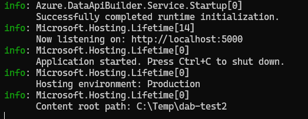
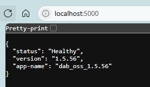
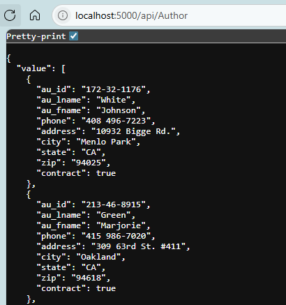
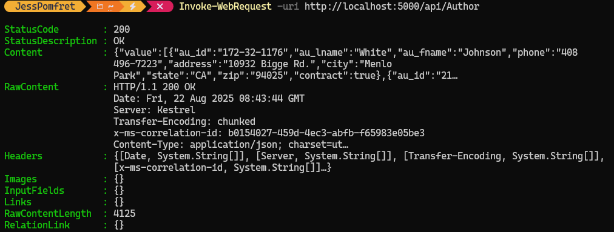
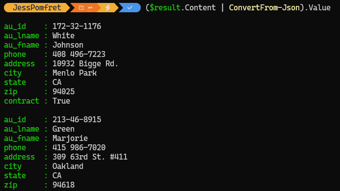
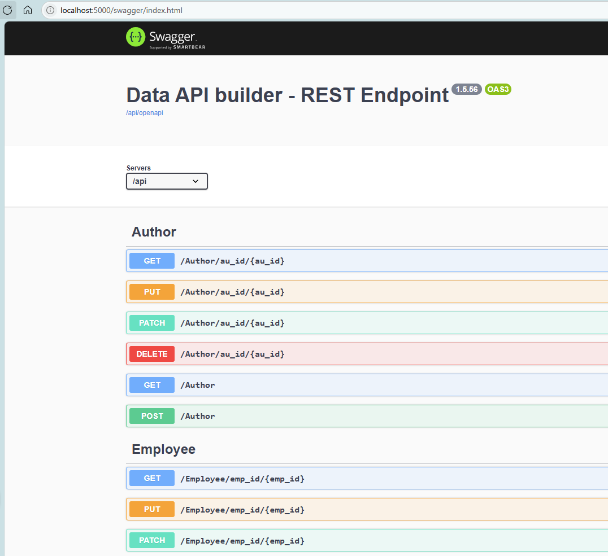

So this thing is pretty neat - let's set it up to run locally

## Install it

```PowerShell
dotnet tool install --global Microsoft.DataApiBuilder
```

You'll see some output and then hopefully a successful message like

```text
You can invoke the tool using the following command: dab
Tool 'microsoft.dataapibuilder' (version '1.5.56') was successfully installed.
```

I have a dbatools docker instance to play with here:

```PowerShell
docker run -p 2500:1433 --volume shared:/shared:z --name mssql1 --hostname mssql1 -d dbatools/sqlinstance
```

## create dab configuration

In your console Navigate to a folder you want to use for this project as the next command will create the `dab-config.json` file in the current folder. Most of this config file is just the defaults, and we'll keep those for our local testing.

```PowerShell
dab init --database-type "mssql" --host-mode "Development" --connection-string "Server=localhost,2500;User Id=sqladmin;Database=pubs;Password=dbatools.IO;TrustServerCertificate=True;Encrypt=True;"
```

Once we have the base config file we'll add entities - these are tables

add an entity

```PowerShell
dab add Author --source "dbo.authors" --permissions "anonymous:*"
```

start it up

```
dab start
```

see output

```text
      Successfully completed runtime initialization.
info: Microsoft.Hosting.Lifetime[14]
      Now listening on: <http://localhost:5000>
info: Microsoft.Hosting.Lifetime[0]
```








call api

```PowerShell
$result = Invoke-WebRequest -Uri http://localhost:5000/api/Author -Method Get
($result.Content | ConvertFrom-Json).Value
```





Also swagger

```PowerShell
/swagger
```



also graph?

but what about running it in azure against an Azure SQL db.