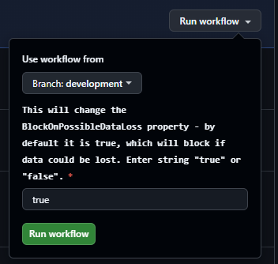

every got this error 

```
Publishing to database '***' on server '***'.
Initializing deployment (Start)
*** The column [dbo].[Users].[password] is being dropped, data loss could occur.
Initializing deployment (Complete)
Analyzing deployment plan (Start)
Analyzing deployment plan (Complete)
Updating database (Start)
An error occurred while the batch was being executed.
Updating database (Failed)
*** Could not deploy package.
Warning SQL72015: The column [dbo].[Users].[password] is being dropped, data loss could occur.
Error SQL72014: Framework Microsoft SqlClient Data Provider: Msg 50000, Level 16, State 127, Line 6 Rows were detected. The schema update is terminating because data loss might occur.
Error SQL72045: Script execution error.  The executed script:
IF EXISTS (SELECT TOP 1 1
           FROM   [dbo].[Users])
    RAISERROR (N'Rows were detected. The schema update is terminating because data loss might occur.', 16, 127)
        WITH NOWAIT;
```

How do you move forward when you do accept the change for dataloss

By default in the publish profile `BlockOnPossibleDataLoss` is set to true, so it'll stop if it is going to do something like drop a column in a table that has data.

Create a second publish profile where this value is false, so dataloss is allowed.

```xml
    <BlockOnPossibleDataLoss>False</BlockOnPossibleDataLoss>
```

leave your pipeline to trigger on commits with the regular publish profile

add a workflow_trigger with some inputs though

```yml
name: Build and release - production

# Controls when the workflow will run
on:
  # Only allow workflow to run after merge has been accepted
  push:
    branches:
      - main
    paths:
      - '**'  # required to have blanket include to be able to use exclude
      - "!.github/**"
      - "!readme.md"

  # Allows you to run this workflow manually from the Actions tab
  workflow_dispatch:
    inputs:
      BlockOnPossibleDataLoss:
        description: 'This will change the BlockOnPossibleDataLoss property - by default it is true, which will block if data could be lost. Enter string "true" or "false".'
        required: true
        default: 'true'
```

if you run into the data loss issue, then run it manually and change the setting:

