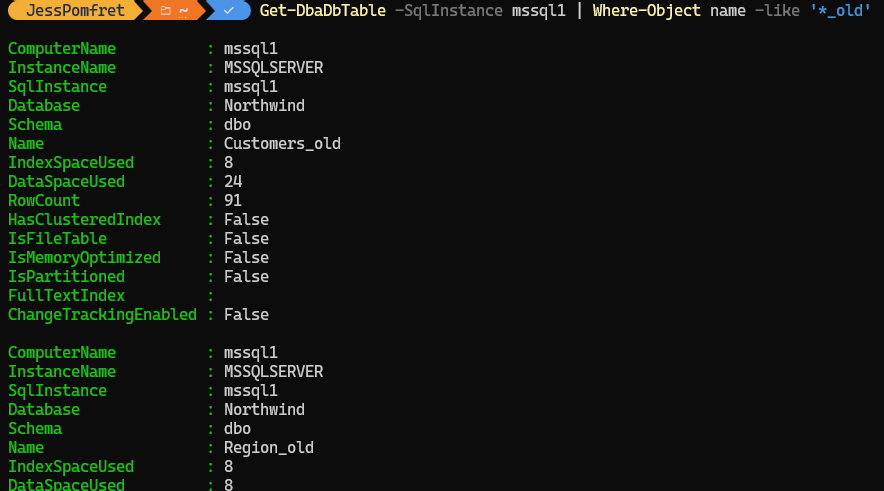
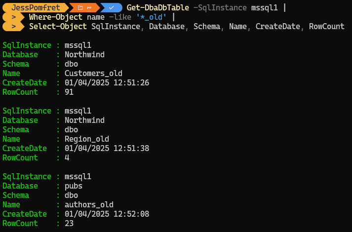

```PowerShell
Get-DbaDbTable -SqlInstance mssql1 | Where-Object name -like '*_old'
```



There is more though

```PowerShell
Get-DbaDbTable -SqlInstance mssql1 |
Where-Object name -like '*_old' |
Select-Object SqlInstance, Database, Schema, Name, CreateDate, RowCount
```

