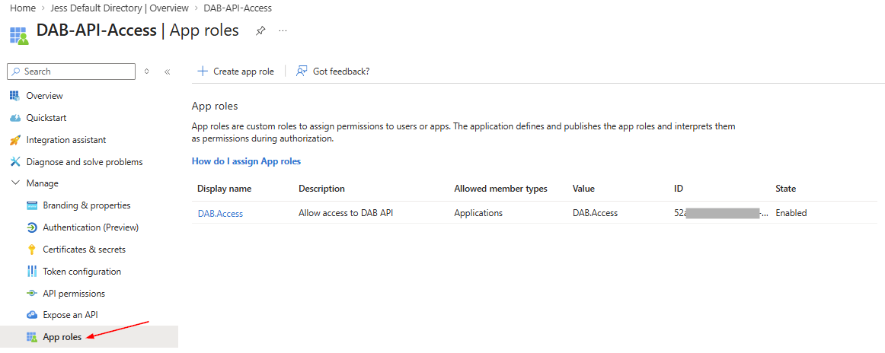
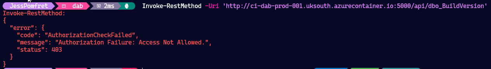

This is post three in my series about the Data API Builder (DAB), the first post, [Data API Builder](/dab-api-builder/), covers what DAB is and how to test it locally against SQL Server in running in a container. The second post, [Running DAB in an Azure Container Instance](/dab-api-container/), starts to productionise this, moving it into the cloud, but with no auth required to hit the endpoints.

In the next three posts we'll cover Authentication, which is slightly complex, hence the three posts:

- DAB API - Add Authentication <-- You are here
- DAB API - User Authentication from Azure CLI
- DAB API - Azure Function Authentication

If you're looking to follow along you need to have the infra we built in the previous post, [Running DAB in an Azure Container Instance](/dab-api-container):

- an Azure SQL Database which is the source
- a Storage Account hosting the `dab-config.json` file
- an Azure Container App running DAB

At this point I can call the DAB API endpoint without authentication and get my data.

```PowerShell
$data = Invoke-RestMethod -Uri 'http://ci-dab-prod-001.uksouth.azurecontainer.io:5000/api/dbo_BuildVersion'
$data.value
```

## The Goal

My end goal for this series is to be able to insert data into my Azure SQL Database from PowerShell code that's running in an Azure Function. The first step of this is to protect my data, by requiring authentication.

Let's get straight into it.

## Entra App Registration

First step here is to create an Entra App Registration. This will define what a valid token is. So when an authenticated user or service requests a token, Entra issues one with an audience and issuer that matches what the DAB API container is configured to expect.

Let's create that App Registration using the Azure CLI. We'll set the identifier to the App Registration ID. This will become the audience on our token, and will need to match what our DAB config file has set, we'll get to that shortly.

  ```Powershell
  # Create the App Registration and capture the app ID
  $app_id = (az ad app create --display-name "DAB-API-Access" --sign-in-audience "AzureADMyOrg" | ConvertFrom-Json).appId

  # Set the identifier URI using the app ID
  az ad app update --id $app_id --identifier-uris "api://$app_id"

  # Create a service principal #TODO: still accurate?
  az ad sp create --id $app_id
  ```

We also need to create an app role which allows us to control authorization, or what authenticated users can do. You can create multiple app roles to separate endpoints, or actions - for today we're going to create one role, `DAB.Access` using the Microsoft Graph API.

  ```powershell
  $existingApp = az ad app show --id $app_id | ConvertFrom-Json

  $roleId = [guid]::NewGuid().ToString()
  $newRole = @{
      allowedMemberTypes = @("Application")
      description        = "Allow access to DAB API"
      displayName        = "DAB.Access"
      id                 = $roleId
      isEnabled          = $true
      value              = "DAB.Access"
  }
  $existingApp.appRoles += $newRole

  # Compress avoids newlines; escape double quotes for the shell
  $bodyJson = (@{ appRoles = $existingApp.appRoles } | ConvertTo-Json -Depth 10 -Compress) -replace '"', '\"'

  az rest --method PATCH `
      --uri "https://graph.microsoft.com/v1.0/applications/$($existingApp.id)" `
      --headers "Content-Type=application/json" `
      --body "$bodyJson"
  ```

You can see this in portal under App roles for your App Registration.



## DAB Config File

We also need to update the `dab-config.json` file to configure it for Entra Authentication, the audience and issuer will need to match the token from the App Registration we created in the previous step.

  ```PowerShell
  $tenantId = ($(az account show) | ConvertFrom-Json).tenantId

  dab configure --runtime.host.authentication.provider EntraID
  dab configure --runtime.host.authentication.jwt.audience "api://$app_id"
  dab configure --runtime.host.authentication.jwt.issuer "https://sts.windows.net/$tenantId"
  ```

You'll end up with a section of your `dab-config.json` file that looks like this, the issuer will contain your tenant id, and the audience of the token contains the app id of the Entra App Registration.

  ```json
  "authentication": {
    "provider": "EntraID",
    "jwt": {
      "audience": "api://***-app-id-****",
      "issuer": "https://sts.windows.net/****-tenant-id****"
    }
  },
  ```

We also need to update our entities, which create the API endpoints, from anonymous access to only allow authenticated users.

> NOTE!
> There is a `dab update` command with a `--permissions` parameter that you can use to update the entities in the config. However, I found this appends the permissions and ended with me allowing authenticated or anonymous access to my endpoints - not ideal.

Since PowerShell is good at manipulating json we can read the config file in and for each entity, change the permission role to `Authenticated`. I'm also adding the `create` action which will allow us to `POST` data, which will insert it into our SQL Database.

  ```powershell
  # Load the DAB config file
  $configPath = "C:\Temp\dab\dab-config.json"
  $config = Get-Content -Path $configPath -Raw | ConvertFrom-Json

  # Loop through all entities and update permissions
  foreach ($entityName in $config.entities.PSObject.Properties.Name) {
      $entity = $config.entities.$entityName
      foreach ($permission in $entity.permissions) {
          if ($permission.role -eq "anonymous") {
              $permission.role = "Authenticated"
          }

          # Add create action to Authenticated role if not already present
          if ($permission.role -eq "Authenticated") {
              $hasCreate = $permission.actions | Where-Object { $_.action -eq "create" }
              if (-not $hasCreate) {
                  $permission.actions += @{ action = "create" }
              }
          }
      }
  }

  # Convert back to JSON and save
  $config | ConvertTo-Json -Depth 10 | Set-Content -Path $configPath
  ```

If you view the `dab-config.json` file now your entities should each look like this with both read and create permissions, and the role set to `Authenticated`.

  ```json
  "dbo_BuildVersion": {
        "source": {
          "object": "dbo.BuildVersion",
          "type": "table"
        },
        "graphql": {
          "enabled": true,
          "type": {
            "singular": "dbo_BuildVersion",
            "plural": "dbo_BuildVersions"
          }
        },
        "rest": {
          "enabled": true
        },
        "permissions": [
          {
            "role": "Authenticated",
            "actions": [
              {
                "action": "read"
              },
              {
                "action": "create"
              }
            ]
          }
        ]
      },
  ```

Upload the updated `dab-config.json` file to the Azure Storage account for our container instance to use.

  ```PowerShell
  $storageKey = az storage account keys list `
    --resource-group $resourceGroup `
    --account-name $storageAccount `
    --query "[0].value" `
    --output tsv

  az storage file upload --account-key $storageKey `
    --account-name $storageAccount `
    --share-name $fileShareName `
    --source dab-config.json
  ```

Once that is there, restart the container app, so that it picks up the latest configuration.

  ```PowerShell
  az container restart `
    --resource-group $resourceGroup `
    --name $containerName
  ```

## Test

Now if I try and get data from the same endpoint that worked earlier, we should get a 403 unauthorized response code.

```PowerShell
Invoke-RestMethod -Uri 'http://ci-dab-prod-001.uksouth.azurecontainer.io:5000/api/dbo_BuildVersion'
```

Something like this:

```text
Invoke-RestMethod:
{
  "error": {
    "code": "AuthorizationCheckFailed",
    "message": "Authorization Failure: Access Not Allowed.",
    "status": 403
  }
}
```



## Up Next

Great - now our API endpoints, and our data is secure we can move onto how to send authenticated user and service requests. In the next post we'll get to the point where we can call these endpoints from Azure CLI again, this time with a token, as an authenticated user.

## Tidy Up

If you've been following along you can tidy up and remove all the resources. First, delete the Azure resource group:

```PowerShell
# Delete all Azure resources (SQL DB, Storage, Container, Function App)
az group delete --name $resourceGroup --yes --no-wait
```

Then clean up the Entra ID resources (these are not deleted with the resource group):

```PowerShell
# Delete the app registration (this also removes app roles and assignments)
az ad app delete --id $app_id
```

## DAB Blog Series

Here are all the links to the DAB blog series:

1. [Data API Builder](/dab-api-builder/)
2. [Running DAB in an Azure Container Instance](/dab-api-container/)
3. More coming soon...

Or you can view all posts about DAB using the [DAB](/categories/dab/) category.
