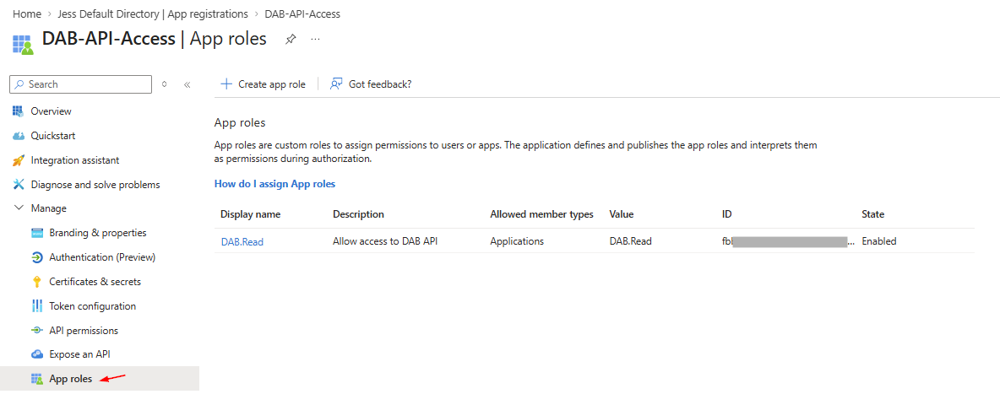
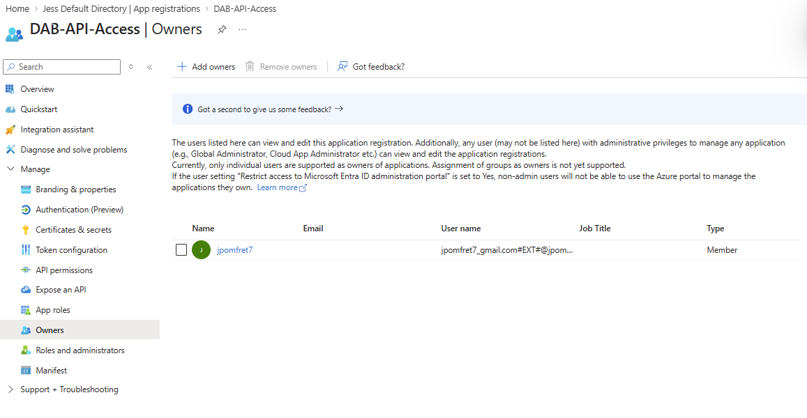
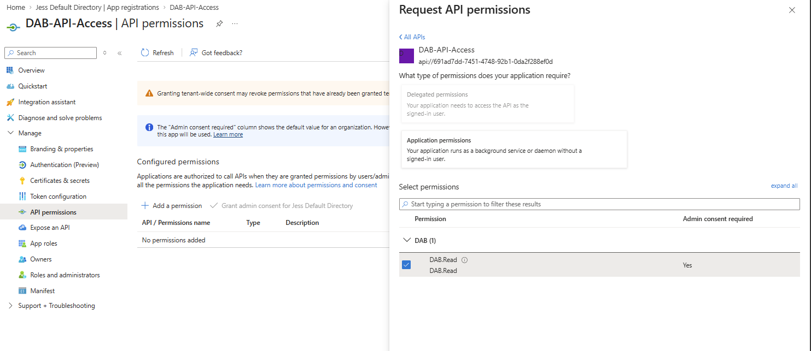
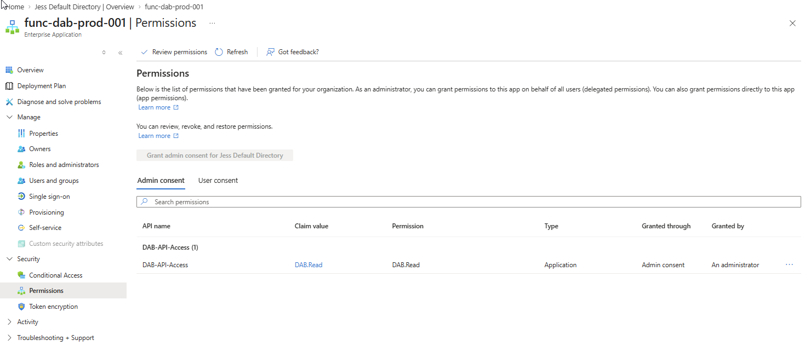
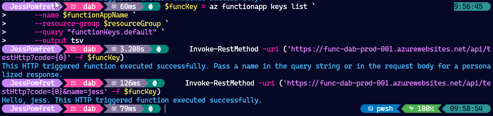

This is post three in my series about the Data API Builder (dab), the first post, [Data API Builder](/dab-api-builder/), covers what dab is and how to test it locally against SQL Server in running in a container. The second post, [Running dab in an Azure Container Instance](/dab-api-container/), starts to productionise this, moving it into the cloud, but with no auth required to hit the endpoints.

In this post we'll look to fix this, specifically by enabling other Azure services to use these endpoints with authentication. If you're looking to follow along you need to have the infra we built in the previous post:

- an Azure SQL Database which is the source
- a Storage Account hosting the `dab-config.json` file
- an Azure Container App running dab

My end goal is to be able to insert data into my Azure SQL Database from PowerShell code that's running in an Azure Function. Let's get straight into it.

## Entra App Registration

If the goal is to create an Azure Function (or another Azure service) that can access the data in the SQL Database via the API endpoints we need to give the Function App a way of authenticating with these endpoints. We'll do this with an App Registation in Entra.

Let's create that app registration.

    ```powershell
    # Create the App Registration
    az ad app create --display-name "DAB-API-Access" --sign-in-audience "AzureADMyOrg"

    # Get the App ID (Client ID) - you'll need this
    $app_id = $(az ad app list --display-name "DAB-API-Access" --query "[0].appId" -o tsv)

    # Add the default user_impersonation scope (this is often sufficient)
    az ad app update --id $app_id --identifier-uris "api://$APP_ID"
    #that last line didn't work but added in the portal

    # Create a service principal for your app registration
    az ad sp create --id $app_id
    ```

need a service prinipal so we can grant admin consent on the API permissions page

## dab Config File

Update the dab config to azure auth and cors

    ```PowerShell
    # Set the authentication provider
    dab configure --runtime.host.authentication.provider EntraID

    # Set the expected audience (Application ID URI)
    dab configure --runtime.host.authentication.jwt.audience "api://$APP_ID"

    # Set the expected issuer (your tenant)
    $tenantId = ($(az account show) | ConvertFrom-Json).id
    dab configure --runtime.host.authentication.jwt.issuer "https://login.microsoftonline.com/$tenantId$/v2.0"
    ```

    ```
    # Update DAB config with the correct values from the token
dab configure --runtime.host.authentication.provider EntraID
dab configure --runtime.host.authentication.jwt.audience "api://$APP_ID"
dab configure --runtime.host.authentication.jwt.issuer "https://sts.windows.net/f98042ad-9bbc-499d-adb4-17193696b9a3/"
```

this is left over json does it match?

    ```json
        "host": {
          "cors": {
            "origins": ["https://azqr-func-jp-dev-e5gxevfjgbhfhmdk.westeurope-01.azurewebsites.net"],
            "allow-credentials": true
          },
          "authentication": {
            "provider": "AzureAD",
            "jwt": {
              "audience": "ffa9ce65-fe37-4958-849c-8747e106577d",
              "issuer": "https://sts.windows.net/8f5c8fb3-b610-4233-8284-63a7254f4029/"
            }
          },
          "mode": "development"
        }
    ```

We also need to update our entities from anonymous access to only allow authenticated users

    ```powershell
    $adminUser ="databaseadmin"
    $securePassword = ConvertTo-SecureString "dbatools.IO!" -AsPlainText -Force
    $cred = [pscredential]::new($adminUser, $securePassword)

    $server = 'sqlsvr-dab-prod-001'
    $database = 'sqldb-dab-prod-001'

    $conn = Connect-DbaInstance -SqlInstance ('{0}.database.windows.net' -f $server) -SqlCredential $cred
    $conn.databases[$database].Tables.ForEach{
        dab update ('{0}_{1}' -f $psitem.schema, $psitem.Name) --permissions "Authenticated:read"
    }
    ```

WARNING
dab update - adds to the entitiy... :
This will change the entities to require auth? does it? still has the anonomous in there too?

So let's manipulate the json with powershell

    ```powershell
      # Load the DAB config file
      $configPath = "C:\Temp\dab\dab-config.json"
      $config = Get-Content -Path $configPath -Raw | ConvertFrom-Json

      # Loop through all entities and update permissions
      foreach ($entityName in $config.entities.PSObject.Properties.Name) {
          $entity = $config.entities.$entityName
          foreach ($permission in $entity.permissions) {
              if ($permission.role -eq "anonymous") {
                  $permission.role = "Authenticated"
              }
          }
          
          # Add create action to Authenticated role for POST operations
          $authPerm = $entity.permissions | Where-Object { $_.role -eq "Authenticated" }
          if ($authPerm) {
              $hasCreate = $authPerm.actions | Where-Object { $_.action -eq "create" }
              if (-not $hasCreate) {
                  $authPerm.actions += @{ action = "create" }
              }
          }
      }

      # Convert back to JSON and save
      $config | ConvertTo-Json -Depth 10 | Set-Content -Path $configPath
    ```

Should look like this with both read and create permissions:

    ```json
    "dbo_BuildVersion": {
          "source": {
            "object": "dbo.BuildVersion",
            "type": "table"
          },
          "graphql": {
            "enabled": true,
            "type": {
              "singular": "dbo_BuildVersion",
              "plural": "dbo_BuildVersions"
            }
          },
          "rest": {
            "enabled": true
          },
          "permissions": [
            {
              "role": "Authenticated",
              "actions": [
                {
                  "action": "read"
                },
                {
                  "action": "create"
                }
              ]
            }
          ]
        },
    ```

TODO why mode dev? gives us swagger and other dev tools

any authenticated user can access - there is a way of doing roles like `DAB.Read` to make it more granular

this changes the entity from anon access to authenticated


1. create function

move variables to the top

```PowerShell
$resourceGroup = 'rg-dab-prod-001'
$storageAccount = "dabconfigstorage1234"  # Must be globally unique
$functionAppName = "func-dab-prod-001"


az functionapp create `
  --resource-group $resourceGroup `
  --name $functionAppName `
  --storage-account $storageAccount `
  --consumption-plan-location $location `
  --runtime powershell `
  --runtime-version 7.4 `
  --functions-version 4 `
  --os-type Windows
```

TODO: need the code in the function to get the token and hit DAB
have a repo for that - how do we wire up the github action without doing it in the portal?
WORKING THROUGH THE PORTAL WITH USER MI 


    ```PowerShell
    # First, make sure you're authenticated with GitHub - I used the cli
    gh auth login

    $repoUrl = "https://github.com/jpomfret/dab-az-func"

    az functionapp deployment github-actions add `
      --resource-group $resourceGroup `
      --name $functionAppName `
      --repo $repoUrl `
      --branch main `
      --token $(gh auth token)
    ```
  
NOTE: still had to update the publish profile secret?
Change to
> Attempting Azure CLI login by using OIDC...
>
> 


enable managed identity on function

    ```powershell
    # Enable system-assigned managed identity
    az functionapp identity assign --name $functionAppName --resource-group $resourceGroup
    ```

    ```text
    {
      "principalId": "a0a7dac7-da1e-4478-ac83-e8fbd75f2265",
      "tenantId": "f98042ad-9bbc-499d-adb4-17193696b9a3",
      "type": "SystemAssigned",
      "userAssignedIdentities": null
    }
    ```

1. add app settings

Get the function FQDN
```PowerShell
$containerFQDN = az container show `
  --resource-group $resourceGroup `
  --name $containerName `
  --query "join('', ['http://', ipAddress.fqdn, ':5000'])" `
  --output "tsv"

#TODO: get this
$clientId = 'a0a7dac7-da1e-4478-ac83-e8fbd75f2265'
```

```powershell
# Get the client ID (principalId) from the function app's managed identity
$clientId = az functionapp identity show `
  --name $functionAppName `
  --resource-group $resourceGroup `
  --query principalId `
  --output tsv

$clientId
```

configure function app settings for the dab_endpoint and the identity of the function?
```powerShell
  az functionapp config appsettings set `
  --name $functionAppName `
  --resource-group $resourcegroup `
  --settings `
    "DAB_ENDPOINT=$containerFQDN" `
    "AZURE_CLIENT_ID=$clientID" `
    "DAB_API_APP_ID=$app_id"
```

1. then give the function MI access to get tokens

Step 1: Add an App Role to the DAB API App Registration


    ```powershell
    #temp file
    #TODO: change this
    # Get the existing app details
    $existingApp = az ad app show --id $app_id | ConvertFrom-Json

    # Add the new app role to existing roles (or replace if needed)
    $roleId = [guid]::NewGuid().ToString()
    $newRole = @{
      allowedMemberTypes = @("Application")
      description = "Allow access to DAB API"
      displayName = "DAB.Read"
      id = $roleId
      isEnabled = $true
      value = "DAB.Read"
    }

    $existingApp.appRoles += $newRole
    $bodyJson = (@{ appRoles = $existingApp.appRoles } | ConvertTo-Json -Depth 10)

    # Update via REST API - save body to variable and use single quotes
    az rest --method PATCH `
      --uri "https://graph.microsoft.com/v1.0/applications/$($existingApp.id)" `
      --headers 'Content-Type=application/json' `
      --body "$bodyJson"
    ```

## make me an owner



## add api permissions

for the DAB-API-Access - DAB.Read role
TODO: do I need to grant admin consent?
NO 
Why Not?
Admin consent is for delegated permissions (scopes) - when a user signs in and grants permission
Managed identities use application permissions (app roles) - direct service-to-service access
> Because these are application permissions, not delegated permissions, an admin must grant consent to use the app roles assigned to the application.
https://learn.microsoft.com/en-us/entra/identity-platform/howto-add-app-roles-in-apps#grant-admin-consent





# Get the service principal ID of the function app's managed identity
$functionSPId = az ad sp show --id $clientId --query "id" -o tsv

```
# Step 1: Get the service principal for the API app registration
$apiServicePrincipalId = az ad sp list --filter "appId eq '$app_id'" --query "[0].id" -o tsv

# Step 2: Get the App Role ID we just created (DAB.Read)
$appRoleId = az ad sp show --id $apiServicePrincipalId --query "appRoles[?value=='DAB.Read'].id" -o tsv

# Step 3: Get the service principal ID of the function app's managed identity
$functionSPId = az ad sp show --id $clientId --query "id" -o tsv

# Step 4: Build the request body as a PowerShell object
$assignmentBody = @{
  principalId = $functionSPId
  resourceId = $apiServicePrincipalId
  appRoleId = $appRoleId
}

# Step 5: Save to a temporary file
$tempFile = [System.IO.Path]::GetTempFileName()
$assignmentBody | ConvertTo-Json | Set-Content $tempFile -Encoding UTF8

# Step 6: Assign the app role using the file
az rest --method POST `
  --uri "https://graph.microsoft.com/v1.0/servicePrincipals/$functionSPId/appRoleAssignments" `
  --headers "Content-Type=application/json" `
  --body "@$tempFile"

# Clean up
Remove-Item $tempFile

```
output from Step 6: Assign the app role using the file
```
{
  "@odata.context": "https://graph.microsoft.com/v1.0/$metadata#appRoleAssignments/$entity",
  "appRoleId": "fbb2566b-7032-4cd0-8cd7-c5e197b6f82c",
  "createdDateTime": "2026-04-03T08:45:37.7996166Z",
  "deletedDateTime": null,
  "id": "by85BHA3s0-sXVlAsBTnwTm8qOfOBz1OhWAwOvFErqU",
  "principalDisplayName": "func-dab-prod-001",
  "principalId": "04392f6f-3770-4fb3-ac5d-5940b014e7c1",
  "principalType": "ServicePrincipal",
  "resourceDisplayName": "DAB-API-Access",
  "resourceId": "56844302-ec84-45c1-8ac1-3f02a58970e9"
}
```



> Summary
> $app_id = Your DAB API app registration (the thing being protected)
> $clientId = Your Function App's managed identity principal ID (the thing requesting access)
> App Role = Permission that managed identities can be assigned to
> Scope = Permission that users/apps can consent to (different use case)
> For managed identity (service-to-service auth), you want App Roles, not scopes!

in entra

- add app role 'Cortex DAB'
- add a scope
- add a authorized application - added wrong id ,  doesn't work for function mi id

## upload new dab config


    ```PowerShell
    $storageKey = az storage account keys list `
      --resource-group $resourceGroup `
      --account-name $storageAccount `
      --query "[0].value" `
      --output tsv

    az storage file upload --account-key $storageKey `
      --account-name $storageAccount `
      --share-name $fileShareName `
      --source dab-config.json
    ```


## restart container

```
az container restart `
  --resource-group $resourceGroup `
  --name $containerName
```


## testinng

The function app has two functions- the testHttp function is the standard test template from VSCode when you create a HTTP function. First grab your function key:

    ```PowerShell
    $funcKey = az functionapp keys list `
      --name $functionAppName `
      --resource-group $resourceGroup `
      --query "functionKeys.default" `
      --output tsv
    ```
You can call it as is:

    ```powershell
    Invoke-RestMethod -uri ('https://func-dab-prod-001.azurewebsites.net/api/testHttp?code={0}' -f $funcKey)
    ```

Or with a name in the query string:

    ```powershell
    Invoke-RestMethod -uri ('https://func-dab-prod-001.azurewebsites.net/api/testHttp?code={0}&name=jess' -f $funcKey)
    ```



    ```powershell
    Invoke-RestMethod -uri ('https://func-dab-prod-001.azurewebsites.net/api/dabHttp?code={0}' -f $funcKey)
    ```

Test the dab function
the value should be the data straight from our sql database.
    ```PowerShell
    (Invoke-RestMethod -uri ('https://func-dab-prod-001.azurewebsites.net/api/dabHttp?code={0}' -f $funcKey)).Value
    ```

and you can pass in a specific schema and entity

    ```PowerShell
    $Schema = "SalesLT"
    $Entity = "Customer"
    (Invoke-RestMethod -uri ('https://func-dab-prod-001.azurewebsites.net/api/dabHttp?code={0}&schema={1}&entity={2}' -f $funcKey, $schema, $entity)).value | ft
    ```

and lets post to add a new customer

```powershell
$Schema = "SalesLT"
$Entity = "Customer"
$newCustomer = @{
  NameStyle = $false
  Title = "Ms."
  FirstName = "Sarah"
  MiddleName = "M."
  LastName = "Connor"
  CompanyName = "Tech Solutions Ltd"
  SalesPerson = "adventure-works\david0"
  EmailAddress = "sarah.connor@adventure-works.com"
  Phone = "555-123-4567"
  PasswordHash = "ABCDEFGHIJKLMNOPQRSTUVWXYZabcdefghijklmnopqr="
  PasswordSalt = "TestSalt"
  ModifiedDate = "2026-04-03T00:00:00"
}

Invoke-RestMethod -Uri ('https://func-dab-prod-001.azurewebsites.net/api/dabHttp?code={0}&schema={1}&entity={2}' -f $funcKey, $schema, $entity) `
  -Method Post `
  -Body ($newCustomer | ConvertTo-Json) `
  -ContentType 'application/json'
```

## there is troubleshooting tips in the function


```text
Invoke-RestMethod:
{
  "troubleshooting": [
    "DAB rejected the token - authentication/authorization issue"
  ],
  "environment": {
    "isAzure": true,
    "msiEndpoint": "http://127.0.0.1:41460/msi/token/",
    "hasClientId": true,
    "websiteInstanceId": "8e50c2f9cd8aebdb6adc53ddfa5e4cea5470a1291841ca58387dec90b5fdc6c1",
    "hasDABEndpoint": true
  },
  "nextSteps": [
    "Verify app role assignment: Function managed identity \u2192 DAB app registration",
    "Check token roles in function logs",
    "Verify DAB config audience matches token audience",
    "Check entity permissions in DAB config"
  ],
  "error": "DAB API call failed: Response status code does not indicate success: 403 (Forbidden).",
  "configuration": {
    "dabEndpoint": "http://ci-dab-prod-001.uksouth.azurecontainer.io:5000",
    "clientId": "04392f6f-3770-4fb3-ac5d-5940b014e7c1"
  },
  "timestamp": "2026-04-03T09:08:06Z"
}
```


The flow should be:

Function requests token with resource: api://{DAB_API_APP_ID}
MSI returns token with that audience
Function calls DAB with that token
DAB validates the token audience matches its config ✅


need to give the container app MI access to the database


## Tidy Up

If you've been following along you can tidy up and remove the whole resource group with the following command

```PowerShell
az group delete --name $resourceGroup
```

## Up Next

troubleshooting?

## dab Blog Series

Here are all the links to the dab blog series:

1. [Data API Builder](/dab-api-builder/)
2. [Running dab in an Azure Container Instance](/dab-api-container/)
3. More coming soon...

Or you can view all posts about dab using the [dab](/categories/dab/) category.
