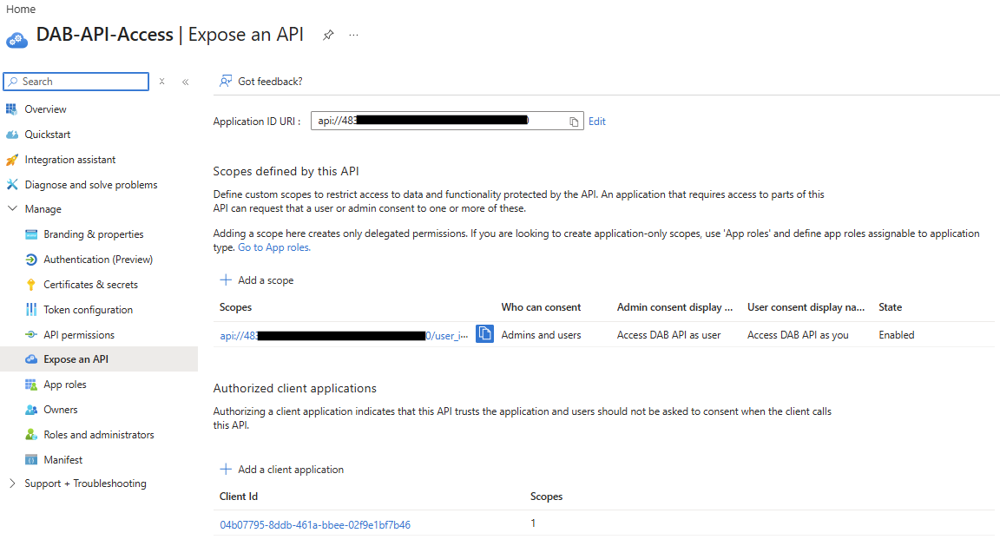

Yes! Entra users can authenticate and call the DAB endpoints. You need to:

Get a token for the DAB API
Be assigned the app role (or have access via delegated permissions)
Include the token in the Authorization header
Here's how to do it with PowerShe

        ```PowerShell
        # Get your user's object ID
        $userId = az ad signed-in-user show --query "id" -o tsv

        # Get the service principal and app role ID
        $apiServicePrincipalId = az ad sp list --filter "appId eq '$app_id'" --query "[0].id" -o tsv
        $appRoleId = az ad sp list --filter "appId eq '$app_id'" --query "[0].appRoles[?value=='DAB.Access'].id" -o tsv

        # Assign your user to the app role
        $assignmentBody = @{
            principalId = $userId
            resourceId = $apiServicePrincipalId
            appRoleId = $appRoleId
        }
        #TODO: change from being a temp file
        $tempFile = [System.IO.Path]::GetTempFileName()
        $assignmentBody | ConvertTo-Json | Set-Content $tempFile -Encoding UTF8

        az rest --method POST `
        --uri "https://graph.microsoft.com/v1.0/users/$userId/appRoleAssignments" `
        --headers "Content-Type=application/json" `
        --body "@$tempFile"

        Remove-Item $tempFile
        ```


## Add a Delegated Permission Scope

TODO - why?

Need this before we authorise Microsoft Azure CLI to get tokens

    ```PowerShell

# Create a delegated permission scope (use different name than app role)
$existingApp = az ad app show --id $app_id | ConvertFrom-Json

$newScopeId = [guid]::NewGuid().ToString()
$body = @{
    api = @{
        oauth2PermissionScopes = @(
            @{
                id = $newScopeId
                value = "user_impersonation"
                type = "User"
                isEnabled = $true
                adminConsentDisplayName = "Access DAB API as user"
                adminConsentDescription = "Allow the application to access DAB API on behalf of the signed-in user"
                userConsentDisplayName = "Access DAB API as you"
                userConsentDescription = "Allow the application to access DAB API on your behalf"
            }
        )
    }
}

$tempFile = [System.IO.Path]::GetTempFileName()
$body | ConvertTo-Json -Depth 10 | Set-Content $tempFile -Encoding UTF8

az rest --method PATCH `
  --uri "https://graph.microsoft.com/v1.0/applications/$($existingApp.id)" `
  --headers "Content-Type=application/json" `
  --body "@$tempFile"

Remove-Item $tempFile

```

## Authorize the Azure CLI to request tokens

 The issue is that Azure CLI is not pre-authorized to request tokens for your DAB API. You need to add Azure CLI as a known/trusted client application. Here's how:

> Authentication failed
> invalid_client: AADSTS650057: Invalid resource. The client has requested access to a resource which is not listed in the requested permissions in the client's application registration. Client app ID: 04b07795-8ddb-461a-bbee-02f9e1bf7b46(Microsoft Azure CLI). Resource value from request: api://4834e86a-398b-4992-bd46-f8f827c02560. Resource app ID: 4834e86a-398b-4992-bd46-f8f827c02560. List of valid resources from app registration: . Trace ID: 0d114f90-7a24-40d4-bf84-10d7b2522300 Correlation ID: 211a8fae-9ed4-4d35-a086-f37aba4f6522 Timestamp: 2026-04-08 05:58:45Z. ($error_uri)

    ```PowerShell
    #$app_id = "691ad7dd-7451-4748-92b1-0da2f288ef0d"
    $azureCliAppId = "04b07795-8ddb-461a-bbee-02f9e1bf7b46" # Microsoft Azure CLI

    # Get the app details
    $existingApp = az ad app show --id $app_id | ConvertFrom-Json

    # Get your scope ID (the one we just created)
    $scopeId = $existingApp.api.oauth2PermissionScopes[0].id

    # Add Azure CLI as a pre-authorized application
    $preAuthorizedApp = @{
        appId = $azureCliAppId
        delegatedPermissionIds = @($scopeId)
    }

    # Build the API object with existing scopes and new pre-authorization
    $api = @{
        oauth2PermissionScopes = $existingApp.api.oauth2PermissionScopes
        preAuthorizedApplications = @($preAuthorizedApp)
        requestedAccessTokenVersion = 1
    }

    # Update the app
    $tempFile = [System.IO.Path]::GetTempFileName()
    @{ api = $api } | ConvertTo-Json -Depth 10 | Set-Content $tempFile -Encoding UTF8

    az rest --method PATCH `
    --uri "https://graph.microsoft.com/v1.0/applications/$($existingApp.id)" `
    --headers "Content-Type=application/json" `
    --body "@$tempFile"

    Remove-Item $tempFile
    ```

`requestedAccessTokenVersion` has to be set to 1 because the function uses 1 and we have to choose the same one

Now on our Enterprise Application (you might need to search by `$APP_ID` in Entra since this is newly created), under `Expose an API` you should see a scope and an authorized client application.



## Test

```PowerShell
az login --tenant $tenantId --scope "api://$app_ID/.default"

# Get a new token (should now be v1.0)
#$app_id = (az ad app create --display-name "DAB-API-Access" --sign-in-audience "AzureADMyOrg" | ConvertFrom-Json).appId
$token = (az account get-access-token --resource "api://$app_id" | ConvertFrom-Json).accessToken

# Verify it's v1.0
$tokenParts = $token.Split('.')
$payload = $tokenParts[1]
while ($payload.Length % 4 -ne 0) { $payload += '=' }
$decodedBytes = [System.Convert]::FromBase64String($payload)
$decodedJson = [System.Text.Encoding]::UTF8.GetString($decodedBytes)
$tokenClaims = $decodedJson | ConvertFrom-Json
Write-Host "Issuer: $($tokenClaims.iss)"  # Should be https://sts.windows.net/tenant-id/

# Test the API
$headers = @{ 'Authorization' = "Bearer $token" }
Invoke-RestMethod -Uri 'http://ci-dab-prod-001.uksouth.azurecontainer.io:5000/api/dbo_BuildVersion' -Headers $headers
```

