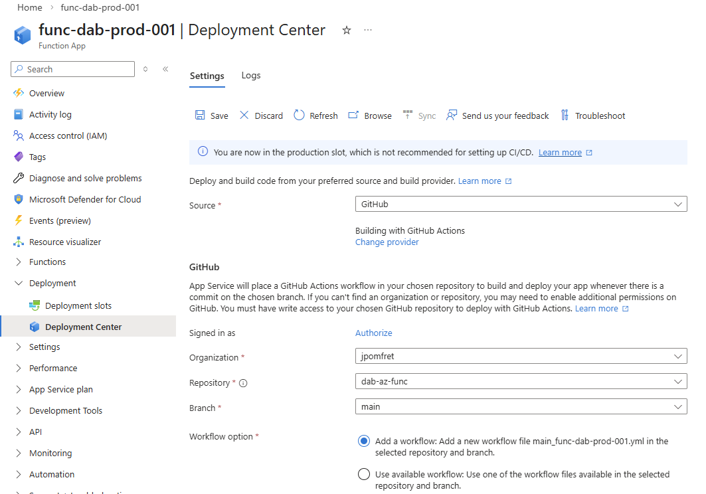
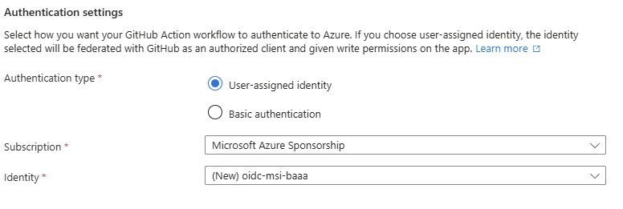
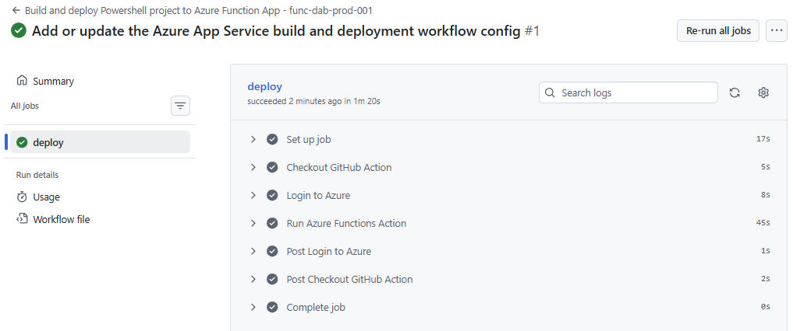
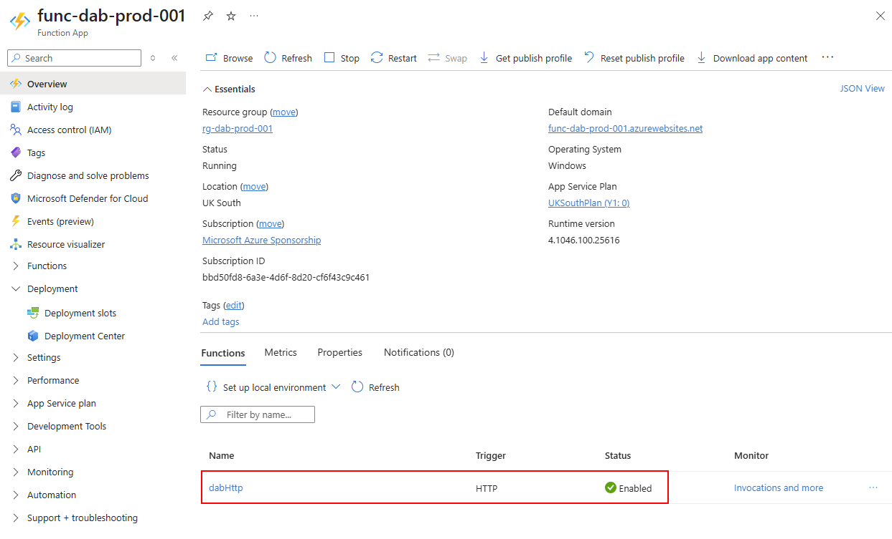
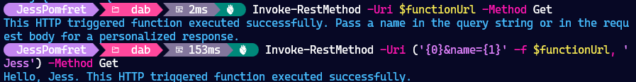

## Create an Azure Function

We need to create the Function App in Azure, this will be the container for our Azure Function code.

We'll assign a system managed identity to this Function App so it can authenticate with other Azure services, including Entra.

```PowerShell
$resourceGroup = 'rg-dab-prod-001'
$storageAccount = "dabconfigstorage1234"  # Must be globally unique
$functionAppName = "func-dab-prod-001"

az functionapp create `
  --resource-group $resourceGroup `
  --name $functionAppName `
  --storage-account $storageAccount `
  --consumption-plan-location $location `
  --runtime powershell `
  --runtime-version 7.4 `
  --functions-version 4 `
  --os-type Windows `
  --assign-identity '[system]'
```

## Develop the function

Then locally in VSCode we'll create an Azure Function to interact with our dab endpoints. This will be able to request tokens from Entra in order to authenticate with dab.

code here: https://github.com/jpomfret/dab-az-func


### .devcontainer

Create a devcontainer for developing PowerShell Azure Functions in VScode.
Love these because...
Also you can use them in GitHub browser

## Add a http function

create a function app project in the current folder

```PowerShell
func init --worker-runtime powershell
```

create our function from the HTTP trigger template

```PowerShell
func new --name testHttp --template "HTTP trigger" --authlevel "function"
```

## push to github

push that sample code to GitHub Repo so we can wire it up with Function App in Azure for easy deployments.


## setup workflow

From the function app in Azure portal (is there a way to do this through CLI?)

link to a github repo where your function code is


setup the auth - this will create an entra app reg


save - this will add the workflow file to your repo

The workflow will run, hopefully successfully and deploy the function to our function app



You can see the function now


## Test the endpoint

```PowerShell
$functionName = "testHttp"

# Get the function key
$functionKey = az functionapp function keys list `
  --resource-group $resourceGroup `
  --name $functionAppName `
  --function-name $functionName `
  --query "default" `
  --output tsv

# Get the function app hostname
$hostname = az functionapp show `
  --resource-group $resourceGroup `
  --name $functionAppName `
  --query "defaultHostName" `
  --output tsv

$functionUrl = ("https://{0}/api/{1}?code={2}" -f $hostname, $functionName, $functionKey)

# Test the function without a name parameter
Invoke-RestMethod -Uri $functionUrl -Method Get

# There is also a name parameter you can pass in
Invoke-RestMethod -Uri ('{0}&name={1}' -f $functionUrl, 'Jess') -Method Get
```

Great - this is working successfully.


## Customise the function to interact with dab

> In the previous blog we configure managed identity on the container app --> database

TODO: need the code in the function to get the token and hit DAB

## add app settings

Get the function FQDN and the cleient id 
```PowerShell
$containerFQDN = az container show `
  --resource-group $resourceGroup `
  --name $containerName `
  --query "join('', ['http://', ipAddress.fqdn, ':5000'])" `
  --output "tsv"

# get the app reg client id
$clientId = $(az ad app list --display-name "DAB-API-Access" --query "[0].appId" -o tsv)
```

Add these to environment settings for function app:

```powershell
  az functionapp config appsettings set `
  --name $functionAppName `
  --resource-group $resourcegroup `
  --settings `
    "DAB_ENDPOINT=$containerFQDN" `
    "AZURE_CLIENT_ID=$clientID"
```


## give the function MI access to get tokens

in entra

- add app role 'Cortex DAB'
- add a scope
- add a authorized application - added wrong id ,  doesn't work for function mi id

```bash
az ad app permission add \
  --id 161e0a85-54fe-4472-9a5d-409cc5dcb14f \
  --api ffa9ce65-fe37-4958-849c-8747e106577d \
  --api-permissions "api://ffa9ce65-fe37-4958-849c-8747e106577d/Cortex.Read.All=Scope"
```

TODO: is this needed if we don't use scope?


## Tidy Up

If you've been following along you can tidy up and remove the whole resource group with the following command

```PowerShell
az group delete --name $resourceGroup
```

## Up Next

troubleshooting?

## dab Blog Series

Here are all the links to the dab blog series:

1. [Data API Builder](/dab-api-builder/)
2. [Running dab in an Azure Container Instance](/dab-api-container/)
3. More coming soon...

Or you can view all posts about dab using the [dab](/categories/dab/) category.


<!--
this is left over json does it match?
```json
    "host": {
      "cors": {
        "origins": ["https://azqr-func-jp-dev-e5gxevfjgbhfhmdk.westeurope-01.azurewebsites.net"],
        "allow-credentials": true
      },
      "authentication": {
        "provider": "AzureAD",
        "jwt": {
          "audience": "ffa9ce65-fe37-4958-849c-8747e106577d",
          "issuer": "https://sts.windows.net/8f5c8fb3-b610-4233-8284-63a7254f4029/"
        }
      },
      "mode": "development"
    }
``` -->
