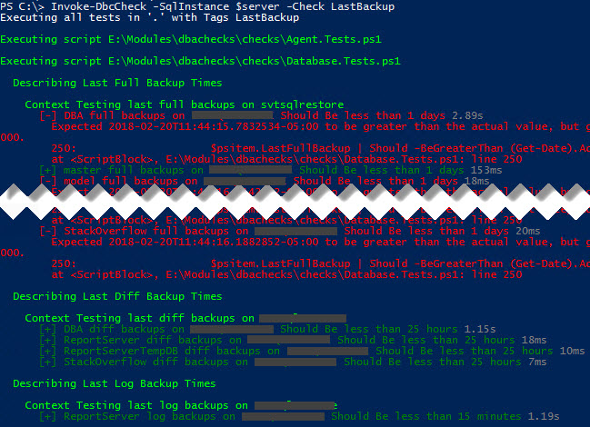
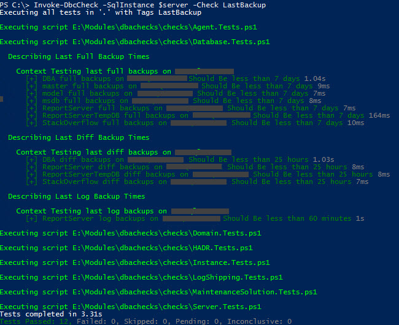

Folks, there is something fantastic coming from the creators of dbatools!

Chrissy LeMaire ([blog](https://blog.netnerds.net/)|[twitter](https://twitter.com/cl)) and Rob Sewell ([blog](https://sqldbawithabeard.com/)|[twitter](https://twitter.com/sqldbawithbeard)) just announced something big at SQLBits 2018, a new PowerShell module that combines [dbatools](https://dbatools.io/) with [Pester](https://github.com/pester/Pester) to ensure your environment is "as expected". I've been lucky enough to get to know both Chrissy and Rob by contributing to dbatools and when they introduced me to this new module I instantly saw a lot of potential.

I'm going to start off with just a small way to gain some value from dbachecks, ensuring your backups are completing with the frequency you expect.

The module is hosted on [GitHub](https://github.com/sqlcollaborative/dbachecks) which means you can fork and contribute to it just as you would with any other open source project. There is also a lot of useful information out there including the [readme](https://github.com/sqlcollaborative/dbachecks#dbachecks).  Reviewing this readme is an important first step as there are a couple of prerequisites and some potential caveats when you go to update the module.

You can download a copy of the module from the PowerShell Gallery (if this doesn't work for you due to corporate firewalls, PowerShell version etc. head back to the readme for more ways to get the module):

Install-Module dbachecks

First off let's take a look at _Get-DbcCheck_ to look for checks we may want to implement: 

Each check has one unique tag which basically names the check and then a number of other tags that can also be used to call a collection of checks.

For this example we are going to use several checks to ensure that we meet the following requirements:

- Full backup once a week - using _LastFullBackup_
- Differential backup once a day - using _LastDiffBackup_
- Log backup every hour - using _LastLogBackup_

Since each of the three checks we want to run also have the _LastBackup_ tag we can use that to call the collection of checks at once.

There are many ways to point dbachecks at your instances, for this simple example we'll just pass in one server name to check.

$server = "ServerName"
Invoke-DbcCheck -SqlInstance $server -Check LastBackup

As you can clearly see from the test results there is a lot of red, meaning I'm not meeting backup requirements. However looking closer at the context we can see that the check is not configured for my specific needs "StackOverflow full backups on Server should be less than 1 days", but I only require a full backup within 7 days.

The checks are set up in a way that make them extremely flexible. You can configure them to meet your needs exactly. We can use _Get-DbcConfig_ to review the backup configurations.  Here you can see we're looking for full backups every 1 day (policy.backup.fullmaxdays), differentials every 25 hours (policy.backup.diffmaxhours) and log backups every 15 minutes (policy.backup.logmaxminutes).

Let's change these configuration properties to match our requirements of a full backup within the last 7 days and a log backup in the last 60 minutes.

Set-DbcConfig -Name policy.backup.fullmaxdays -Value 7
Set-DbcConfig -Name policy.backup.logmaxminutes -Value 60

Now that the configuration is setup correctly we can rerun and confirm our environment backups are in the green.

Validating your backups are running is just one small example of how you can utilize dbachecks to keep your environment in line.  In fact this is just the tip of the iceberg, there are 80 checks as of writing this post as well as multiple ways to display the results (including a pretty impressive PowerBi dashboard - [Cláudio Silva has a great post on that](http://claudioessilva.eu/2018/02/22/dbachecks-using-power-bi-dashboards-to-analyse-results/)).

I hope this has peaked your interest in dbachecks, I suggest heading over to the [readme](https://github.com/sqlcollaborative/dbachecks#dbachecks) to learn more or download a copy and get checking right away!

Useful links:

- [dbachecks on github](https://github.com/sqlcollaborative/dbachecks)
- [dbachecks blog](http://dbachecks.io/blog)
- [Introducing dbachecks](https://dbachecks.io/introducing) - including links to a plethora of blog posts by other contributors
