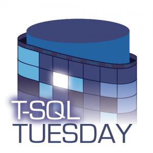

Thanks to [Jens Vestergaard](http://t-sql.dk/) for hosting T-SQL Tuesday #101.  When I saw the topic for this month’s T-SQL Tuesday, I knew instantly which tool I would write about. Although there are many great tools out there that make my job as a DBA easier (and I’m excited to read the summary for this month to see what everyone else leans on), there is one that has fundamentally changed far more than just my work day. First of all I love PowerShell; the ability to make my daily tasks both repeatable and automated is something that has always appealed to me. Then I found [dbatools](http://dbatools.io), which combines everything I love about PowerShell into an ever-evolving open source module.

Once you [install the module](https://dbatools.io/install) you can run the following to list all the available commands in your toolbox. It’s a good idea to keep your copy of the module updated and check this often as people are always adding new commands.

Get-Command -Module dbatools -CommandType Function | Out-GridView

Having hundreds of commands can be a little overwhelming. In no particular order, these are the top five that I use most or that save me the most time.

### Test-DbaSqlBuild

When I found this command I couldn’t have been more excited. My day-to-day job requires the care and watering of over 100 SQL Server instances of varying versions.  Using this command you can get the current build of all your instances and then compare that to the most recent available.  There are also parameters for how far you want to be from the latest version. Setting the -latest switch means just that, your server will only be seen as compliant if it’s on the latest release, passing in -1CU means that it can be no more than 1 cumulative update behind.

This snippet takes the registered instances from our central management servers and pipes them into Test-DbaSqlBuild to determine if they are on the latest version. It creates an easy list of what needs patched.

Get-DbaRegisteredServer -SqlInstance nonProdServers, prodServers | 
Test-DbaSqlBuild -Latest

### Get-DbaDiskSpace

This is a great command to have handy. Pass in one or many server names and it returns the current size, amount of space available and blocksize for all drives and mount points on that server. There are also switches to look for any drives that have SQL files on, or to check the filesystem fragmentation levels.  One great use of this command is to pass in a list of servers and filter for drives under 5% free space. This is a great proactive check of where action may be needed soon.

Get-DbaDiskSpace -ComputerName $servers | Where-Object {$\_.PercentFree -lt 5}

### Copy-DbaDatabase

This command is used to move databases from one instance to another. You can use either a backup/restore method or by detaching and re-attaching the files. Check out my post on the [dbatools blog](https://dbatools.io/migrating-application-dbs/) for a more detailed look on how I used this to save a lot of time on a recent project at work.

Copy-DbaDatabase -Source SourceServer -Destination DestinationServer \`
-Database MigratingDatabase -BackupRestore -NetworkShare \\\\fileshare\\

### Repair-DbaOprhanedUser

This command is pure wizardry and [Steve Jones has a more extensive post](https://voiceofthedba.com/2018/02/16/dbatools-and-orphaned-users/) on this command, but it does exactly what it says. It syncs up the SIDs for SQL logins that you’ve migrated from one instance to another. This is not a difficult task, however this one line fixes any orphaned logins on your whole instance. Extremely useful if you are migrating a lot of databases to new servers.

Repair-DbaOrphanUser -SqlInstance serverName

### Write-DbaDataTable

The final command for my top five takes an object in PowerShell and uses SQL bulk copy to insert it into a table in a SQL Server database. Using the -AutoCreateTable switch will do just that, if the table doesn’t exist it will be created. One thing to watch is this will be a heap so if you’re going to use this table going forward building the table ahead of time with appropriate indexes and keys is probably advisable. However, this one line can be very useful for quickly throwing results into a table to save or analyze further.

$results | Write-DbaDataTable -SqlInstance serverName -Database databaseName -Table tableName -AutoCreateTable

 

The Second reason dbatools is my favorite tool is all the other things I’ve gained and learnt from this module.  It’s been almost one year since my first pull request to dbatools, and at that point I had a decent handle on PowerShell but git was a foreign language. Guided by Chrissy LeMaire ([t](http://twitter.com/cl)) and some other folks from the [slack channel](http://dbatools.io/slack) I got the repo forked, created my own branch and then submitted a PR to get my contributions merged in.  Since then I’ve contributed multiple more PRs, everything from small fixes to the command based help, to writing a brand new command (Get-DbaDbCompression will be released soon!).

This tool not only gives you hundreds of commands to make your job easier, it encourages you to branch out and get involved in a truly special community. You will meet some brilliant people to bounce ideas off, learn new skills like github, integration tests or even continuous integration and development, all while giving back to the amazing community that surrounds the SQL Server ecosystem.  This blog is the start of my attempt to give back while furthering my understanding of certain topics. In June I’ll be stepping even further outside of my comfort zone by presenting at my local user group on data compression, and of course that’ll feature some dbatools related demos.
