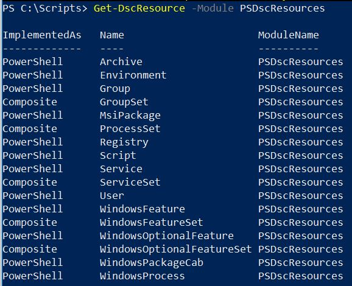
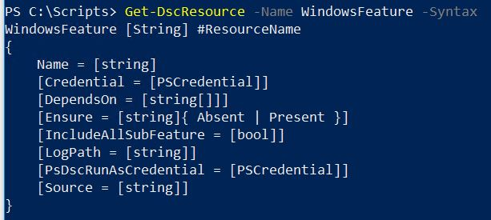
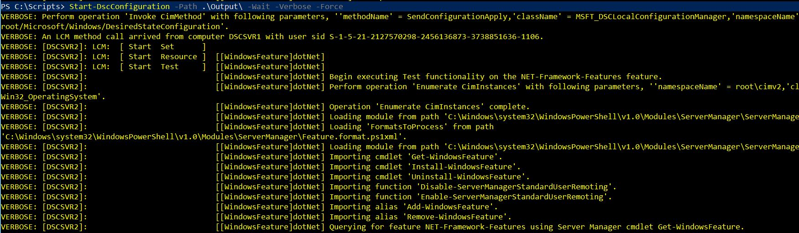
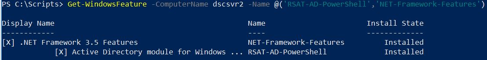

[](https://garrybargsley.com/t-sql-tuesday-110-automate-all-the-things/)

Automation is something that interests me greatly, and I think if you have read even one of my previous posts you’ll know that my favorite tool for this kind of work is PowerShell.  This is the perfect topic to kick off T-SQL Tuesday for 2019 so thanks goes to Garry Bargsley for hosting this month.

One of my goals for 2019 is to improve our server build process, it’s currently reasonably well scripted but there are some definite gaps. I’ve started looking at using PowerShell Desired State Configuration (DSC) to install and configure SQL Server to both meet our needs and increase our speed and efficiency. Although full automation is a stretch goal for this project the DSC technology can certainly scale to accomplish that.

### PowerShell Desired State Configuration

PowerShell DSC is a platform to support the concept of Infrastructure as Code (IaC).  It uses declarative syntax instead of the usual imperative syntax of PowerShell.  This means that you describe your desired state rather than the specific steps needed to get there.  There are two modes for DSC, push and pull, although pull mode offers more features and scalability, we’ll look at writing our configuration and using push mode for this blog post to keep it simple.

I hope that this blog post will be the first of a series this year as I work to finalize the full process of installing and configuring SQL Server with DSC. For now I will share step 1, ensuring the freshly built Windows OS meets the necessary prerequisites for the SQL Server installation.  Today we’ll look at installing two Windows Features ‘.NET 3.5 Features’ and ‘Active Directory module for Windows PowerShell’ on our target node.

The first thing we’ll want to do is to update the in-box DSC resources, PSDesiredStateConfiguration. This version comes with Windows PowerShell 4.0 and 5.0 however there have been notable improvements that we will want to take advantage of.  Since the updated module is available in the PowerShell Gallery we can install it to our workstation using the following (note the name change):

```
Install-Module PSDSCResources
```

Since we are using the push mode we need to make sure any modules we use to write our configurations are available on our target nodes.  I have manually copied the `PSDSCResource` module to a path within the `$env:PSModulePath` on the target node so it’ll be available when the configuration is enacted there. There are other ways to handle this including setting up a resource module file share.

### Writing our First Configuration

We’re now ready to write our first configuration, although we are still writing PowerShell the syntax is a little different.  One of my favorite things about PowerShell is using the command based help to discover how to execute new cmdlets and functions, DSC is no different here. We can use `Get-DscResource` to list all the resources we have available.



Since we are going to use the WindowsFeature resource we can find out how to use that by passing in the `-Syntax` parameter to `Get-DscResource`.



The only required parameter for the WindowsFeature resource is Name so we’ll include that.  I also like to include the ‘Ensure’ parameter, it defaults to ‘Present’ but I feel it makes it clearer to specifically define that.  I also want to set ‘IncludeAllSubFeature’ to true so those get installed also. 

The below code is all we need to get started with our first configuration. Apart from the resource blocks that we have already mentioned there are a couple of other important parts to note. First is the keyword `Configuration` which shows we are writing a DSC Configuration document. In this case I’ve named our configuration ‘SQLServerPreReq’. Secondly, the `Node` keyword is important, this defines the target node for our configuration.  It’s important to remember that this is a simple example, it is possible to pass in multiple node names or to parameterize that node name to make our configuration more useful.

The last line of code calls our SQLServerPreReq configuration and specifies the output path.  When you call a configuration a MOF file is created which is the document that will be sent to the target node and used to both enact the configuration and monitor for configuration drift (a feature of the pull mode that we’ll save for a future post).

```
Configuration SQLServerPreReq {

    Import-DscResource -ModuleName PSDSCResources

    Node 'DscSvr2' {
        WindowsFeature dotNet
        {
            Name                    = 'NET-Framework-Features'
            Ensure                  = 'Present'
            IncludeAllSubFeature    = $true
        }
        WindowsFeature ADPowershell 
        {
            Name                    = 'RSAT-AD-PowerShell'
            Ensure                  = 'Present'
            IncludeAllSubFeature    = $true
        }
    }
}

SQLServerPreReq -Output .\Output\ 
```

Once we have our MOF file the final step is to enact our configuration against our target node.  I’m using the `-wait` and `-verbose` parameters so that the configuration doesn’t run in the background and we can view the verbose messages on screen as it executes.

```
Start-DscConfiguration -Path .\Output\ -Wait -Verbose
```

[](https://jesspomfret.com/wp-content/uploads/2019/01/startDscConfiguration1-1.jpg)

Once this runs successfully you can confirm the features are installed using `Get-WindowsFeature`.

```
Get-WindowsFeature -ComputerName dscsvr2 `
-Name @('RSAT-AD-PowerShell','NET-Framework-Features')
```



### Using Composite Resources

This simple configuration shows how you can install two windows features using PowerShell DSC, however it is rather redundant to have to specify separate resource blocks for each feature.  Since we updated our in-box DSC Resources to the newer PSDSCResources module we are able to use the new WindowsFeatureSet resource which is an example of a composite resource. We can review the syntax again using Get-DscResource:

```
Get-DscResource -Name WindowsFeatureSet -Syntax
```

The main difference is that WindowsFeatureSet takes an array of features to install and then translates this to use multiple WindowsFeature resources when the MOF file is created.  This allows us to keep our configuration document as tidy and concise as possible.

```
Configuration SQLServerPreReq_v2 {

    Import-DscResource -ModuleName PSDSCResources
  
    Node 'DscSvr2' {
        WindowsFeatureSet PreReqFeatures
        {
            Name                    = @('NET-Framework-Features'
                                        'RSAT-AD-PowerShell')
            Ensure                  = 'Present'
            IncludeAllSubFeature    = $true
        }
    }
}

SQLServerPreReq_v2 -Output .\Output\ 
```

That’s step one towards automating my SQL Server builds, I’m looking forward to adding more to this series. Thanks again to Garry for picking the perfect T-SQL Tuesday topic to kick off the year with.
