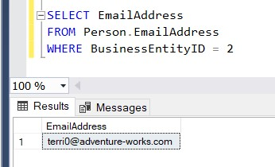

It’s T-SQL Tuesday time again! March felt really long for a lot of us as we got used to our new way of life, so I’m excited we made it to April’s prompt.

This month’s topic is asking for a discussion around whether unit testing for databases is valuable. Since getting involved with dbatools and beginning to write more structured PowerShell (meaning modules and DSC resources rather than just an odd script) I have learnt a lot more about testing code. However, I have zero experience with testing databases. So I’m excited for this topic. Thanks for hosting Hamish ([b](https://hybriddbablog.com/)|[t](https://twitter.com/TheHybridDBA)).

I recently watched Steve Jones give a session as part of [Redgate Streamed](https://www.red-gate.com/hub/events/redgate-events/redgate-streamed/) on using [tSQLt](https://tsqlt.org/) for database testing. It’s not the first time I’ve heard about this tool and it’s been on my list for way too long as something I want to investigate a little further. I figured this was a good excuse.

## Unit tests for PowerShell

Writing tests for PowerShell code makes a lot of sense to me. There is something really nice about being able to test all the (covered) functionality of a function or cmdlet, after you’ve fiddled around with it.  It’s easy to get lost in fixing a bug, or adding some great new functionality and accidentally break something else. Having tests written ensures the function still works as desired, and as you add functionality or fix bugs you can add to the test cases, making the whole process more robust.  I’m 100% for unit and integration testing for code. No doubt about it.

## So why not databases?

Data is always the difficult bit when people talk about DevOps or agile development practices, and to be honest, I’d be way out of my depth to talk about how and why to test your data.  I’m instead going to look at using tSQLt to test functions and stored procedures. After all, there’s code in our databases too! After seeing the benefits of writing tests for PowerShell functions, I can easily see the benefits of testing the programmable objects in our databases.

## Installing tSQLt

Getting started with tSQLt is really easy- [you download a zip file](https://tsqlt.org/downloads/), unzip the contents and then run the tSQLt.class.sql script against your development database.

There are a couple of requirements, including CLR integration must be enabled and your database must be set to trustworthy.  These could open up some security considerations, but for my development environment it’s no issue.

After I ran the tSQLt.class.sql script I got the following in the messages tab of SSMS. We’re ready to go:

Installed at 2020-04-07 15:45:03.200
 
+-----------------------------------------+
|                                     	|
| Thank you for using tSQLt.          	|
|                          	            |
| tSQLt Version: 1.0.5873.27393       	|
|                                     	|
+-----------------------------------------+
 
Completion time: 2020-04-11T14:25:21.6912488+01:00

## Test a simple function

To start with I made a really simple function to make sure I understood the tSQLt syntax and could get my first test written successfully.  It takes two numbers and returns the sum.

CREATE OR ALTER FUNCTION dbo.AddTwoNumbers (@int1 int, @int2 int)
RETURNS INT AS
BEGIN
   	RETURN @int1 + @int2
END

In tSQLt we’ll use a test class to group similar tests together, which will enable us to run a suite of tests in one go. Since this is for TSQLTuesday I’ll create a test class named testTSQLTuesday.

EXEC tSQLt.NewTestClass 'testTSQLTuesday';
GO

This is basically just a schema for our tests to live in. I’m now ready to create my first test. The documentation for tSQLt has some good examples to get us started, and I followed the ‘AssertEquals’ example from their [tutorial](https://tsqlt.org/user-guide/tsqlt-tutorial/).

When we run our tSQLt tests the stored procedure name will be the name of the test, so it’s important to make those meaningful. I named this one ‘test the addTwoNumbers function works’.

From the little I do know about test-driven development, I understand we should write the test to initially fail. That’ll confirm that I haven’t set it up in a way that will provide false positives. In the below test I’m saying that I expect the sum of 1 and 2 calculated by my function to be 4, obviously untrue.

\-- create the test to fail
CREATE OR ALTER PROCEDURE testTSQLTuesday.\[test the addTwoNumbers function works\]
AS
BEGIN
	DECLARE @actual INT;
	DECLARE @testInt1 INT = 1;
	DECLARE @testInt2 INT = 2;
 
	SELECT @actual = dbo.AddTwoNumbers(@testInt1, @testInt2);
 
	DECLARE @expected INT = 4;
	EXEC tSQLt.AssertEquals @expected, @actual;
 
END;
 
GO

You can see this is a pretty simple test to set up. I declared two numbers that I’ll pass to the function and then fill in what I expect the result to be (still the wrong answer at this point).

To run the test I’ll use the tSQLt.Run stored procedure, passing in my test class name.

EXEC tSQLt.Run 'testTSQLTuesday';

Reviewing the messages pane in SSMS I can see my test has failed, as expected, and it let’s you know it expected 4 but got 3.

 \[testTSQLTuesday\].\[test the addTwoNumbers function works\] failed: (Failure) Expected: <4> but was: <3>
 
+----------------------+
|Test Execution Summary|
+----------------------+
 
|No|Test Case Name                                           |Dur(ms)|Result |
+--+---------------------------------------------------------+-------+-------+
|1 |\[testTSQLTuesday\].\[test the addTwoNumbers function works\]| 	13|Failure|
-----------------------------------------------------------------------------
Msg 50000, Level 16, State 10, Line 43
Test Case Summary: 1 test case(s) executed, 0 succeeded, 1 failed, 0 errored.
-----------------------------------------------------------------------------
 
Completion time: 2020-04-11T14:37:18.8297577+01:00

Now I’ll fix the test so if the function is working as expected the test should pass.

\-- create the test
CREATE OR ALTER PROCEDURE testTSQLTuesday.\[test the addTwoNumbers function works\]
AS
BEGIN
	DECLARE @actual INT;
	DECLARE @testInt1 INT = 1;
	DECLARE @testInt2 INT = 2;
 
	SELECT @actual = dbo.AddTwoNumbers(@testInt1, @testInt2);
 
	DECLARE @expected INT = (@testInt1 + @testInt2);
	EXEC tSQLt.AssertEquals @expected, @actual;
 
END;
 
GO

Good news, our first tSQLt test has passed.

+----------------------+
|Test Execution Summary|
+----------------------+
 
|No|Test Case Name                                           |Dur(ms)|Result |
+--+---------------------------------------------------------+-------+-------+
|1 |\[testTSQLTuesday\].\[test the addTwoNumbers function works\]|  	3|Success|
-----------------------------------------------------------------------------
Test Case Summary: 1 test case(s) executed, 1 succeeded, 0 failed, 0 errored.
-----------------------------------------------------------------------------
 
Completion time: 2020-04-11T16:33:56.6201835+01:00

## Test a stored procedure that changes data

One thing I thought that was really cool with tSQLt is that it executes the tests in a transaction, and then rolls it back after testing to ensure things are left the way they were before we started testing.  To show this I’ve created a simple stored procedure that allows us to update an email address in the Person.EmailAddress table from AdventureWorks2017.

CREATE PROCEDURE Person.UpdateEmailAddress
   	@NewEmailAddress varchar(100),
   	@BusinessEntityID int
AS
 
UPDATE Person.EmailAddress
SET EmailAddress = @NewEmailAddress
where BusinessEntityID = @BusinessEntityID
 
GO

Then I wrote a test, similar to the first example, which compares the actual value that is in the Person.EmailAddress table after running the procedure with what I would expect to be in there.

CREATE OR ALTER PROCEDURE testTSQLTuesday.\[test the UpdateEmailAddress procedure\]
AS
BEGIN
	DECLARE @actual varchar(100);
	DECLARE @newEmail varchar(100) = 'test@test.com';
	DECLARE @businessEntityID INT = 2;
 
   	EXEC person.UpdateEmailAddress @newEmail, @businessEntityId
 
	SELECT @actual = EmailAddress
   	FROM Person.EmailAddress
   	WHERE BusinessEntityID = @businessEntityID
 
	DECLARE @expected varchar(100) = @newEmail
	EXEC tSQLt.AssertEquals @expected, @actual;
 
END;
GO

I added this to the same test class so we’ll execute both tests with the same call to tSQLt.Run.

EXEC tSQLt.Run 'testTSQLTuesday';

The results now show I have two tests that passed.

+----------------------+
|Test Execution Summary|
+----------------------+
 
|No|Test Case Name                                           |Dur(ms)|Result |
+--+---------------------------------------------------------+-------+-------+
|1 |\[testTSQLTuesday\].\[test the addTwoNumbers function works\]|  	6|Success|
|2 |\[testTSQLTuesday\].\[test the UpdateEmailAddress procedure\]|  	7|Success|
-----------------------------------------------------------------------------
Test Case Summary: 2 test case(s) executed, 2 succeeded, 0 failed, 0 errored.
-----------------------------------------------------------------------------
 
Completion time: 2020-04-11T17:17:36.4799073+01:00

To run this test we had to actually call the stored procedure that changes data in our tables. As I mentioned though, this all happened within a transaction that was never committed. We can confirm our data was unchanged by checking the table.

SELECT EmailAddress
FROM Person.EmailAddress
WHERE BusinessEntityID = 2;

This is just scratching the surface of what tSQLt can do. The [full user guide](https://tsqlt.org/full-user-guide/) is available online.  This goes through all the available assertions (we only looked at AssertEquals here) as well as more complicated topics such as how to isolate dependencies to be able to effectively unit test.

## Summary

Writing this post has been a great excuse for me to try out tSQLt and write my first T-SQL unit tests. To be honest, it was a lot easier than I expected.  I will say I’m comfortable writing pester tests for my PowerShell code so that base was helpful, but the documentation for tSQLt made getting setup and starting to test databases pretty straightforward.

The cost of unit testing your database code is the time investment to get comfortable with the tools and to write the tests as you develop the database code.  The benefit though is a more reliable, easier to maintain database with less bugs, which will in the end make your data safer.

I’d say there is a significant benefit to applying unit testing to databases, and I believe we’ll see a significant increase in the number of folks applying unit tests to their database environments.
