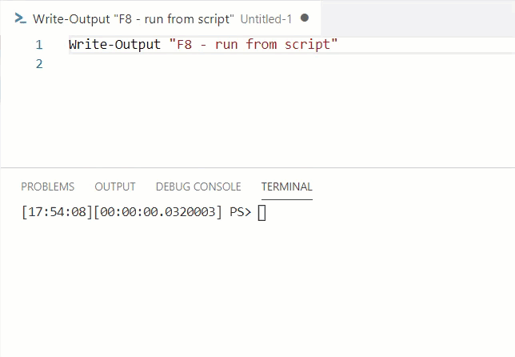
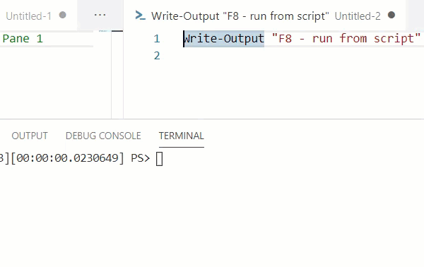

I wrote previously about how I loved little life hacks and shortcuts for my [February T-SQL Tuesday prompt](https://jesspomfret.com/t-sql-tuesday-123-summary). If you read that you’ll know I use VSCode a lot and really love all the shortcuts available in that program. This is just a quick tip that I’m so glad I found, read – took the time to work out.

I specifically write a lot of PowerShell in VSCode and so often find myself using F8 to run the selected line in the integrated console. One thing that always drove me a little crazy was that my cursor stayed in the integrated console after execution, rather than returning to the script I was writing.  I hadn’t managed to find the shortcut to return to the editor window I was working in until recently when I decided to figure it out.

Since I started writing this post a couple of weeks ago, I discovered an even better solution thanks to the following tweet from [Simon Sabin](http://twitter.com/simon_sabin). The tweet also links to a GitHub issue where there is a discussion on why this is the default behaviour.

https://twitter.com/simon\_sabin/status/1252253795603681281

So by adding the following to your `settings.json` file you can override that behaviour, and keep the focus in your script pane.

"powershell.integratedConsole.focusConsoleOnExecute": false

## **Original Solution**

The original solution to this dilemma is to use the keyboard shortcut to return focus to the script pane. Using Ctrl+1 will return you to the first editor group (unless you are using ZoomIt!).

If you have more than one editor group open you can use CTRL+2 to get to the second group, or CTRL+3 to get to the third group.

Also, as with most shortcuts in VSCode, you can also customise the key bindings, by opening the command palette (F1) and choosing ‘Open Keyboard Shortcuts’ either in the GUI or JSON format.

The commands to customise are below with the defaults:  
\- workbench.action.focusFirstEditorGroup: Ctrl+1  
\- workbench.action.focusSecondEditorGroup: Ctrl+2  
\- workbench.action.focusThirdEditorGroup: Ctrl+3 (and so on up to the eighth editor group)

A bonus tip for you: If you’re in the GUI keyboard shortcut editor and you right click and copy, or press Ctrl+C, you’ll actually copy the JSON you’d need to customise your key bindings in the keyboard shortcuts (JSON) file.

{
  "key": "ctrl+5",
  "command": "workbench.action.focusFifthEditorGroup"
}

I’m really excited to have discovered a couple of optimisations so now when I’m writing a script and I execute a line of PowerShell in the integrated console I will easily be able to navigate back to my editor pane using Ctrl+1 instead of having to reach for the mouse.
